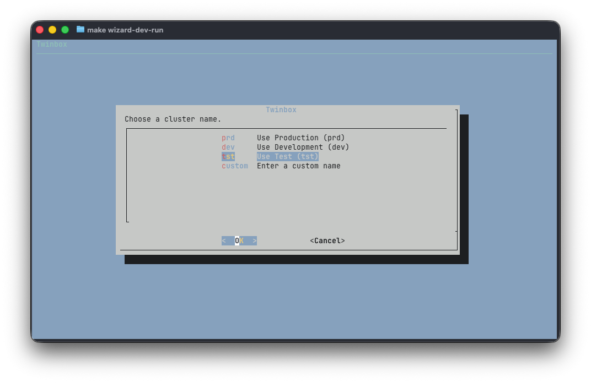
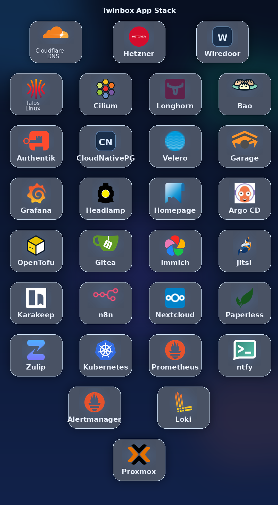

# Twinbox

**Production-grade Kubernetes on your own hardware. One command.**

Twinbox turns a Proxmox server into a fully configured Talos Linux cluster with GitOps, secrets, storage, backups, and ingress — all set up through a guided web interface.

## What you start with

Bring any machine with [Proxmox](https://www.proxmox.com/en/products/proxmox-virtual-environment/get-started) installed. Old servers, workstations, or a fresh build — anything with virtualization support works.

<p align="center">
  
</p>

## What Twinbox does

Run one command on the Proxmox console. The wizard creates a Management VM that boots the full Twinbox stack.

<p align="center">
  
</p>

Open your browser to continue the installation. The web UI guides you through cluster provisioning, networking, and platform services.

<p align="center">
  
</p>

## What you get

<p align="center">
  
</p>

- **Talos Linux** — immutable, API-driven Kubernetes OS
- **Cilium** — kube-proxy-free networking and policy-ready datapath
- **Hubble** — network flow visibility and the Hubble UI dashboard
- **Cloudtty** — browser-based Kubernetes shell on the cluster itself
- **Argo CD** — GitOps for every component
- **Longhorn** — distributed block storage
- **OpenBao + External Secrets Operator** — centralized secret management
- **Traefik** — ingress and routing
- **SeaweedFS** — S3-compatible backup target on the Management VM
- **Velero** — automated cluster backups to SeaweedFS
- **CloudNativePG** — managed PostgreSQL clusters
- **Authentik** — single sign-on and identity provider

## Quick start

```bash
bash <(curl -fsSL https://raw.githubusercontent.com/harrywesterman/twinbox/main/wizard/setup-wizard.sh)
```
