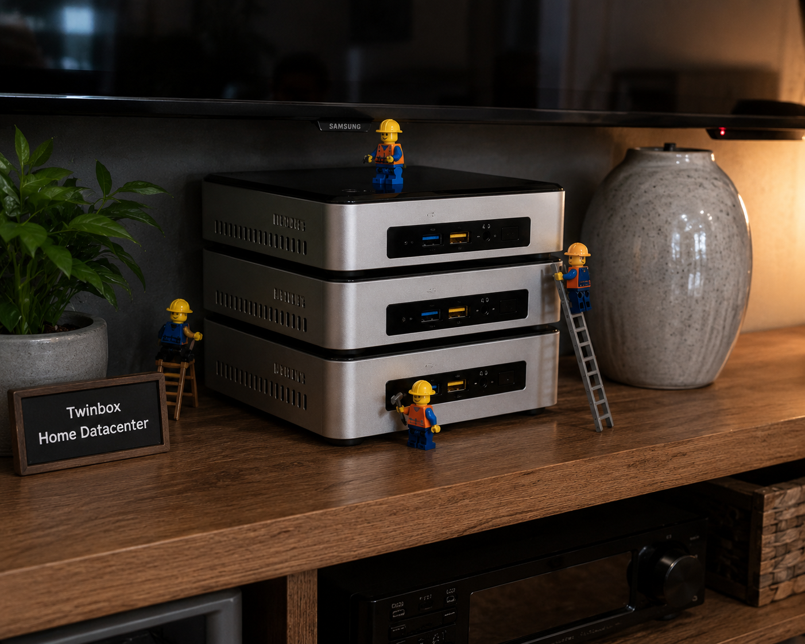
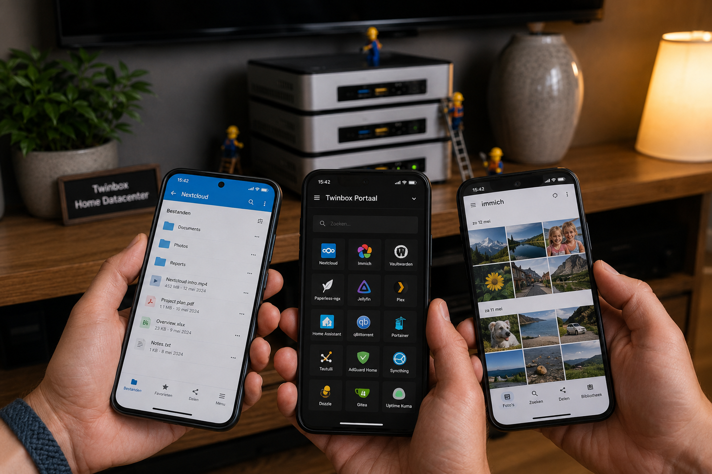
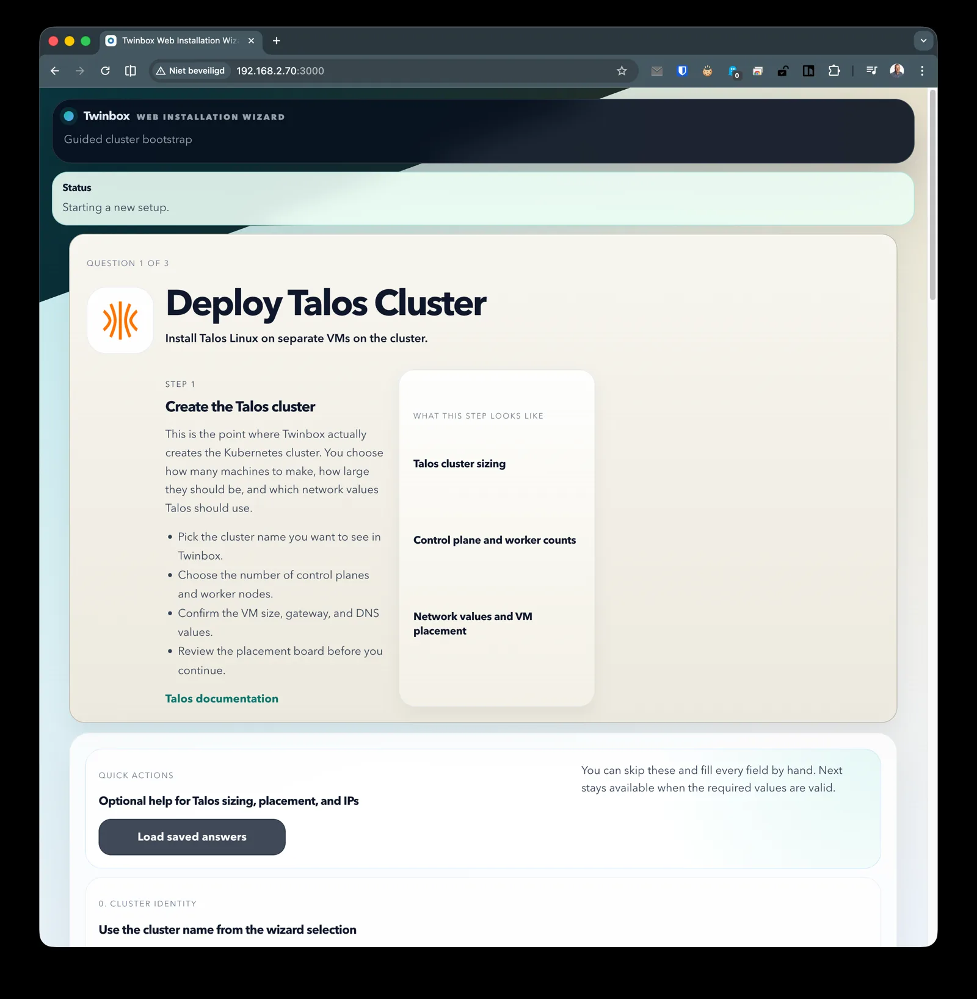
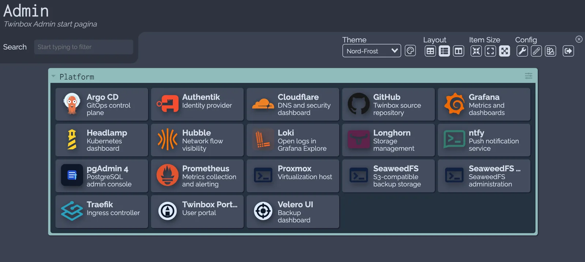
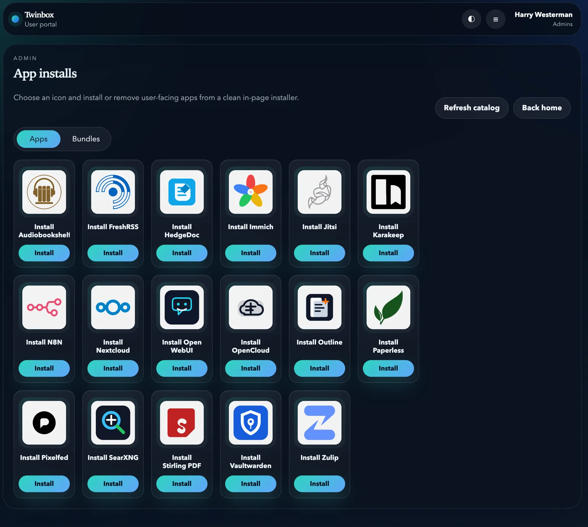

# Twinbox

**Your own private little datacenter to run at home**

  

You can run awesome Open Source alternatives like NextCloud for your documents and Immich for you photos on your phones. Your email, your chats and much more is all hosted on your own servers. No more sharing of all your information with Big Tech. No data is ever leaving your personal servers. Twinbox is simple to install, even for non-technical people. It will update itself, and keep itself safe. 

  

Twinbox turns Proxmox hosts into a fully configured [Talos Linux](https://www.talos.dev/) Kubernetes platform with GitOps, secrets, storage, backups, ingress, observability, identity, and an application portal. It starts with a small Proxmox console bootstrap, then continues through a guided web interface that provisions the cluster and platform services for you.

Use it to build an on-prem cloud for private applications, shared services, and homelab or small-site infrastructure without hand-assembling every Kubernetes component yourself.

## Quick Start

1. Install [Proxmox VE](https://www.proxmox.com/en/products/proxmox-virtual-environment/get-started) on the machines that will host Twinbox.
2. Run the Twinbox setup wizard from the Proxmox console. The wizard creates a Management VM and starts the Twinbox manager stack.
3. Open the web wizard in your browser and follow the guided flow for cluster provisioning, networking, and platform services.
4. Continue in the [Twinbox documentation](https://harrywesterman.github.io/Twinbox/) for the full user guide, architecture notes, and troubleshooting reference.

## Requirements

Twinbox is designed for x86 hardware running Proxmox VE. Old servers, workstations, compact machines, and fresh builds can all work as long as they support virtualization.

| Resource | Minimum         |
| -------- | --------------- |
| Nodes    | 3 x86 machines  |
| Memory   | 16 GB per node  |
| Disk     | 500 GB per node |
| Network  | 1 Gbit Ethernet |

The original Twinbox lab was built on three second-hand Intel NUCs. Faster networking and more memory are welcome, especially for larger app catalogs or heavier storage workloads.

## How It Works

Run one command on the Proxmox console. The bootstrap wizard creates a Management VM that runs the Twinbox manager API, web UI, worker, queue, and supporting services.

  

Open the web wizard to continue the installation. It guides you through Proxmox access, VM creation, Talos provisioning, networking, storage, GitOps, identity, observability, ingress, and backup setup.

  

When the platform is ready, the admin console gives operators a single place to inspect the cluster and management services.

  

The Twinbox Portal is the user-facing launcher for applications, bundles, intranet links, settings, and cluster status.

  

## Platform

Twinbox installs a complete Kubernetes operations stack:

| Area                   | Components                                                    |
| ---------------------- | ------------------------------------------------------------- |
| Kubernetes foundation  | Talos Linux, Cilium, Hubble                                   |
| GitOps                 | Argo CD                                                       |
| Storage and backups    | Longhorn, SeaweedFS, Velero                                   |
| Ingress and access     | Traefik, MetalLB, Cloudflare Tunnel, NetBird, Wiredoor        |
| Identity and secrets   | Authentik, OpenBao, External Secrets Operator                 |
| Databases              | CloudNativePG                                                 |
| Observability          | Prometheus, Alertmanager, Grafana, Loki, Tempo, Grafana Alloy |
| Security               | CrowdSec with Traefik bouncer                                 |
| User and admin portals | Twinbox Portal, Dashy                                         |

## App Catalog

Install additional applications through the Twinbox Portal:

- **Audiobookshelf** - audiobook and podcast server
- **FreshRSS** - self-hosted RSS feed reader
- **HedgeDoc** - real-time collaborative markdown editor
- **Immich** - photo and video backup
- **Jitsi** - video conferencing with OpenID Connect
- **Karakeep** - bookmark and web archiving
- **n8n** - workflow automation
- **Nextcloud** - file sync and collaboration
- **OpenCloud** - open source collaboration platform
- **OpenWebUI** - AI chat interface
- **Outline** - team knowledge base
- **Paperless** - document management with OCR
- **Pixelfed** - decentralized photo sharing
- **SearXNG** - privacy-respecting metasearch engine
- **Stirling PDF** - PDF manipulation tools
- **Vaultwarden** - Bitwarden-compatible password manager
- **Zulip** - threaded team chat

## Documentation

- [User guide](https://harrywesterman.github.io/Twinbox/user-guide/) - prerequisites, bootstrap, web wizard, and platform overview
- [Architecture](https://harrywesterman.github.io/Twinbox/architecture/) - system layers, runtime flow, and component responsibilities
- [Configuration](https://harrywesterman.github.io/Twinbox/configuration/) - environment and platform configuration reference
- [Troubleshooting](https://harrywesterman.github.io/Twinbox/troubleshooting/) - operational checks and recovery notes

## Project Structure

| Path               | Purpose                                                   |
| ------------------ | --------------------------------------------------------- |
| `wizard/`          | Proxmox bootstrap scripts that create the Management VM   |
| `manager-web/`     | React web wizard on port `3000`                           |
| `manager-api/`     | Manager API, catalog, validation, state, and job queueing |
| `manager-worker/`  | Queue polling and job execution                           |
| `scripts/manager/` | Talos, Proxmox, Argo CD, OpenBao, and platform automation |
| `categories/`      | Wizard step manifests and runners                         |
| `gitops/`          | Argo CD applications, Helm values, and Kustomize overlays |
| `portal/`          | Twinbox Portal                                            |
| `config/`          | Pinned defaults, Cilium values, and portal content        |
| `docs/`            | MkDocs user guide and technical reference                 |

## License

Twinbox is released under the [MIT License](LICENSE).
