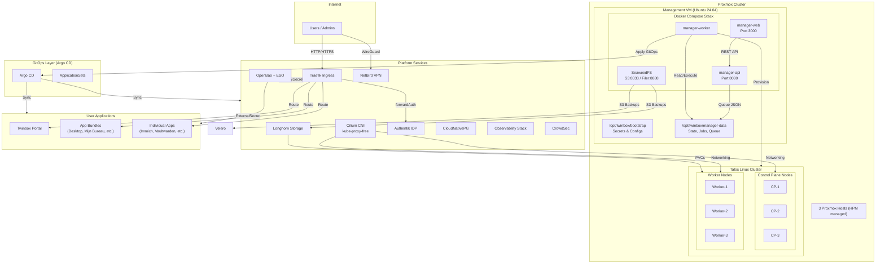
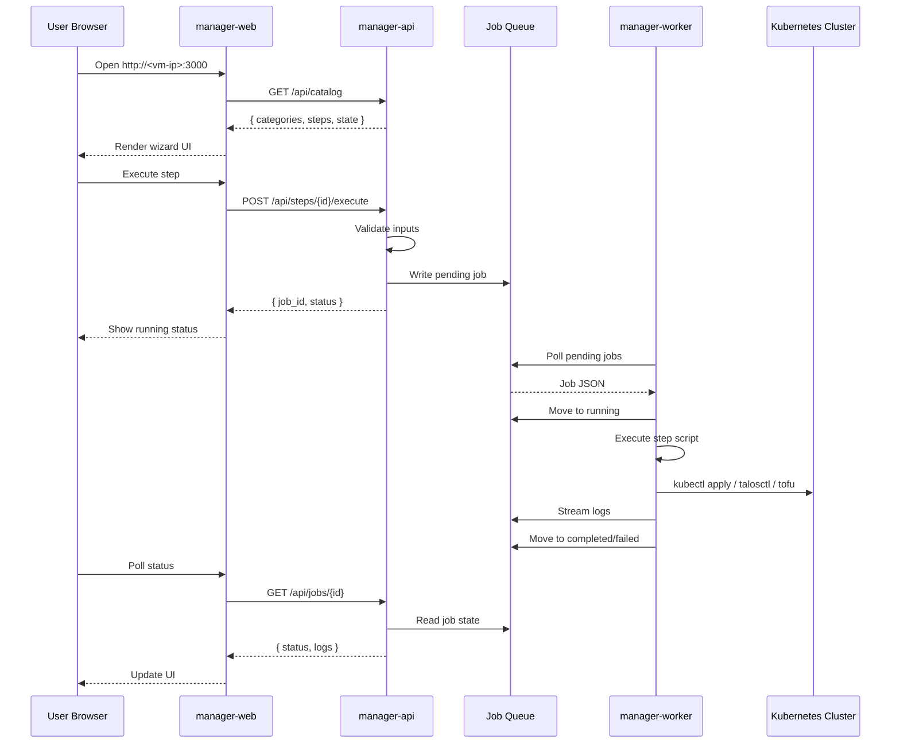
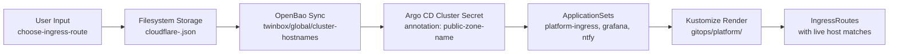
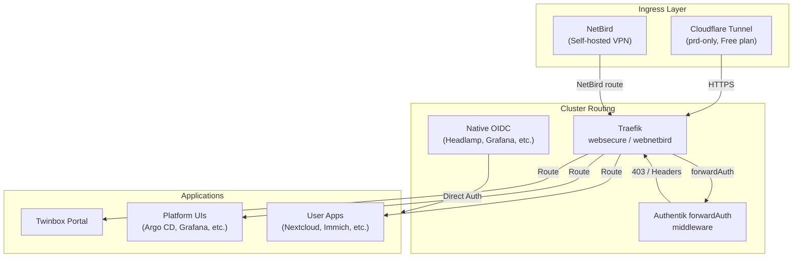
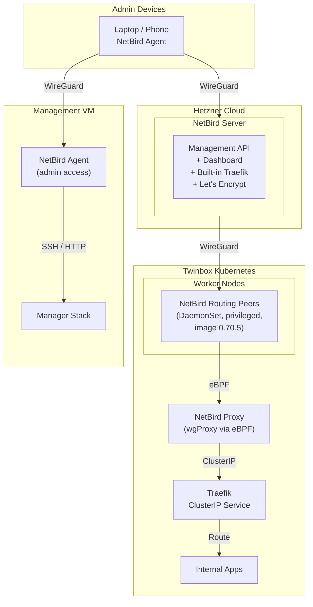
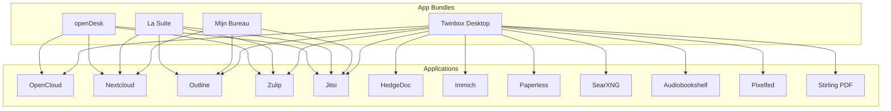
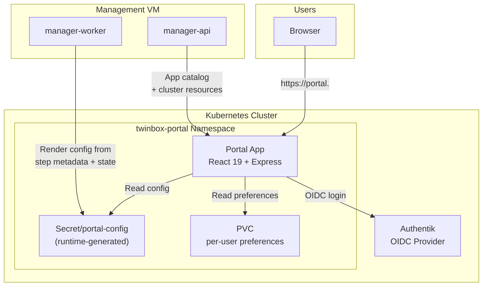

# Architecture

Twinbox runs on a Proxmox cluster to deliver a production-grade Kubernetes platform. The system is built from five layers: a Proxmox bootstrap wizard, a Management VM that runs the control plane, a Talos Linux Kubernetes cluster, a GitOps-managed application platform, and a suite of infrastructure services (NetBird, Traefik, Cilium, etc.).

## Layers

### 1. Wizard Layer

- `wizard/setup-wizard.sh` runs on the Proxmox host.
- Prompts for Management VM sizing, network settings, and cluster name.
- Creates the Management VM from an Ubuntu 24.04 cloud image.
- Seeds a cloud-init snippet that installs Ansible and runs the baseline playbook.
- Creates `/opt/twinbox` runtime directories without cloning the repository.
- Detects and supports cleanup of existing resources for the same cluster.

### 2. Manager Runtime Layer

Runs on the Management VM as Docker Compose services:

| Service | Port | Purpose |
|---------|------|---------|
| `manager-web` | `3000` | React wizard UI |
| `manager-api` | `8080` | REST API for catalog, jobs, state |
| `manager-worker` | — | Queue polling and job execution |
| `seaweedfs` | `8333` / `8888` | S3-compatible object store for backups |
| `seaweedfs-admin` | `23646` | SeaweedFS admin dashboard |

The `manager-api` and `manager-worker` images bundle:
- `categories/` — wizard step manifests and runners
- `scripts/manager/` — Talos/Proxmox/Argo CD/OpenBao logic
- `lib/secrets/` — shared secret library

Runtime state lives under `/opt/twinbox/manager-data/`:
- `clusters/<id>.json` — cluster metadata
- `jobs/<id>.json` — job records
- `logs/<id>.log` — streamed job logs
- `queue/{pending,running,completed}/<id>.json` — job queue
- `step-state/global/<stepId>.json` — global step state
- `step-state/clusters/<id>/<stepId>.json` — cluster-scoped step state

### 3. Execution Layer

Scripts and step runners executed by `manager-worker`:

**Cluster Provisioning**
- `scripts/manager/apply-cluster.sh` — OpenTofu-driven Talos VM creation
- `scripts/manager/bootstrap-talos.sh` — control plane bootstrap
- `scripts/manager/create-talos-vms.sh` — thin wrapper around `apply-cluster`
- `scripts/manager/collect-state.sh` — cluster state inspection

**Networking**
- `scripts/manager/render-cilium-manifest.sh` — Cilium bootstrap manifest
- `scripts/manager/install-argocd.sh` — Argo CD installation
- `scripts/manager/install-cloudtty.sh` — browser-based cluster shell
- `scripts/manager/install-traefik-manager.sh` — Traefik Manager UI

**Storage & Secrets**
- `scripts/manager/install-longhorn-storage.sh` — Longhorn + default SC
- `scripts/manager/install-secret-sync.sh` — External Secrets + OpenBao
- `scripts/manager/openbao-secret-sync.sh` — OpenBao lifecycle library
- `scripts/manager/sync-openbao-global-secret.sh` — sync single secret to OpenBao

**Observability**
- `scripts/manager/install-prometheus.sh` — kube-prometheus-stack
- `scripts/manager/diagnose-monitoring.sh` — monitoring diagnostics
- `scripts/manager/reconcile-observability.sh` — observability reconciliation
- `scripts/manager/refresh-grafana-dashboard.mjs` — dashboard refresh
- `scripts/manager/render-grafana-dashboard.mjs` — dashboard rendering

**Backup**
- `scripts/manager/install-velero-backup.sh` — Velero + SeaweedFS
- `scripts/manager/install-velero-ui.sh` — Velero UI with OIDC
- `scripts/manager/install-management-backup.sh` — host cron jobs

**Utility**
- `scripts/manager/upsert-secret-artifact.mjs` — secret file attachments
- `scripts/manager/cluster-public-zone.sh` — public zone derivation
- `scripts/manager/upsert-argocd-cluster-secret.sh` — Argo cluster secret
- `scripts/manager/uninstall-argocd-application.sh` — app removal
- `scripts/manager/authentik-auth.sh` — Authentik API helper
- `scripts/manager/sync-pgadmin4-server.sh` — pgAdmin server sync

**Category Runners**
- `categories/*/steps/*/run.sh` — all wizard step scripts

### 4. State Layer

| Location | Content |
|----------|---------|
| `manager-data/clusters/*.json` | Cluster definitions (nodes, IPs, VMIDs) |
| `manager-data/jobs/*.json` | Job metadata and status |
| `manager-data/logs/*.log` | Real-time job output |
| `manager-data/queue/{pending,running,completed}/*.json` | Job queue files |
| `manager-data/step-state/global/*.json` | Global wizard progress |
| `manager-data/step-state/clusters/<id>/*.json` | Per-cluster wizard progress |

### 5. Bootstrap Secret Layer

| Location | Content |
|----------|---------|
| `/opt/twinbox/bootstrap/secrets/global/*.json` | Cross-cluster secrets |
| `/opt/twinbox/bootstrap/secrets/cluster/<id>/` | Cluster-scoped artifacts |
| `/opt/twinbox/bootstrap/openbao/seal/*` | Auto-unseal key material |
| `/opt/twinbox/bootstrap/openbao/init/*` | Root token, recovery keys |

## Request Flow

1. `manager-web` loads `/api/catalog` to render the wizard.
2. The UI executes a step through `POST /api/steps/{step_id}/execute`.
3. `manager-api` validates inputs, persists state, and writes a queue file.
4. `manager-worker` moves the job to `queue/running`, executes the bundled step script, streams logs, and finalizes state.
5. The UI polls job and catalog state.

## Secret Flow

```mermaid
graph LR
    subgraph Bootstrap["Bootstrap Phase"]
        B1["Proxmox wizard<br/>generates JSON"]
        B2["Management VM stores<br/>/opt/twinbox/bootstrap/secrets/global/"]
    end

    subgraph Sync["OpenBao Sync"]
        S1["sync-openbao-global-secret.sh<br/>pushes to OpenBao KV"]
        S2["ClusterSecretStore/openbao<br/>registered in cluster"]
    end

    subgraph Runtime["Runtime Phase"]
        R1["ExternalSecret resources<br/>in GitOps manifests"]
        R2["ESO controller reads<br/>OpenBao via ClusterSecretStore"]
        R3["Kubernetes Secrets<br/>created in target namespaces"]
        R4["Pods mount Secrets<br/>as env vars or files"]
    end

    B1 --> B2
    B2 --> S1
    S1 --> S2
    S2 --> R1
    R1 --> R2
    R2 --> R3
    R3 --> R4
```

### Bootstrap Phase

1. The Proxmox wizard generates local JSON files under `/opt/twinbox/bootstrap/secrets/global/`.
2. `provision-nodes` materializes Talos runtime files (talosconfig, kubeconfig, cilium manifest) as cluster-scoped attachments.
3. `install-secret-sync` installs External Secrets Operator and OpenBao on Longhorn-backed storage.
4. `install-secret-sync` seeds OpenBao from the Management VM bootstrap files.

### OpenBao Sync Phase

5. Each step that generates secrets calls `sync-openbao-global-secret.sh` to push values into OpenBao's KV store at paths like `twinbox/global/<secret-name>`.
6. `ClusterSecretStore/openbao` is registered in the cluster, allowing any namespace to read secrets from OpenBao.

### Runtime Phase

7. GitOps manifests contain `ExternalSecret` resources that declare which OpenBao paths to read.
8. The External Secrets Operator controller watches `ExternalSecret` resources, reads the corresponding values from OpenBao, and creates standard Kubernetes `Secret` objects.
9. Pods consume these secrets as environment variables or mounted files.

### Secret Examples

| Secret | Origin | Consumers |
|--------|--------|-----------|
| `proxmox.json` | Wizard | Proxmox API calls |
| `traefik-dashboard.json` | Wizard | Traefik dashboard basic auth |
| `twinbox-login.json` | Wizard | Authentik first user password |
| `velero.json` | Wizard + SeaweedFS | Velero backup credentials |
| `authentik.json` | Wizard | Seed-only; deleted after OpenBao sync |
| `grafana-oidc.json` | Step script | Grafana OIDC config |
| `pgadmin4-oidc.json` | Step script | pgAdmin OIDC config |
| `cloudflare-<id>.json` | Step script | Cloudflare DNS/tunnel credentials |
| `crowdsec.json` | Step script | CrowdSec bouncer key |
| `ntfy.json` | Step script | Ntfy configuration |
| `netbird.json` | Step script | NetBird setup keys and tokens |

## Provisioning Flow

The Talos cluster is provisioned in a strict sequence:

1. **VM Creation** — `apply-cluster.sh` creates VMs via OpenTofu on Proxmox.
   - Control planes: `4 GB RAM / 10 GB disk` (fixed)
   - Workers: disk sized from free Proxmox storage via slider (default `100%`)
   - Nodes labeled with `twinbox.io/role=control-plane` or `twinbox.io/role=worker`

2. **Talos Bootstrap** — `bootstrap-talos.sh` initializes the first control plane and retrieves kubeconfig.

3. **Cilium Injection** — `render-cilium-manifest.sh` renders the pinned Cilium Helm chart.
   - Manifest stored at `/opt/twinbox/bootstrap/secrets/cluster/<id>/cilium/cilium-bootstrap.yaml`
   - Injected as inline manifest into control-plane Talos configs
   - Configured for kube-proxy-free: `cni: none`, `proxy.disabled: true`
   - KubePrism enabled on port `7445`
   - Host DNS workaround: `hostDNS.forwardKubeDNSToHost: false`
   - Explicit NTP: `machine.time.servers: [TWINBOX_TIME_SERVER]`
   - Hubble Relay and Hubble UI enabled

4. **Health Wait** — `provision-nodes` waits for `cilium`, `cilium-operator`, `coredns`, `hubble-relay`, `hubble-ui`, and verifies `kube-proxy` is not deployed.

## Platform Installation Flow

After the Talos/Cilium bootstrap, platform services install in this order:

| Order | Step | What It Does |
|-------|------|--------------|
| 1 | `install-argocd` | Argo CD for GitOps |
| 2 | `install-longhorn-storage` | Default SC, SeaweedFS backup target, recurring jobs |
| 3 | `install-prometheus` | Metrics, alerts, node-exporter, kube-state-metrics |
| 4 | `install-loki` | Log aggregation for Grafana |
| 5 | `install-tempo` | Distributed tracing for Grafana |
| 6 | `install-alloy` | Unified telemetry collector |
| 7 | `install-grafana` | Dashboards with pre-seeded Twinbox views |
| 8 | `install-secret-sync` | External Secrets + OpenBao + ClusterSecretStore |
| 9 | `install-cloudnativepg` | PostgreSQL operator |
| 10 | `install-postgres-clusters` | Authentik DB + poolers |
| 11 | `install-authentik-idp` | Authentik with PostgreSQL, OpenBao seed, blueprint automation |
| 12 | `create-users-and-groups` | First user + `admins` group |
| 13 | `install-traefik` | Ingress controller |
| 14 | `install-velero-backup` | Cluster backups to SeaweedFS |
| 15 | `install-velero-ui` | Velero UI with OIDC |
| 16 | `install-management-backup` | Host cron: etcd snapshots + restic |
| 17 | `install-crowdsec` | IDS + Traefik bouncer |
| 18 | `install-ntfy` | Push notifications |
| 19 | `install-cloudtty` | Browser-based cluster shell |
| 20 | `install-headlamp` | Kubernetes dashboard with OIDC |
| 21 | `install-twinbox-portal` | User-facing app launcher |
| 22 | `install-dashy-dashboard` | Legacy admin launcher |
| 23 | `install-management-consoles` | Proxmox, Longhorn, SeaweedFS UIs |
| 24 | `install-pgadmin4` | PostgreSQL management |
| 25 | `install-adguard` | AdGuard Home DNS with NetBird nameserver push, DNS forwarder on management VM |
| 26+ | App bundles / individual apps | User applications via Argo CD |

### Ingress Configuration

After the core platform, ingress routes are configured based on user choice:

| Route | Step | Description |
|-------|------|-------------|
| Cloudflare Tunnel | `configure-cloudflare-tunnel` | Outbound tunnel to Cloudflare edge |
| NetBird | `provision-netbird-bastion` + `configure-netbird-ingress` + `install-netbird-routing-peers` | Self-hosted WireGuard VPN + routing |

## Domain Flow

All platform services share a single base domain (`ZONE_NAME`) provided during the **Choose Ingress Route** wizard step. Twinbox prefixes the cluster slug for non-`prd` public hostnames and uses the base DNS domain directly for `prd`. The canonical policy lives in [`docs/ingress-policy.md`](./ingress-policy.md).

1. **User input** — The user enters the base domain (e.g. `example.com`) in the web wizard.
2. **Filesystem storage** — `choose-ingress-route/run.sh` writes `ZONE_NAME`, `WIREDOOR_FQDN`, and `WILDCARD_FQDN` to `/opt/twinbox/bootstrap/secrets/global/cloudflare-<cluster-id>.json`.
3. **OpenBao sync** — The same script calls `sync-openbao-global-secret.sh` to push these values to OpenBao at `twinbox/global/cluster-hostnames`.
4. **Argo cluster secret** — The ingress/domain step upserts a local Argo CD cluster secret in the `argocd` namespace with the derived public zone name as an annotation.
5. **ApplicationSets** — The `platform-ingress`, `grafana`, and `ntfy` ApplicationSets read the cluster annotation at render time and project the domain into Kustomize patches or Helm values.
6. **Kustomize render** — The `platform-ingress` ApplicationSet deploys `gitops/platform/` via Kustomize, which patches the live route expressions before sync.

The local Argo cluster secret must exist before the domain-aware ApplicationSets are applied.

### Affected Services

| Service | Hostname Pattern |
|---------|-----------------|
| Argo CD | `argocd.<ZONE_NAME>` |
| Traefik dashboard | `traefik.<ZONE_NAME>` |
| Authentik | `authentik.<ZONE_NAME>` |
| pgAdmin 4 | `pgadmin4.<ZONE_NAME>` |
| Headlamp | `headlamp.<public-zone-name>` |
| Grafana | `grafana.<ZONE_NAME>` |
| Twinbox Portal | `portal.<ZONE_NAME>` |
| Dashy admin | `admin.<ZONE_NAME>` |
| ntfy | `ntfy.<ZONE_NAME>` |
| SeaweedFS | `seaweedfs.<ZONE_NAME>` |
| SeaweedFS Admin | `seaweedfs-admin.<ZONE_NAME>` |
| Proxmox (proxy) | `proxmox.<ZONE_NAME>` |

## Data Flow

Traffic enters the cluster through one of two supported ingress strategies:

- **Cloudflare Tunnel** — Outbound tunnel to Cloudflare edge. TLS terminated at Cloudflare. Free plan has 100MB upload limit. `prd`-only on Cloudflare Free.
- **NetBird** — Self-hosted WireGuard VPN with SSO. Bastion VPS runs NetBird server + dashboard. Routing peers in Kubernetes forward traffic to Traefik.

All strategies use the same `IngressRoute` structure; only `entryPoints` and `tls` differ. Domain names are projected at Argo CD render time from the cluster secret annotation.

## Network Flow (NetBird)

NetBird provides self-hosted VPN ingress with SSO integration via Authentik. The solution consists of four components:

| Component | Role | Details |
|-----------|------|---------|
| **Server** (`netbird-server`) | Management VM | Runs the NetBird server, dashboard, and embedded Traefik with Let's Encrypt. Serves the management API and dashboard at `https://netbird.<zone>`. |
| **Proxy** (`netbird-proxy`) | In-cluster | Runs an eBPF-based wgProxy for tunnel backhaul. Targets the Traefik ClusterIP (not the upstream service directly). |
| **Routing Peers** (`netbirdio/netbird:0.70.5`) | In-cluster (DaemonSet) | Deployed as a privileged DaemonSet across worker nodes. Image pinned in `config/pinned-defaults.sh` and `gitops/platform-apps/netbird-routing-peers/deployment.yaml`. |
| **Admin Agent** (`netbird-agent`) | Management VM | Enrolls the Management VM into the NetBird tailnet for admin access. |

### Setup Steps

1. **Bastion** (`provision-netbird-bastion`) — Provisions a Hetzner VM running the NetBird server, dashboard, and built-in Traefik with Let's Encrypt.
2. **Ingress Config** (`configure-netbird-ingress`) — Connects NetBird to Authentik for SSO, creates groups and setup keys via OpenTofu, and configures reverse proxy targets.
3. **Routing Peers** (`install-netbird-routing-peers`) — Deploys NetBird agents in the Kubernetes cluster as a DaemonSet so the bastion can route traffic to internal Traefik services.
4. **Admin Access** (`configure-netbird-admin-access`) — Enrolls the Management VM into the NetBird tailnet so admin devices can reach it securely.

### Domain Pattern

The proxy domain is `<zone>` (e.g. `bierineenweek.nl`), not `proxy.<zone>`. Apps are addressed as `<app>.<zone>`. Route `10.96.0.0/12` has `groups=[proxy_group]`, `peer_groups=[k8s_routers_group]`.

### Proxy & Routing

The proxy service targets a **NetBird resource** (the Traefik ClusterIP), not
the upstream service directly. The eBPF-based wgProxy handles tunnel backhaul
between the bastion and in-cluster services, allowing the NetBird server to
route traffic to internal Traefik services on the proxy subnet `10.96.0.0/12`.
Because Twinbox runs Cilium in kube-proxy-free mode, `bpf.lbExternalClusterIP`
must stay enabled so this routed traffic can reach ClusterIP services.

## App Bundle Architecture

Twinbox groups applications into **bundles** that install multiple related apps in one step:

| Bundle | Apps | Target Audience |
|--------|------|----------------|
| **Twinbox Desktop** | OpenCloud, Outline, HedgeDoc, Zulip, Jitsi, Paperless, Immich, SearXNG, Audiobookshelf, Pixelfed, Stirling PDF | Complete sovereign workspace |
| **Mijn Bureau** | Nextcloud, Outline, Jitsi | Dutch government workspace |
| **La Suite** | Outline, Nextcloud, Zulip, Jitsi | French government workspace |
| **openDesk** | OpenCloud, Nextcloud, Zulip, Jitsi | German government workspace |

Bundle definitions live in `categories/apps/bundles/*.yaml`. Each bundle declares an `apps:` list that references individual step IDs. When a bundle step executes, it queues each app step in sequence.

Individual apps can also be installed standalone. The portal renders both bundles and individual apps in the catalog based on step metadata and current step-state.

## Portal Architecture

The **Twinbox Portal** is the default user-facing landing page:

- Runs on the Kubernetes cluster, not the Management VM.
- React 19 frontend + Express backend with JWT validation via `jose`.
- Authenticates through Authentik OIDC.
- Stores per-user preferences in a PVC-backed store.
- Renders the app catalog from step metadata plus cluster step-state.
- Configuration is runtime-generated by `install-twinbox-portal` and written to `Secret/portal-config`.
- Deployed via Argo CD from `gitops/platform-apps/twinbox-portal/`.

**Dashy** remains the legacy admin launcher at `admin.<ZONE_NAME>` for operator tools, while the portal becomes the normal front door for end users. Dashy tiles are also rendered at runtime from step metadata into `ConfigMap/dashy-config`.

Apps installed through the App Installs flow are rendered in the portal catalog for end users and are excluded from Dashy tiles.

## Runtime Guarantees

- Queue recovery marks orphaned `running` jobs as failed on worker startup.
- Step state is cluster-scoped for Talos cluster journeys.
- Talos configs and kubeconfigs are runtime artifacts, not canonical files under `manager-data/`.
- Management VM edits under `/opt/twinbox` are temporary runtime changes unless they are committed and pushed back to GitHub `main`.
- OpenBao uses static auto-unseal material stored on the Management VM for zero-touch restarts.
- The Management VM runs SeaweedFS in Docker as the default S3 target for Velero, Longhorn, CloudNativePG, Talos etcd snapshots, and `/opt/twinbox` backups.
- The Management VM does not need a Twinbox repository checkout; cloud-init seeds `/opt/twinbox` runtime and bootstrap data, while the manager images carry the executable step catalog.
- Debugging follows the layer split:
  - host: `/opt/twinbox/bootstrap`, `.env`, compose files, runtime state
  - container: `/opt/twinbox/categories`, `/opt/twinbox/scripts`
- The first visible setup step in the UI is `Deploy Talos Cluster`.
