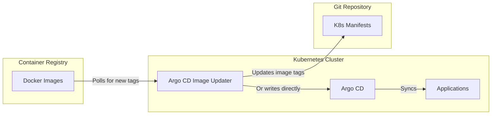

# Argo CD Image Updater

Argo CD Image Updater is an optional add-on that automatically updates container images in Argo CD applications when new versions are published to a registry. It works by monitoring image repositories and writing updated image tags back to Git or directly to Argo CD.

## Architecture



## Installation

Argo CD Image Updater is deployed through the `argocd-image-updater.yaml` Argo CD application.

### What it does

1. Deploys the Image Updater controller in the `argocd` namespace
2. Configures registry credentials (if needed)
3. Watches annotated Argo CD applications for image updates

### Prerequisites

- `install-argocd` must be completed

### Inputs

None. The step is fully automated if enabled.

## Configuration

### Application Annotations

To enable image updates for an application, add annotations to the Argo CD Application manifest:

```yaml
apiVersion: argoproj.io/v1alpha1
kind: Application
metadata:
  name: my-app
  namespace: argocd
  annotations:
    argocd-image-updater.argoproj.io/image-list: myapp=ghcr.io/myorg/myapp
    argocd-image-updater.argoproj.io/myapp.update-strategy: semver
    argocd-image-updater.argoproj.io/myapp.allow-tags: regexp:^v.*
    argocd-image-updater.argoproj.io/write-back-method: git
```

| Annotation | Description |
|------------|-------------|
| `image-list` | Comma-separated list of images to watch |
| `update-strategy` | `semver`, `latest`, `digest`, `name` |
| `allow-tags` | Regex filter for acceptable tags |
| `write-back-method` | `git` (commit to repo) or `argocd` (direct to API) |

### Update Strategies

| Strategy | Behavior |
|----------|----------|
| `semver` | Updates to the highest semantic version (e.g. `v1.2.3` → `v1.2.4`) |
| `latest` | Updates to the newest tag by timestamp |
| `digest` | Updates to the newest image digest (immutable tags) |
| `name` | Updates to the lexicographically highest tag |

### Write-Back Methods

- **git** — Image Updater clones the repo, updates the manifest, commits, and pushes. Argo CD then syncs normally. This preserves Git as the source of truth.
- **argocd** — Image Updater writes directly to the Argo CD API. Faster but does not update Git.

Twinbox defaults to `git` write-back to maintain the GitOps workflow.

## Verification

```bash
kubectl -n argocd get pods -l app.kubernetes.io/name=argocd-image-updater
kubectl -n argocd logs deployment/argocd-image-updater
```

## Troubleshooting

### No updates happening

```bash
# Check the updater logs
kubectl -n argocd logs deployment/argocd-image-updater | grep -i error

# Verify application annotations
kubectl -n argocd get application <app-name> -o yaml | grep -A 10 annotations

# Check registry access
kubectl -n argocd exec deploy/argocd-image-updater -- curl -s https://ghcr.io/v2/
```

### Git write-back fails

```bash
# Verify the updater has a valid Git token
kubectl -n argocd get secret argocd-image-updater-git-creds

# Check Git permissions
kubectl -n argocd logs deployment/argocd-image-updater | grep -i git
```

## Security Notes

- Image Updater needs read access to image registries
- For Git write-back, it needs push access to the repository
- Use a dedicated GitHub token or deploy key with minimal permissions
- Never give Image Updater admin access to the repository

## When to Use

Use Argo CD Image Updater for:
- Automatically rolling out new application versions
- Keeping dev/test environments up to date
- Patch-level security updates

Avoid for:
- Production environments requiring manual approval
- Applications with complex rollout strategies (canary, blue/green)
- Infrastructure components where version pinning is critical
