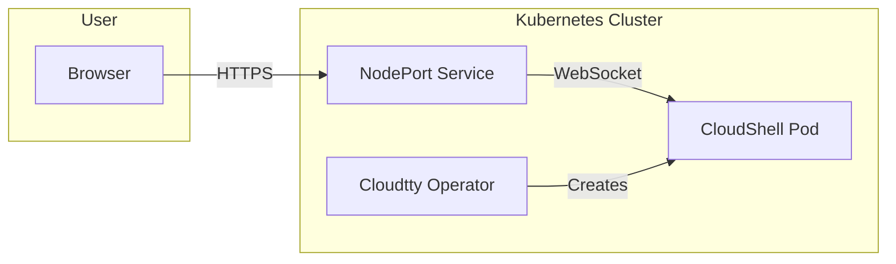

# Cloudtty

Cloudtty is a Kubernetes operator that provides browser-based terminal access to the cluster. It creates disposable CloudShell instances that run directly in the cluster, accessible through a NodePort service.

## Architecture



## Installation

The `install-cloudtty` step deploys the Cloudtty operator and creates a default CloudShell instance.

### What it does

1. Installs the Cloudtty operator with Helm
2. Creates a default CloudShell instance
3. Exposes it through a NodePort service

### Prerequisites

- `install-argocd` must be completed

### Inputs

None. The step is fully automated.

## Access

After installation, access the CloudShell through the NodePort:

```bash
# Get the NodePort
kubectl -n cloudtty get svc cloudshell

# Access via any node IP
https://<node-ip>:<node-port>
```

The CloudShell runs with cluster-admin privileges by default. It is intended for operator use only and should not be shared with end users.

## Security

- CloudShell pods run with `cluster-admin` service account
- Access is through NodePort, not ingress
- No authentication is enforced by Cloudtty itself
- Restrict network access to the NodePort range (default: 30000-32767) at the firewall level

## Verification

```bash
kubectl -n cloudtty get pods
kubectl -n cloudtty get cloudshell
kubectl -n cloudtty get svc
```

## Troubleshooting

### CloudShell not opening

```bash
kubectl -n cloudtty logs deployment/cloudtty-operator
kubectl -n cloudtty describe pod -l app.kubernetes.io/name=cloudtty
```

Check for resource constraints or image pull errors.

### NodePort not accessible

```bash
# Verify the service
curl -k https://<node-ip>:<node-port>

# Check firewall rules
sudo iptables -L -n | grep <node-port>
```

Ensure the NodePort range is open on your network firewall or cloud security groups.
