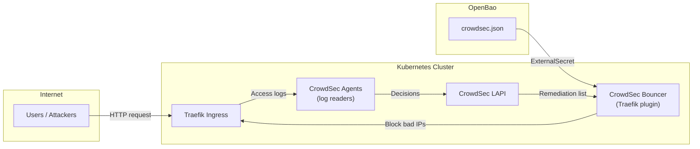

# CrowdSec

CrowdSec is a collaborative intrusion detection system (IDS) that analyzes service logs for suspicious behavior and exposes remediation decisions to Traefik through a bouncer plugin.

## Architecture



## Components

| Component | Purpose |
|-----------|---------|
| **LAPI** (Local API) | Central decision engine that collects signals from agents and serves block lists |
| **Agents** | Log parsers that read Traefik access logs and detect suspicious patterns |
| **Bouncer** | Traefik plugin that queries the LAPI and blocks known-bad client IPs |

## Installation

The `install-crowdsec` step runs automatically during platform setup.

### What it does

1. Generates or reuses a CrowdSec Traefik bouncer key
2. Stores the key in OpenBao at `twinbox/global/crowdsec`
3. Materializes the Kubernetes Secrets through External Secrets Operator
4. Applies the CrowdSec Argo CD application
5. Configures Traefik to use the CrowdSec bouncer plugin

### Prerequisites

- `install-secret-sync` must be completed (OpenBao + External Secrets)
- `install-traefik` must be completed (Traefik must be running)

### Inputs

None. The step is fully automated.

## Configuration

### Traefik Integration

The CrowdSec bouncer is configured as a Traefik plugin through the `crowdsec-bouncer` middleware. All ingress routes that want CrowdSec protection must reference this middleware.

The middleware is defined in the Traefik values and reads the bouncer key from the `crowdsec-bouncer-credentials` secret.

### Alerting

CrowdSec decisions are exposed as Prometheus metrics. The default alert rules include:

- High rate of blocked IPs
- LAPI unreachable
- Agent not reporting

These alerts route through Alertmanager to ntfy.

## Verification

```bash
kubectl -n crowdsec get pods
kubectl -n crowdsec get externalsecret
kubectl -n crowdsec get secret crowdsec-bouncer-credentials
kubectl -n traefik exec deploy/traefik -- wget -qO- http://crowdsec-service.crowdsec.svc.cluster.local:8080
```

## Troubleshooting

### Bouncer returns 403 for all requests

If the bouncer key is missing or invalid, Traefik may block all traffic.

```bash
# Verify the secret
kubectl -n crowdsec get secret crowdsec-bouncer-credentials -o jsonpath='{.data.CROWDSEC_BOUNCER_KEY}' | base64 -d

# Verify ExternalSecret status
kubectl -n crowdsec get externalsecret crowdsec-bouncer-credentials

# Regenerate the key
# Rerun the install-crowdsec step in the wizard
```

### Agents not reading logs

```bash
kubectl -n crowdsec logs daemonset/crowdsec-agent
```

Check that the Traefik access log path is mounted correctly and that the agent has permissions to read it.

### LAPI unreachable

```bash
kubectl -n crowdsec get svc crowdsec-service
kubectl -n crowdsec get pods -l app=crowdsec-lapi
```

Verify the LAPI pod is running and the service selector matches.

## Security Notes

- The bouncer key is scoped to read-only access to the LAPI decision stream
- CrowdSec agents run with minimal privileges and only read log files
- The LAPI does not expose write endpoints to the bouncer
- Block decisions are local to your cluster; community signals are optional and disabled by default
