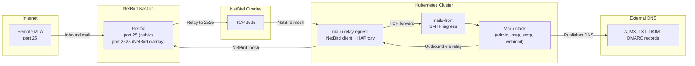

# Mailu

Mailu is a mail server suite deployed on the Kubernetes cluster that uses the existing NetBird bastion as a public SMTP edge. The first version supports one mail domain, the cluster `public_zone_name`, with `mail.<public-zone>` as the public mail hostname.

## Architecture



## Components

| Component | Location | Purpose |
|-----------|----------|---------|
| **Mailu Helm chart** | Namespace `mailu` | Full mail stack: SMTP, IMAP, admin UI, Roundcube webmail |
| **mailu-front** | Kubernetes Service | Internal SMTP/IMAP/submission endpoint |
| **mailu-relay-egress** | Namespace `netbird` | NetBird client + HAProxy that forwards SMTP to the bastion overlay |
| **Bastion Postfix** | NetBird bastion | Public SMTP edge on `25/tcp`, SASL-relay on `2525/tcp` (NetBird only) |
| **External Secrets** | OpenBao -> K8s | Mailu runtime, internal TLS, relay, and DNS secrets |
| **DNSEndpoint** | external-dns | Publishes MX, SPF, DKIM, DMARC records |
| **Traefik IngressRoute** | Namespace `mailu` | HTTPS for `mail.<public-zone>` admin/Webmail UI |

## Runtime Shape

- Mailu runs in namespace `mailu` through the official Mailu Helm chart pinned to chart `2.7.1` (app version `2024.06.51`).
- Mailu UI traffic is exposed through Traefik at `https://mail.<zone>`.
- Mailu SMTP/IMAP/submission ports stay internal to Kubernetes.
- The NetBird bastion runs Postfix and exposes only public inbound SMTP on `25/tcp`.
- Mailu sends outbound mail to `mailu-relay-egress.netbird.svc.cluster.local:2525`.
- The `mailu-relay-egress` pod runs a dedicated NetBird client and HAProxy TCP forwarder to the bastion's NetBird overlay address on port `2525`.
- Mailu v1 uses one `ReadWriteOnce` shared PVC. The installer labels one Ready worker node with `twinbox.io/mailu-storage-node=<cluster-slug>` and pins the shared-PVC Mailu workloads to that node to avoid Longhorn multi-attach failures.
- Apache Tika full-text indexing is disabled in v1 to keep the first mail install small and reliable.
- Mailu uses its own built-in login system for admin and webmail authentication.

## Authentication

Users authenticate directly through Mailu's admin UI. The initial admin credentials are set via the `initialAccount` Helm values during installation. The password is stored in OpenBao at `twinbox/global/mailu-runtime` (key: `initial-admin-password`) and materialized as a Kubernetes secret.

## DNS

The installer creates a `DNSEndpoint` named `mailu-mail-dns` in the `external-dns` namespace after Mailu has generated DKIM material.

| Record | Value |
|--------|-------|
| `A mail.<zone>` | `<bastion IPv4>` |
| `MX <zone>` | `10 mail.<zone>.` |
| `TXT <zone>` | `v=spf1 mx -all` |
| `TXT _dmarc.<zone>` | `v=DMARC1; p=<policy>; rua=mailto:<rua>@<zone>; adkim=s; aspf=s` |
| `TXT <selector>._domainkey.<zone>` | Mailu exported DKIM value |

`external-dns` is configured to manage MX records. PTR/rDNS is not automated and must be configured manually at the IP owner:

```text
<bastion IPv4> -> mail.<zone>
```

## Bastion Postfix

`scripts/manager/configure-bastion-mailu-postfix.sh` installs and configures Postfix over SSH.

Key guardrails:
- `mynetworks` is limited to localhost.
- Public inbound SMTP accepts mail only for the configured Mailu domain.
- Outbound relay on `2525` requires SASL authentication over TLS.
- `2525` is bound to the NetBird/private address, not `0.0.0.0`.
- The Hetzner firewall only opens `25/tcp`; it does not open `2525/tcp`.
- Relay credentials are passed through a root-only temporary file, never as process arguments.

NetBird guardrails:
- A dedicated `mailu-relay-egress` NetBird group and setup key are created by the NetBird network OpenTofu module.
- NetBird policy permits the Mailu egress peer to reach the bastion proxy peer on TCP `2525`.
- The setup key is synced to OpenBao and exposed to Kubernetes with an ExternalSecret.

## Secrets

OpenBao paths:

| Path | Keys |
|------|------|
| `twinbox/global/mailu-runtime` | `secret-key`, `api-token`, `initial-admin-password` |
| `twinbox/global/mailu-certificates` | `mail-hostname`, `tls.crt`, `tls.key` |
| `twinbox/global/mailu-relay` | `relay-username`, `relay-password` |
| `twinbox/global/mailu-dns` | `mail_domain`, `mail_hostname`, `dkim_selector`, `dkim_txt_name`, `dkim_txt_value`, `spf_txt_name`, `spf_txt_value`, `dmarc_txt_name`, `dmarc_txt_value`, `mx_name`, `mx_value` |
| `twinbox/global/netbird-mailu-relay-egress` | `NB_SETUP_KEY`, `NB_MANAGEMENT_URL`, `NB_HOSTNAME` |

## GitOps Resources

| Resource | Purpose |
|----------|---------|
| `gitops/optional-apps/mailu.yaml` | Opt-in ApplicationSet used by the app installer (canonical) |
| `gitops/apps/mailu.yaml` | Direct/manual Application manifest for consistency |
| `gitops/values/mailu.yaml` | Mailu defaults, disables host ports/chart ingress/Tika, enables Roundcube, sets resource limits |
| `gitops/platform-apps/mailu/` | Namespace, ExternalSecrets, Traefik IngressRoutes, relay egress resources in `netbird` namespace |

The installer annotates the Argo CD cluster secret before enabling the optional app. Annotations:

| Annotation | Purpose |
|------------|---------|
| `twinbox.io/mailu-relay-host` | Patches the relay egress HAProxy target |
| `twinbox.io/mailu-admin-localpart` | Admin account local part |
| `twinbox.io/mailu-storage-size` | Persistent storage size |
| `twinbox.io/mailu-storage-node` | Node selector value for shared-PVC Mailu workloads |
| `twinbox.io/mailu-dmarc-rua-localpart` | DMARC RUA local part |

## Installer Flow

`categories/apps/steps/install-mailu/run.sh`:

1. Derives `public_zone_name`, `mail_domain`, and `mail_hostname`.
2. Loads the NetBird bastion secret and SSH key.
3. Discovers or validates the bastion NetBird overlay IP for the Mailu relay.
4. Generates or reuses Mailu runtime, internal TLS, and relay secrets.
5. Syncs secrets to OpenBao.
6. Labels a Ready worker node for Mailu shared storage.
7. Annotates the Argo CD cluster secret with Mailu render values.
8. Applies the Mailu Argo CD application.
9. Waits for ExternalSecrets, deployments, and statefulsets.
10. Discovers the `mailu-front` ClusterIP.
11. Configures bastion Postfix.
12. Verifies the bastion NetBird route and TCP connectivity to `mailu-front:25`.
13. Verifies the in-cluster relay service and the egress pod's NetBird path to the bastion relay on `2525`.
14. Exports Mailu DNS records and generates DKIM only when no existing DKIM record is present.
15. Creates `DNSEndpoint` records.
16. Writes step outputs, including the relay host, storage node, and PTR action required.

DNS is intentionally created after the NetBird route, relay egress, and Postfix checks. A failed install should not publish MX records that point production mail at an unverified edge.

## Security Notes

- The bastion Postfix is not an open relay: it accepts public SMTP only for the configured domain, requires SASL for outbound relay, and binds the relay listener to the NetBird overlay address only.
- Mailu internal ports are never exposed on a public Kubernetes LoadBalancer.
- DKIM is generated once and reused on subsequent installs to avoid DNS churn.
- Relay credentials are stored in OpenBao and materialized through External Secrets.

## Verification

```bash
bash -n categories/apps/steps/install-mailu/run.sh
bash -n scripts/manager/configure-bastion-mailu-postfix.sh
python3 -m pytest -q tests/test_mailu_gitops.py
helm template mailu mailu/mailu --version 2.7.1 --namespace mailu \
  -f gitops/values/mailu.yaml \
  --set domain=example.com \
  --set hostnames[0]=mail.example.com \
  --set initialAccount.domain=example.com \
  --set externalRelay.host='[mailu-relay-egress.netbird.svc.cluster.local]:2525'
```

Live production validation must also include public DNS checks, PTR/rDNS, Postfix `postfix check` on the bastion, and an external open-relay test.

## Kubernetes Resources

```bash
kubectl -n mailu get pods,svc,externalsecret
kubectl -n netbird get pods -l app=mailu-relay-egress
kubectl -n mailu get ingressroute
kubectl -n external-dns get dnsendpoint mailu-mail-dns
```

## Troubleshooting

| Symptom | Likely cause | Check |
|---------|-------------|-------|
| Mailu pods are pending or CrashLoopBackOff | External Secrets not synced, PVC not provisioned, storage-node label missing, or Longhorn not ready | `kubectl -n mailu get externalsecret`, `kubectl -n mailu get pvc`, and `kubectl get nodes -l twinbox.io/mailu-storage-node` |
| Outbound mail is queued but not delivered | Relay egress pod is not connected to NetBird, or bastion Postfix relay is down | `kubectl -n netbird logs deployment/mailu-relay-egress` and verify NetBird peer status |
| Public SMTP rejects inbound mail | DNS MX record not yet published, bastion Postfix not configured, or Hetzner firewall blocks `25/tcp` | `dig MX <zone>`, `ssh bastion postfix check`, check Hetzner firewall rules |
| `mail.<zone>` does not load in browser | Traefik IngressRoute missing or certificate not issued | `kubectl -n mailu get ingressroute` and check cert-manager certificate status |
| DKIM signature fails recipient checks | DKIM record missing or mismatch | `dig TXT <selector>._domainkey.<zone>` and compare with Mailu exported value |
| Admin login fails after install | Initial admin password not synced or password changed externally | Check OpenBao `twinbox/global/mailu-runtime` and materialized Kubernetes secret |

## Comparison

| Feature | Mailu (Twinbox) | External SMTP relay |
|---------|-----------------|---------------------|
| Self-hosted | Yes | No |
| Public inbound SMTP | Bastion Postfix edge | Provider handles it |
| DKIM/DMARC/SPF | Automated via ExternalDNS | Provider-managed or manual |
| Webmail (Roundcube) | Included | Usually separate |
| Single domain | Yes (v1) | Any number |
| Maintenance burden | Moderate (K8s + bastion) | Low (SaaS) |
