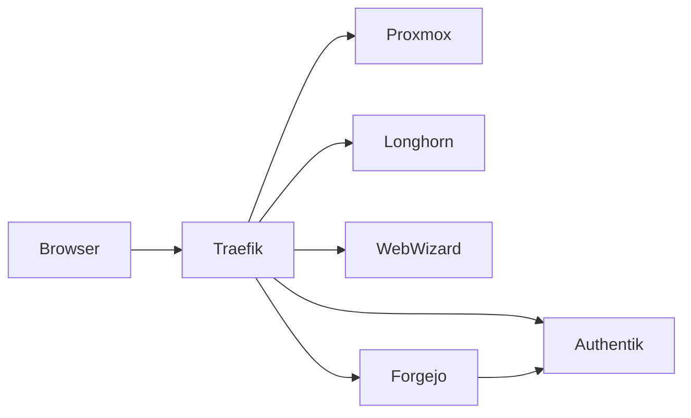

# Management Consoles

The `install-management-consoles` step publishes operator interfaces through Traefik and Authentik. Proxmox, Longhorn, Hubble, and the Twinbox Web Wizard use Authentik proxy applications. Forgejo uses native Authentik OIDC.

| Console | URL | Target | Authentication |
|---|---|---|---|
| Proxmox | `https://proxmox.<ZONE_NAME>` | Proxmox API | Authentik proxy |
| Longhorn | `https://longhorn.<ZONE_NAME>` | In-cluster frontend | Authentik proxy |
| Web Wizard | `https://webwizard.<ZONE_NAME>` | Management VM port 3000 | Authentik proxy |
| Forgejo | `https://forgejo.<ZONE_NAME>` | Management VM port 3001 | Native OIDC |

The Management VM no longer provides SeaweedFS filer or admin consoles. The independent, cluster-native application-media store retains `s3-admin.<ZONE_NAME>` and is installed by `install-seaweedfs-object-store`, not by this step. A dedicated backup SeaweedFS VM is managed as infrastructure and is not exposed as a public management console.

Management-VM and Proxmox endpoints are rendered from runtime-discovered addresses by `scripts/manager/ensure-management-endpoints.sh`; fixed addresses are never part of the manifests.
