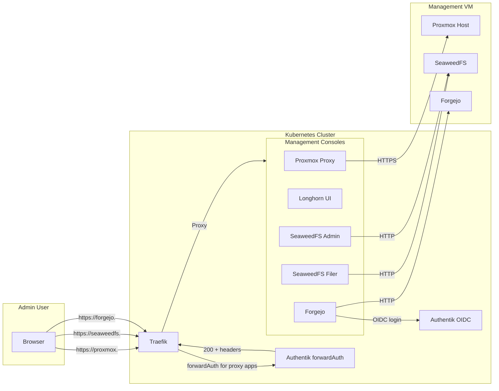

# Management Consoles

The `install-management-consoles` step publishes operator web consoles and wires them into Authentik. It runs after the portal and Dashy are online so the Traefik, Longhorn, Proxmox, Forgejo, and SeaweedFS web UIs can be published. Proxmox, Longhorn, Hubble, Web Wizard, and the SeaweedFS UI use Authentik proxy applications; SeaweedFS also exposes `/cache` anonymously for Mastodon media by rewriting it to the `mastodon` bucket on the S3 endpoint. Forgejo uses native Authentik OIDC login inside Forgejo.

## Architecture



## Published Consoles

| Console | URL | Target | Auth |
|---------|-----|--------|------|
| Proxmox | `https://proxmox.<ZONE_NAME>` | Proxmox host API | Authentik |
| SeaweedFS Filer | `https://seaweedfs.<ZONE_NAME>` | SeaweedFS filer UI | Authentik |
| SeaweedFS Admin | `https://seaweedfs-admin.<ZONE_NAME>` | SeaweedFS admin dashboard | Authentik |
| Forgejo | `https://forgejo.<ZONE_NAME>` | Forgejo on Management VM port 3001 | Native Authentik OIDC in Forgejo |
| Longhorn UI | `https://longhorn.<ZONE_NAME>` | Longhorn frontend service | Authentik |
| Twinbox Wizard | `https://webwizard.<ZONE_NAME>` | Management VM port 3000 | Authentik |

## How It Works

### Proxmox Proxy

Proxmox runs on the host, not in Kubernetes. The console uses a Traefik `ServersTransport` with `insecureSkipVerify: true` to proxy HTTPS to the Proxmox host:

```yaml
# Traefik ServersTransport
apiVersion: traefik.io/v1alpha1
kind: ServersTransport
metadata:
  name: proxmox-transport
  namespace: traefik
spec:
  insecureSkipVerify: true
```

The Service and Endpoints point at the Proxmox host IP:

```yaml
apiVersion: v1
kind: Service
metadata:
  name: proxmox
  namespace: traefik
spec:
  ports:
    - port: 8006
      targetPort: 8006
---
apiVersion: v1
kind: Endpoints
metadata:
  name: proxmox
  namespace: traefik
subsets:
  - addresses:
      - ip: <PROXMOX_HOST>
    ports:
      - port: 8006
```

### SeaweedFS Proxy

SeaweedFS runs in Docker on the Management VM. The console proxies to the Management VM IP:

```yaml
apiVersion: v1
kind: Endpoints
metadata:
  name: seaweedfs
  namespace: traefik
subsets:
  - addresses:
      - ip: <MANAGEMENT_VM_IP>
    ports:
      - port: 8888
```

### Forgejo Proxy And Login

Forgejo runs in Docker on the Management VM. The console proxies to the Management VM port `3001`:

```yaml
apiVersion: v1
kind: Endpoints
metadata:
  name: forgejo
  namespace: longhorn-system
subsets:
  - addresses:
      - ip: <MANAGEMENT_VM_IP>
    ports:
      - port: 3001
```

Access to `https://forgejo.<ZONE_NAME>` is proxied by Traefik without the `authentik-forwardauth` middleware. Forgejo owns the login flow and shows a native Authentik/OIDC login button. The Authentik application slug is `forgejo`, the Forgejo auth source is named `authentik`, and the callback URL is:

```text
https://forgejo.<ZONE_NAME>/user/oauth2/authentik/callback
```

The management console step creates or updates the Authentik OAuth2 provider, stores the client credentials in OpenBao under `twinbox/global/forgejo-oidc`, sets `FORGEJO_ROOT_URL=https://forgejo.<ZONE_NAME>/` in `/opt/twinbox/.env`, recreates the Forgejo container, and then configures the Forgejo auth source with `forgejo admin auth add-oauth` or `forgejo admin auth update-oauth`.

The bootstrap helper still creates a local Forgejo admin account and stores the generated password in `/opt/twinbox/bootstrap/secrets/global/forgejo.json`. Treat that account as break-glass access for bootstrap or OIDC incidents.

### Longhorn UI

Longhorn UI runs inside the cluster. The console uses the standard Longhorn frontend service:

```bash
kubectl -n longhorn-system get svc longhorn-frontend
```

## Authentik Integration

Most consoles are registered as Authentik proxy applications:

1. **Application** — Created in Authentik with the console URL
2. **Provider** — Proxy provider pointing at the internal service
3. **Policy** — Group policy restricting access to the `admins` group
4. **Middleware** — Traefik `forwardAuth` middleware referencing the Authentik outpost

Forgejo is the exception: it is registered as an Authentik OAuth2/OpenID Connect provider and application, restricted to the `admins` group, and then configured as a Forgejo authentication source.

## Installation

The `install-management-consoles` step runs automatically during platform setup.

### Prerequisites

- `install-twinbox-portal` must be completed
- `install-dashy-dashboard` must be completed
- `install-traefik` must be completed
- `install-authentik-idp` must be completed

### Inputs

None. The step is fully automated.

## Configuration

### Adding a Custom Console

To add a new management console, create three files in `gitops/platform/management-consoles/`:

1. **Endpoints** — Point at the target IP
2. **Service** — Define the port
3. **IngressRoute** — Route through Traefik with forwardAuth

Example for a custom monitoring tool:

```yaml
# endpoints.yaml
apiVersion: v1
kind: Endpoints
metadata:
  name: custom-tool
  namespace: traefik
subsets:
  - addresses:
      - ip: 192.168.1.100
    ports:
      - port: 8080

# service.yaml
apiVersion: v1
kind: Service
metadata:
  name: custom-tool
  namespace: traefik
spec:
  ports:
    - port: 8080
      targetPort: 8080

# ingressroute.yaml
apiVersion: traefik.io/v1alpha1
kind: IngressRoute
metadata:
  name: custom-tool
  namespace: traefik
spec:
  entryPoints:
    - websecure
  routes:
    - kind: Rule
      match: Host(`custom-tool.<ZONE_NAME>`)
      middlewares:
        - name: authentik-forwardauth
          namespace: authentik
      services:
        - kind: Service
          name: custom-tool
          port: 8080
  tls: {}
```

Then register the application in Authentik and add a policy binding for the `admins` group.

## Verification

```bash
kubectl -n traefik get ingressroute | grep -E 'proxmox|seaweedfs|longhorn'
kubectl -n traefik get endpoints
kubectl -n traefik get service
kubectl -n authentik get application
```

## Troubleshooting

### Console returns 404

```bash
# Verify the IngressRoute exists
kubectl -n traefik get ingressroute <console-name>

# Verify the Service and Endpoints
kubectl -n traefik get svc <console-name>
kubectl -n traefik get endpoints <console-name>

# Check DNS
dig <console-name>.<ZONE_NAME>
```

### Console returns 502/503

The upstream service is unreachable. Check the Endpoints IP and port:

```bash
kubectl -n traefik describe endpoints <console-name>

# Test connectivity from Traefik
kubectl -n traefik exec deploy/traefik -- wget -qO- http://<endpoint-ip>:<port>
```

### Authentik login loop

If a proxy-authenticated console keeps redirecting to Authentik and back:

1. Verify the Authentik application URL matches the IngressRoute host
2. Check that the provider redirect URI includes the callback path
3. Ensure the `authentik-forwardauth` middleware is applied

```bash
kubectl -n authentik get application <console-name> -o yaml
kubectl -n traefik get middleware authentik-forwardauth -o yaml
```

For Forgejo OIDC, verify the auth source and callback instead:

```bash
docker exec twinbox-forgejo forgejo admin auth list --vertical-bars
kubectl -n longhorn-system get ingressroute forgejo -o yaml
```

## Security Notes

- Proxy consoles are protected by Authentik forwardAuth
- Forgejo is protected by native Authentik OIDC login in Forgejo
- Only members of the `admins` group can access them
- Proxmox proxy uses `insecureSkipVerify` because Proxmox uses a self-signed certificate
- SeaweedFS admin console has full write access to the object store
- Never expose management consoles without authentication
