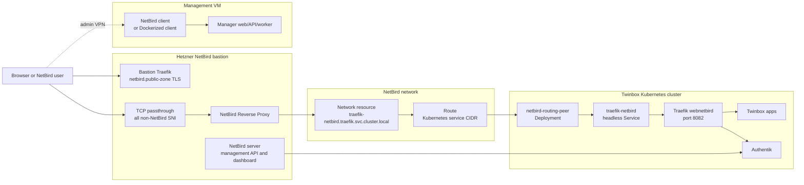

# NetBird

NetBird is the self-hosted ingress and VPN option for Twinbox. It gives the
cluster a public HTTPS entrypoint without exposing the Talos nodes or the
Management VM directly to the internet.

In the current Twinbox implementation, NetBird is used for two related paths:

- public application ingress through NetBird Reverse Proxy (auto-created per app)
- private administrator access to the Management VM through a NetBird peer

## Components

| Component | Location | Purpose |
| --- | --- | --- |
| NetBird bastion | Hetzner Cloud VPS | Runs the self-hosted NetBird server, dashboard, management API, embedded relay/proxy stack, Docker, and Traefik for the NetBird hostname. |
| NetBird Reverse Proxy | Bastion Docker stack | Terminates public HTTPS for app hostnames such as `authentik.ZONE` and forwards requests into the NetBird network. |
| NetBird network resources | NetBird management API | Defines the internal Traefik target, groups, setup keys, routes, and policies. |
| Routing peer | Kubernetes namespace `netbird` | Runs `netbirdio/netbird:0.70.5` with privileged networking and forwards proxy traffic to the cluster service network. |
| Traefik NetBird backend | Kubernetes service `traefik/traefik-netbird` | Headless service exposing Traefik's `webnetbird` entrypoint on port `8082`. |
| Authentik OIDC app | Authentik | Lets NetBird use Twinbox Authentik as its identity provider. |
| Management VM peer | Management VM | Enrolls the Management VM as `twinbox-mgmt-<cluster-slug>` for admin access. |



## Traffic Model

Twinbox creates two public DNS records for NetBird:

- `netbird.<public-zone>` points to the NetBird dashboard and management API
- `<public-zone>` (wildcard) points to the NetBird proxy endpoint

The bastion also receives a wildcard DNS record for the selected public zone:

```text
*.public-zone -> NetBird bastion IPv4
```

The bastion Traefik stack terminates HTTPS only for
`netbird.<public-zone>`. It must serve an exact certificate whose SAN contains
only `netbird.<public-zone>`. It must not load or serve a wildcard
`*.public-zone` certificate. Browsers can reuse an HTTP/2 connection across
origins when the certificate is valid for both names; if NetBird serves a
wildcard certificate, a browser can send the later Authentik authorize request
over the existing NetBird connection. That request then reaches bastion Traefik
as HTTP traffic instead of as raw TLS passthrough and can fail with Traefik's
`404 page not found` and `router: "-"`.

All non-NetBird hostnames, including `authentik.<public-zone>` and app
hostnames, are handled by a TCP passthrough router on the bastion proxy
container:

```text
HostSNI(*) && !HostSNI(netbird.<public-zone>)
```

That passthrough route forwards the original TLS connection to NetBird Reverse
Proxy. The reverse proxy owns the app and Authentik certificates and routes each
hostname through the NetBird network. Reverse proxy services are auto-created
during application installation by the `ensure-netbird-service.sh` helper. Each
service targets the NetBird network resource for the internal Traefik backend:

```text
traefik-netbird.traefik.svc.cluster.local:8082
```

Services are created per-application as each `install-*` step runs, using the
helper script that reads credentials from the bastion secret. The
`configure-netbird-ingress` step no longer creates services — only groups,
routes, setup keys, and the Traefik resource.

Inside Kubernetes, `gitops/platform/traefik/traefik-netbird-service.yaml`
creates a headless service named `traefik-netbird`. That service selects the
Traefik pods and forwards to the `webnetbird` entrypoint. Routes that must work
through NetBird use that entrypoint; Authentik has a dedicated
`authentik-netbird` IngressRoute so OIDC discovery is reachable before NetBird
SSO is registered.

## Wizard Flow

### 1. Choose NetBird

`choose-ingress-route` records `netbird` as the selected ingress route. For
non-production clusters this is the available route; production clusters can
also use Cloudflare Tunnel.

The public zone is derived with `scripts/manager/cluster-public-zone.sh`. A
production cluster normally uses the configured DNS domain directly, while
non-production clusters use the slug-prefixed zone model.

### 2. Provision NetBird Bastion

Step: `provision-netbird-bastion`

This step creates the Hetzner VPS and bootstraps the NetBird server stack.

Inputs:

| Input | Required | Notes |
| --- | --- | --- |
| `hcloud_token` | Yes | Hetzner Cloud token with permissions to create servers, SSH keys, and firewalls. |
| `hcloud_location` | No | Defaults to `fsn1`. |
| `hcloud_server_type` | No | Defaults to `cax11`. |
| `netbird_admin_email` | Usually no | Falls back to the first admin email from `create-users-and-groups`. |
| `ssh_public_key` | No | If omitted, Twinbox generates and stores an ed25519 key under `manager-data/ssh/netbird-<cluster-id>/`. |

The step:

1. reads DNS provider credentials from the `external-dns-credentials` secret
2. removes stale Hetzner resources with the same Twinbox names
3. applies `infra/opentofu/netbird/`
4. creates `netbird.<public-zone>` and `<public-zone>` (wildcard) `DNSEndpoint` records
5. waits for cloud-init to finish on the bastion
6. calls NetBird's automated setup API and stores the short-lived personal access token

The bastion cloud-init config installs Docker, runs NetBird's upstream
`getting-started.sh`, patches the compose stack for Twinbox defaults, pins the
NetBird image to `PINNED_NETBIRD_VERSION`, enables the reverse proxy, configures
DNS-01 for the exact NetBird hostname, and opens `22/tcp`, `80/tcp`, `443/tcp`,
and `3478/udp` with UFW.

The compose patch deliberately does not create a bastion HTTP wildcard router.
There should be no `traefik.http.routers.wildcard`, `cluster-proxy`, or HTTP
`proxy-insecure` transport labels on the bastion Traefik or proxy containers.
The bastion Traefik dynamic file should contain only the TCP `pp-v2`
serversTransport used by the passthrough service; it should not contain
`tls.certificates` for `/certs/live/<zone>.crt`.

For greenfield bootstrap, the automated setup call is intentionally made over
the bastion's internal Docker network with the public NetBird hostname in the
`Host` header. `NETBIRD_URL` remains the public `https://netbird.<public-zone>`
URL stored for clients, but creating the initial personal access token does not
depend on the public certificate already being trusted. After the token is
written, cloud-init performs a public TLS healthcheck and logs a warning if
Let's Encrypt issuance is still pending or temporarily rate-limited. That
warning does not make this step fail; missing a setup token still does.

Runtime secret:

```text
/opt/twinbox/bootstrap/secrets/global/netbird-bastion-<cluster-id>.json
```

Important keys in that file:

| Key | Meaning |
| --- | --- |
| `NETBIRD_IP` | Bastion public IPv4 address. |
| `NETBIRD_URL` | Management URL, for example `https://netbird.example.com`. |
| `NETBIRD_FQDN` | Dashboard/API FQDN (e.g. `netbird.example.com`). |
| `NETBIRD_SETUP_TOKEN` | Personal access token from the bootstrap setup API. |
| `SSH_PRIVATE_KEY` | Present when Twinbox generated the bastion SSH key. |

### 3. Configure NetBird Ingress

Step: `configure-netbird-ingress`

This is the main integration step. It connects Authentik, NetBird, OpenBao,
Argo CD, Traefik, and DNS.

Inputs:

| Input | Required | Notes |
| --- | --- | --- |
| `netbird_token` | No | Uses `NETBIRD_SETUP_TOKEN` from the bastion secret when omitted. |
| `netbird_management_url` | No | Uses `NETBIRD_URL` from the bastion secret when omitted. |
| `traefik_resource_address` | No | Defaults to `traefik-netbird.traefik.svc.cluster.local`. |
| `proxy_services_json` | No | Extra reverse proxy services. Authentik is always included. Services are auto-created during application installation; this form is for initial setup only. |

The step runs three OpenTofu modules:

| Module | Runtime workdir | Purpose |
| --- | --- | --- |
| `infra/opentofu/authentik-netbird/` | `manager-data/opentofu/authentik-netbird-<cluster-id>/` | Creates the Authentik OAuth/OIDC provider for NetBird. |
| `infra/opentofu/netbird-network/` | `manager-data/opentofu/netbird-network-<cluster-id>/` | Creates groups, setup keys, routes, the Traefik network resource, and policies. |
| `infra/opentofu/netbird-idp/` | `manager-data/opentofu/netbird-idp-<cluster-id>/` | Registers Authentik as the NetBird identity provider. |

Reverse proxy services are auto-created during application installation by the
`ensure-netbird-service.sh` helper script.

NetBird groups:

| Group | Purpose |
| --- | --- |
| `twinbox-<cluster-id>-admins` | Administrators that can reach the Management VM. |
| `twinbox-<cluster-id>-management-vm` | Management VM peer group. |
| `twinbox-<cluster-id>-k8s-routers` | Kubernetes routing peer group. |
| `twinbox-<cluster-id>-proxy` | Reverse proxy route/resource group. |

NetBird setup keys:

| Key | Usage |
| --- | --- |
| `twinbox-<cluster-id>-k8s-routers` | Reusable setup key for the Kubernetes routing peer. |
| `twinbox-<cluster-id>-management-vm` | Single-use setup key for the Management VM peer. |

Network and policy details:

- NetBird network name: `twinbox-<cluster-id>`
- Traefik resource: `twinbox-<cluster-id>-traefik`
- Traefik resource address: `traefik-netbird.traefik.svc.cluster.local` by default
- Kubernetes service route: discovered from the API server, falling back to `10.96.0.0/12`
- Route `groups`: proxy group
- Route `peer_groups`: Kubernetes routing peer group
- Reverse proxy policy: allows the NetBird `All` group to reach the Traefik resource on TCP `8082`
- Admin policies: allow the admins group to reach the Management VM group on SSH, manager web, and manager API ports

After creating the network resources, the step syncs these runtime secrets into
OpenBao:

| OpenBao secret | Source file | Keys |
| --- | --- | --- |
| `twinbox/global/netbird-routing-peers` | `/opt/twinbox/bootstrap/secrets/global/netbird-routing-peers-<cluster-id>.json` | `NB_SETUP_KEY`, `NB_MANAGEMENT_URL` |
| `twinbox/global/netbird-admin-access` | `/opt/twinbox/bootstrap/secrets/global/netbird-admin-access-<cluster-id>.json` | `NB_SETUP_KEY`, `NB_MANAGEMENT_URL` |

It then applies the `netbird-routing-peers` Argo CD application, waits for the
routing peer deployment, waits for the Traefik NetBird backend endpoints, creates
the wildcard DNS record, waits for public Authentik OIDC discovery through the
NetBird proxy, and finally registers Authentik as the NetBird identity provider.

Reverse proxy services are created by each `install-*` step through the
`ensure-netbird-service.sh` helper script rather than during this configuration
step. Public OIDC discovery is allowed to
log a warning and continue when public TLS or reverse-proxy reachability is not
healthy yet, so the NetBird API configuration can still finish. Browser SSO is
only healthy once the public NetBird path has a trusted certificate and can
reach Authentik.

The step also seeds the NetBird account database over SSH so the account domain
matches the Twinbox public zone and the first Authentik admin can become the SSO
owner. Before editing the NetBird store database, it writes a timestamped backup
under `/opt/netbird/twinbox-db-backups` on the bastion.

### 4. Install Routing Peers

Step: `install-netbird-routing-peers`

This step applies the same Argo CD application explicitly:

```text
gitops/apps/netbird-routing-peers.yaml
```

The application deploys:

- namespace `netbird`
- ExternalSecret `netbird-routing-peers`
- Deployment `netbird-routing-peer`

The routing peer container reads `NB_SETUP_KEY` and `NB_MANAGEMENT_URL` from the
Kubernetes secret created by External Secrets. It runs privileged with
`NET_ADMIN`, `SYS_ADMIN`, and `SYS_RESOURCE`, mounts `/dev/net/tun`, and keeps
NetBird state in an `emptyDir`.

### 5. Configure Admin Access

Step: `configure-netbird-admin-access`

This enrolls the Management VM as a NetBird peer named:

```text
twinbox-mgmt-<cluster-slug>
```

The step reads:

```text
/opt/twinbox/bootstrap/secrets/global/netbird-admin-access-<cluster-id>.json
```

If the host has a native `netbird` client and systemd, the step runs
`netbird up`. Otherwise, when Docker is available, it starts a Dockerized
NetBird client with host networking and a persistent Docker volume named
`twinbox-netbird`.

## GitOps Manifests

The NetBird routing peer application is committed under:

```text
gitops/platform-apps/netbird-routing-peers/
```

The platform Traefik backend is committed under:

```text
gitops/platform/traefik/traefik-netbird-service.yaml
```

The Authentik NetBird route and forwarded-header middleware are committed under:

```text
gitops/platform/authentik/ingressroute.yaml
gitops/platform/authentik/netbird-forwarded-headers-middleware.yaml
```

The forwarded-header middleware forces `X-Forwarded-Proto=https` and
`X-Forwarded-Port=443` for the NetBird path so Authentik emits public HTTPS OIDC
URLs even though the in-cluster backend connection is plain HTTP on the
`webnetbird` entrypoint.

## Runtime State

Do not edit these as source files. They are created by the wizard on the
Management VM:

```text
/opt/twinbox/bootstrap/secrets/global/netbird-bastion-<cluster-id>.json
/opt/twinbox/bootstrap/secrets/global/netbird-routing-peers-<cluster-id>.json
/opt/twinbox/bootstrap/secrets/global/netbird-admin-access-<cluster-id>.json
/opt/twinbox/bootstrap/secrets/global/netbird-network-<cluster-id>.json
manager-data/opentofu/netbird-<cluster-id>/
manager-data/opentofu/authentik-netbird-<cluster-id>/
manager-data/opentofu/netbird-network-<cluster-id>/
manager-data/opentofu/netbird-idp-<cluster-id>/
manager-data/ssh/netbird-<cluster-id>/
```

## Operations

### Auto-create services

The `ensure-netbird-service.sh` helper script creates or updates NetBird reverse
proxy services. It is called automatically by every `install-*` step that exposes
an app through Traefik.

Usage:

```bash
bash scripts/manager/ensure-netbird-service.sh \
  --service-name <name> \
  --service-domain <domain> \
  [--service-path /]
```

The script reads credentials from the bastion secret file
(`/opt/twinbox/bootstrap/secrets/global/netbird-bastion-<cluster-id>.json`),
finds the proxy cluster by domain, checks for an existing service by name+domain,
and either creates or updates it. It is idempotent.

### Check the routing peer

Run from the Management VM with the cluster kubeconfig:

```bash
kubectl -n netbird get deployment,pods,externalsecret,secret
kubectl -n netbird logs deployment/netbird-routing-peer
kubectl -n netbird rollout status deployment/netbird-routing-peer
```

### Check the Traefik backend

```bash
kubectl -n traefik get svc traefik-netbird
kubectl -n traefik get endpointslice -l kubernetes.io/service-name=traefik-netbird
```

The service should expose port `8082` and have ready endpoints for Traefik pods.

### Check NetBird API objects

Use the NetBird management API:

```text
https://netbird.<public-zone>/api/
```

Useful endpoints:

```text
/api/groups
/api/peers
/api/policies
/api/routes
```

Use the NetBird token from the Management VM runtime secret. Never print or
commit that token.

### Check the bastion

Find the bastion IP and SSH key from:

```text
/opt/twinbox/bootstrap/secrets/global/netbird-bastion-<cluster-id>.json
```

On the bastion:

```bash
docker ps
docker logs netbird-server
docker logs netbird-proxy
docker logs traefik
openssl s_client -connect 127.0.0.1:443 -servername netbird.<public-zone> </dev/null 2>/dev/null \
  | openssl x509 -noout -subject -ext subjectAltName
cat /opt/netbird/setup-result.json
```

The setup result contains credentials and tokens, so treat it as secret.

The NetBird certificate check should show `DNS:netbird.<public-zone>` and must
not show `DNS:*.public-zone`. A wildcard SAN on the NetBird hostname reopens the
browser HTTP/2 connection coalescing bug that broke NetBird login through
Authentik.

### Refresh External Secrets

If the routing peer is using stale credentials, force External Secrets to
refresh and recreate the pod:

```bash
kubectl -n netbird annotate externalsecret netbird-routing-peers force-sync="$(date +%s)" --overwrite
kubectl -n netbird delete pod -l app.kubernetes.io/name=netbird-routing-peer
```

### Management VM Peer

On the Management VM:

```bash
sudo netbird status
docker logs twinbox-netbird
```

Only one of those paths is expected to exist. Native `netbird` is used when
installed; otherwise the wizard uses the Dockerized client.

## Common Failure Modes

| Symptom | Likely cause | Check |
| --- | --- | --- |
| `netbird-routing-peer` is not created | Argo CD app was not applied or External Secrets is not ready | `kubectl -n argocd get app netbird-routing-peers` and `kubectl -n netbird get externalsecret` |
| Routing peer starts but proxy cannot reach apps | Traefik NetBird backend has no endpoints or NetBird route/policy is missing | Check `traefik-netbird` EndpointSlices and NetBird `/api/routes`, `/api/policies`. |
| Authentik OIDC discovery fails | The `authentik-netbird` route, forwarded-header middleware, NetBird reverse proxy service, or routing peer is missing/stale | Fetch `https://authentik.<public-zone>/.well-known/openid-configuration` through the public NetBird path and compare NetBird proxy plus in-cluster Authentik logs. |
| Browser lands on `https://authentik.<public-zone>/application/o/authorize/` and sees `404 page not found` | Bastion Traefik is terminating Authentik as HTTP instead of passing raw TLS to NetBird Reverse Proxy. The usual cause is that bastion Traefik serves a wildcard certificate for `netbird.<public-zone>`, allowing browser HTTP/2 connection coalescing. | Confirm the NetBird certificate has only `DNS:netbird.<public-zone>`, confirm there is no bastion HTTP wildcard router, and confirm `authentik.<public-zone>` uses the TCP passthrough route. |
| Browser or strict `curl` shows a certificate error for NetBird | Let's Encrypt issuance is still pending or the exact hostname hit a temporary rate limit; the bastion may be serving Traefik's default self-signed certificate | Check `/var/log/cloud-init-output.log` on the bastion and retry after the rate-limit window. The install can continue if the NetBird setup token was created. |
| Public app hostname resolves but returns no app | Reverse proxy service is missing or targets the wrong Traefik resource (check `netbird-network-<cluster-id>.json`) | Check NetBird reverse proxy services and `netbird-network-<cluster-id>.json`. |
| Management VM is unreachable over NetBird | The Management VM peer is not enrolled or admin group policy is missing | Check `netbird status`, the `twinbox-netbird` container, NetBird peers, and admin policies. |

### NetBird OIDC login check

When you need to verify the browser-side login path, test the exact authorize
URL from the management VM and expect a redirect into Authentik's login flow:

```bash
curl -sS -D - -o /dev/null \
  --get \
  --data-urlencode "client_id=<netbird-client-id>" \
  --data-urlencode "code_challenge=<pkce-challenge>" \
  --data-urlencode "code_challenge_method=S256" \
  --data-urlencode "redirect_uri=https://netbird.<public-zone>/oauth2/callback" \
  --data-urlencode "response_type=code" \
  --data-urlencode "scope=openid profile email" \
  --data-urlencode "state=<random-state>" \
  "https://authentik.<public-zone>/application/o/authorize/"
```

Expected result:

- `HTTP/2 302`
- `Location: /if/flow/default-authentication-flow/...`

The most reliable end-to-end signal is the browser flow itself. In the bastion
Traefik access log, a healthy flow shows:

- `GET /oauth2/auth...` on `netbird-backend@docker`
- redirect to Authentik through TCP passthrough, not `router: "-"`
- `GET /oauth2/callback?...` on `netbird-backend@docker` with `303`
- `POST /oauth2/token` on `netbird-backend@docker` with `200`
- authenticated API calls such as `/api/users/current` with `200`

Do not treat `curl` from the bastion host as proof that the browser path works:
fresh command-line requests usually open a new TLS connection and do not
reproduce browser HTTP/2 connection coalescing from `netbird.<public-zone>` to
`authentik.<public-zone>`.

## Comparison

| Feature | Cloudflare Tunnel | Wiredoor | NetBird |
| --- | --- | --- | --- |
| Self-hosted control plane | No | Yes, simple bastion | Yes, Hetzner NetBird bastion |
| Public app ingress | Yes | Yes | Yes, through NetBird Reverse Proxy |
| Mesh VPN | No | No | Yes |
| Authentik SSO for network access | No | No | Yes |
| Management VM private access | No | Limited to bastion model | Yes, via NetBird peer and policies |
| Requires routing peer in cluster | No | No | Yes |

NetBird is the most complete option when Twinbox needs both public app ingress
and private administrative network access under a self-hosted control plane.
