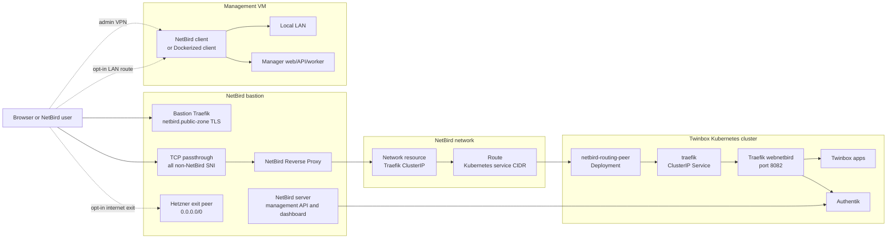
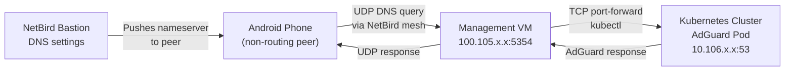

# NetBird

NetBird is the self-hosted ingress and VPN option for Twinbox. It gives the
cluster a public HTTPS entrypoint without exposing the Talos nodes or the
Management VM directly to the internet.

In the current Twinbox implementation, NetBird is used for five related paths:

- public application ingress through NetBird Reverse Proxy (auto-created per app)
- private administrator SSH access to the Management VM and bastion through NetBird peers
- browser SSH to the Management VM and bastion through a Termix NetBird sidecar
- opt-in local LAN access through the Management VM routing peer
- opt-in internet exit through a separate bastion routing peer

## Components

| Component | Location | Purpose |
| --- | --- | --- |
| NetBird bastion | Hetzner VPS or existing Debian/Ubuntu VM | Runs the self-hosted NetBird server, dashboard, management API, embedded relay/proxy stack, Docker, and Traefik for the NetBird hostname. |
| NetBird Reverse Proxy | Bastion Docker stack | Terminates public HTTPS for app hostnames such as `authentik.ZONE` and forwards requests into the NetBird network. |
| NetBird network resources | NetBird management API | Defines the internal Traefik ClusterIP target, groups, setup keys, routes, and policies. |
| Routing peer | Kubernetes namespace `netbird` | Runs `netbirdio/netbird:0.73.2` with privileged networking and forwards proxy traffic to the cluster service network. |
| Traefik NetBird backend | Kubernetes service `traefik/traefik` | Stable ClusterIP service exposing Traefik's `webnetbird` entrypoint on port `8082`. |
| Authentik OIDC app | Authentik | Lets NetBird use Twinbox Authentik as its identity provider. |
| Management VM peer | Management VM | Enrolls the Management VM as `twinbox-mgmt-<cluster-slug>` for admin access and local LAN routing. |
| Termix Browser SSH peer | Kubernetes namespace `termix` | Enrolls a privileged Termix sidecar as `twinbox-<cluster-id>-browser-ssh` so browser SSH reaches hosts over NetBird peer IPs. |
| Bastion proxy peer | NetBird bastion | Existing host-network `netbird-client` peer in the `proxy` group. It is also the NetBird SSH destination for the bastion host. |
| Bastion exit peer | NetBird bastion | Runs a separate Dockerized NetBird client named `twinbox-<cluster-id>-hetzner-exit` for opt-in internet exit traffic. |



## Traffic Model

Twinbox creates two public DNS records for NetBird:

- `netbird.<public-zone>` points to the NetBird dashboard and management API
- `<public-zone>` (wildcard) points to the NetBird proxy endpoint

The bastion also receives a wildcard DNS record for the selected public zone:

```text
*.public-zone -> NetBird bastion IPv4
```

The bastion Traefik stack terminates HTTPS only for
`netbird.<public-zone>`. It must serve an exact certificate whose SAN contains
only `netbird.<public-zone>`. It must not load or serve a wildcard
`*.public-zone` certificate. Browsers can reuse an HTTP/2 connection across
origins when the certificate is valid for both names; if NetBird serves a
wildcard certificate, a browser can send the later Authentik authorize request
over the existing NetBird connection. That request then reaches bastion Traefik
as HTTP traffic instead of as raw TLS passthrough and can fail with Traefik's
`404 page not found` and `router: "-"`.

All non-NetBird hostnames, including `authentik.<public-zone>` and app
hostnames, are handled by a TCP passthrough router on the bastion proxy
container:

```text
HostSNI(*) && !HostSNI(netbird.<public-zone>)
```

That passthrough route forwards the original TLS connection to NetBird Reverse
Proxy. The reverse proxy owns the app and Authentik certificates and routes each
hostname through the NetBird network. Reverse proxy services are auto-created
during application installation by the `ensure-netbird-service.sh` helper. Each
service targets the NetBird network resource for the internal Traefik backend:

```text
<traefik-cluster-ip>:8082
```

Services are created per-application as each `install-*` step runs, using the
helper script that reads credentials from the bastion secret. The
`configure-netbird-ingress` step no longer creates services — only groups,
routes, setup keys, and the Traefik resource.

Inside Kubernetes, NetBird targets Traefik's stable `traefik` ClusterIP service
on the `webnetbird` entrypoint. This avoids pinning NetBird reverse proxy
services to transient Traefik pod IPs, which would break when pods are replaced
during Talos or Kubernetes upgrades. It also avoids the public `websecure`
entrypoint middlewares, which are meant for Cloudflare/public browser traffic.
Public app and console routes should therefore keep their existing
`websecure` `IngressRoute` with `tls: {}` and define a matching
`<name>-netbird` `IngressRoute` on `webnetbird` without `tls`. The two routes
should use the same `Host(...)` match and backend service definition, and Argo
CD host patches must cover both route names.
Because Twinbox runs Cilium in kube-proxy-free mode,
`config/cilium-values.yaml` enables `bpf.lbExternalClusterIP` and
`socketLB.hostNamespaceOnly` so NetBird-forwarded packets inside the routing
peer pod can be load-balanced to ClusterIP services through the lower datapath.

## Wizard Flow

### 1. Choose NetBird

`choose-ingress-route` records `netbird` as the selected ingress route. For
non-production clusters this is the available route; production clusters can
also use Cloudflare Tunnel.

The public zone is derived with `scripts/manager/cluster-public-zone.sh`. A
production cluster normally uses the configured DNS domain directly, while
non-production clusters use the slug-prefixed zone model.

### 2. Provision NetBird Bastion

Step: `provision-netbird-bastion`

This step either creates a Hetzner VPS or bootstraps an existing Debian/Ubuntu
VM as the NetBird bastion. The existing VM path also covers a local VM where
SSH uses a LAN address and public DNS points at a router-forwarded public IPv4.

If Hetzner returns `resource_unavailable` while placing the default `cax11`
server, Twinbox retries once with `cpx22`.

Inputs:

| Input | Required | Notes |
| --- | --- | --- |
| `bastion_provider` | Yes | `hetzner` by default. Use `existing-vm` for a VM you created yourself. |
| `hcloud_token` | Hetzner only | Hetzner Cloud token with permissions to create servers, SSH keys, and firewalls. |
| `hcloud_location` | No | Defaults to `fsn1`. |
| `hcloud_server_type` | No | Defaults to `cax11` and falls back once to `cpx22` if Hetzner cannot place the default server. |
| `existing_bastion_mode` | Existing VM only | `cloud-vm` or `local-port-forward`. |
| `existing_bastion_public_ipv4` | Existing VM only | Public IPv4 used for DNS A records. |
| `existing_bastion_ssh_host` | Existing VM only | SSH endpoint reachable from the Management VM; this may be a private LAN address for local mode. |
| `existing_bastion_ssh_port` | Existing VM only | Defaults to `22`. SSH does not need to be publicly forwarded. |
| `existing_bastion_ssh_user` | Existing VM only | `root` for this version. |
| `existing_bastion_ssh_private_key` | Existing VM only | Private key used from the Management VM to bootstrap the host. |
| `existing_bastion_confirm_clean_host` | Existing VM only | Must be `true`; Twinbox refuses unmanaged `/opt/netbird/docker-compose.yml`. |
| `existing_bastion_confirm_port_forwarding` | Local VM only | Must be `true` after forwarding TCP `80`, TCP `443`, and UDP `3478` to the VM. |
| `netbird_admin_email` | Usually no | Falls back to the first admin email from `create-users-and-groups`. |
| `ssh_public_key` | No | If omitted, Twinbox generates and stores an ed25519 key under `manager-data/ssh/netbird-<cluster-id>/`. |

The step:

1. reads DNS provider credentials from the `external-dns-credentials` secret
2. for Hetzner, removes stale resources and applies `infra/opentofu/netbird/`
3. for existing VMs, SSHes to the supplied host and runs the shared bootstrap
4. creates `netbird.<public-zone>` and `<public-zone>` (wildcard) `DNSEndpoint` records
5. waits for cloud-init or the SSH bootstrap to finish on the bastion
6. calls NetBird's automated setup API and stores the short-lived personal access token

The shared bastion bootstrap installs Docker, runs NetBird's upstream
`getting-started.sh`, patches the compose stack for Twinbox defaults, pins the
NetBird image to `PINNED_NETBIRD_VERSION`, enables the reverse proxy, configures
DNS-01 for the exact NetBird hostname, and writes a Twinbox ownership marker at
`/opt/netbird/.twinbox-bastion.json`. Hetzner cloud-init enables UFW for SSH,
HTTP, HTTPS, and STUN. Existing VM mode only adjusts UFW when it is already
active; otherwise configure the provider firewall or router yourself.

For a local VM with port forwarding:

1. Reserve a stable LAN address for the bastion VM.
2. Forward TCP `80`, TCP `443`, and UDP `3478` to the VM.
3. Do not forward SSH unless you explicitly accept that exposure; Twinbox only
   needs SSH from the Management VM.
4. Confirm your ISP is not using CGNAT/DS-Lite for the public IPv4.
5. Use `existing_bastion_public_ipv4` for DNS A records and
   `existing_bastion_ssh_host` for the LAN SSH endpoint.

The compose patch deliberately does not create a bastion HTTP wildcard router.
There should be no `traefik.http.routers.wildcard`, `cluster-proxy`, or HTTP
`proxy-insecure` transport labels on the bastion Traefik or proxy containers.
The bastion Traefik dynamic file should contain only the TCP `pp-v2`
serversTransport used by the passthrough service; it should not contain
`tls.certificates` for `/certs/live/<zone>.crt`.
The bastion NetBird dashboard/API routers attach a `netbird-no-store`
headers middleware so stale browser-cached 404 or auth responses are not reused
after route or service changes.

The NetBird Reverse Proxy receives a separate DNS-01 wildcard certificate for
`<public-zone>` and `*.<public-zone>`. It is mounted only in the `netbird-proxy`
container at `/wildcard-certs` and enabled through
`NB_PROXY_WILDCARD_CERT_DIR=/wildcard-certs`. NetBird matches app SNI hostnames
against that certificate before ACME prefetch, so app installation does not
issue one Let's Encrypt certificate per service. A daily systemd timer renews
the wildcard certificate with `lego`; NetBird hot-reloads updated files.

For greenfield bootstrap, the automated setup call is intentionally made over
the bastion's internal Docker network with the public NetBird hostname in the
`Host` header. `NETBIRD_URL` remains the public `https://netbird.<public-zone>`
URL stored for clients, but creating the initial personal access token does not
depend on the public certificate already being trusted. After the token is
written, cloud-init performs a public TLS healthcheck and logs a warning if
Let's Encrypt issuance is still pending or temporarily rate-limited. That
warning does not make this step fail; missing the generated API token still
does. The token validity is controlled by the OpenTofu
`netbird_admin_token_expire_days` variable and defaults to a long-lived
automation token using NetBird's maximum setup-PAT lifetime of 365 days.
Plan to rotate `NETBIRD_ADMIN_TOKEN` before that yearly expiry.

Runtime secret:

```text
/opt/twinbox/bootstrap/secrets/global/netbird-bastion-<cluster-id>.json
```

Important keys in that file:

| Key | Meaning |
| --- | --- |
| `NETBIRD_IP` | Bastion public IPv4 address. |
| `BASTION_PROVIDER` | `hetzner` or `existing-vm`. |
| `BASTION_MODE` | `cloud-vm` or `local-port-forward`. |
| `BASTION_PUBLIC_IPV4` | Public IPv4 used for DNS A records; new readers prefer this over `NETBIRD_IP`. |
| `BASTION_SSH_HOST` | SSH endpoint reachable from the Management VM. |
| `BASTION_SSH_PORT` | SSH port, defaulting to `22` for old secrets. |
| `BASTION_SSH_USER` | SSH user, defaulting to `root` for old secrets. |
| `BASTION_RDNS_STATUS` | `configured` for automated Hetzner PTR/rDNS, or `manual-required` for BYO bastions. |
| `NETBIRD_URL` | Management URL, for example `https://netbird.example.com`. |
| `NETBIRD_FQDN` | Dashboard/API FQDN (e.g. `netbird.example.com`). |
| `NETBIRD_ADMIN_TOKEN` | Preferred long-lived Personal Access Token for Twinbox automation. |
| `NETBIRD_SETUP_TOKEN` | Backwards-compatible copy of the bootstrap Personal Access Token. Prefer `NETBIRD_ADMIN_TOKEN` for runtime automation. |
| `SSH_PRIVATE_KEY` | Present when Twinbox generated the bastion SSH key. |

### 3. Configure NetBird Ingress

Step: `configure-netbird-ingress`

This is the main integration step. It connects Authentik, NetBird, OpenBao,
Argo CD, Traefik, and DNS.

Inputs:

| Input | Required | Notes |
| --- | --- | --- |
| `netbird_token` | No | Uses `NETBIRD_ADMIN_TOKEN`, then `NETBIRD_API_TOKEN`, then `NETBIRD_SETUP_TOKEN` from the bastion secret when omitted. |
| `netbird_management_url` | No | Uses `NETBIRD_URL` from the bastion secret when omitted. |
| `traefik_resource_address` | No | Defaults to the discovered Traefik ClusterIP. |
| `proxy_services_json` | No | Extra reverse proxy services. Authentik is always included. Services are auto-created during application installation; this form is for initial setup only. |

The step runs three OpenTofu modules:

| Module | Runtime workdir | Purpose |
| --- | --- | --- |
| `infra/opentofu/authentik-netbird/` | `manager-data/opentofu/authentik-netbird-<cluster-id>/` | Creates the Authentik OAuth/OIDC provider for NetBird. |
| `infra/opentofu/netbird-network/` | `manager-data/opentofu/netbird-network-<cluster-id>/` | Creates groups, setup keys, routes, the Traefik network resource, and policies. |
| `infra/opentofu/netbird-idp/` | `manager-data/opentofu/netbird-idp-<cluster-id>/` | Registers Authentik as the NetBird identity provider. |

Reverse proxy services are auto-created during application installation by the
`ensure-netbird-service.sh` helper script.

NetBird groups:

| Group | Purpose |
| --- | --- |
| `twinbox-<cluster-id>-admins` | Administrators that can reach the Management VM and bastion SSH services. |
| `twinbox-<cluster-id>-management-vm` | Management VM peer group. |
| `twinbox-<cluster-id>-k8s-routers` | Kubernetes routing peer group. |
| `twinbox-<cluster-id>-proxy` | Reverse proxy route/resource group and bastion host-network NetBird peer. |
| `twinbox-<cluster-id>-management-lan-routers` | Management VM LAN routing peers. |
| `twinbox-<cluster-id>-bastion-exit-routers` | Hetzner internet exit routing peers. |
| `twinbox-<cluster-id>-browser-ssh` | Termix sidecar peer used for browser SSH host entries. |
| `twinbox-<cluster-id>-exit-node-users` | Peers allowed to manually select Twinbox LAN and exit routes. |

NetBird setup keys:

| Key | Usage |
| --- | --- |
| `twinbox-<cluster-id>-k8s-routers` | Reusable setup key for the Kubernetes routing peer. |
| `twinbox-<cluster-id>-management-vm` | Single-use setup key for the Management VM peer. |
| `twinbox-<cluster-id>-management-lan-router` | Single-use setup key for the Management VM peer with LAN routing group membership. |
| `twinbox-<cluster-id>-bastion-exit-router` | Single-use setup key for the separate Hetzner internet exit peer. |
| `twinbox-<cluster-id>-browser-ssh` | Single-use setup key for the Termix Browser SSH sidecar peer. |

Network and policy details:

- NetBird network name: `twinbox-<cluster-id>`
- Traefik resource: `twinbox-<cluster-id>-traefik`
- Traefik resource address: discovered Traefik ClusterIP by default
- Traefik target port: `8082` (`webnetbird`, HTTP)
- Kubernetes service route: discovered from the API server, falling back to `10.96.0.0/12`
- Management VM LAN route: detected from the Management VM IP/interface and distributed to admins/exit node users
- Hetzner exit route: `0.0.0.0/0`, distributed to admins/exit node users
- IPv6 overlay groups are cleared because Twinbox currently declares IPv4-only
  LAN and exit routes. Without this, NetBird clients can auto-pair the exit
  route with `::/0` even though the Hetzner peer is not configured for IPv6
  internet egress.
- Route `groups`: proxy group
- Route `peer_groups`: Kubernetes routing peer group
- LAN and exit routes set `masquerade = true` and `skip_auto_apply = true`
- Reverse proxy policy: allows the NetBird `All` group to reach the Traefik resource on TCP `8082`
- Admin policies: allow the admins group to reach the Management VM group on SSH, manager web, and manager API ports, and the bastion `proxy` group on SSH
- Browser SSH policies: allow the Termix Browser SSH group to reach the Management VM group and bastion `proxy` group on SSH
- ICMP policies allow admin/exit node users to select the LAN and internet exit routes

The Management VM route is for the local LAN only. It is not the default
internet exit. The Hetzner bastion exit peer is the only Twinbox route that
advertises `0.0.0.0/0`, so selecting it sends internet-bound traffic out
through the Hetzner VPS public IP.

Both routes are intentionally opt-in on clients. Twinbox creates the routes
enabled in NetBird but with Auto Apply disabled (`skip_auto_apply = true`), so
mobile and desktop clients must select the LAN route or Hetzner exit route
manually.

After creating the network resources, the step syncs these runtime secrets into
OpenBao:

| OpenBao secret | Source file | Keys |
| --- | --- | --- |
| `twinbox/global/netbird-routing-peers` | `/opt/twinbox/bootstrap/secrets/global/netbird-routing-peers-<cluster-id>.json` | `NB_SETUP_KEY`, `NB_MANAGEMENT_URL` |
| `twinbox/global/netbird-admin-access` | `/opt/twinbox/bootstrap/secrets/global/netbird-admin-access-<cluster-id>.json` | `NB_SETUP_KEY`, `NB_MANAGEMENT_URL` |
| `twinbox/global/netbird-management-lan-router` | `/opt/twinbox/bootstrap/secrets/global/netbird-management-lan-router-<cluster-id>.json` | `NB_SETUP_KEY`, `NB_MANAGEMENT_URL`, `NB_HOSTNAME` |
| `twinbox/global/netbird-bastion-exit-router` | `/opt/twinbox/bootstrap/secrets/global/netbird-bastion-exit-router-<cluster-id>.json` | `NB_SETUP_KEY`, `NB_MANAGEMENT_URL`, `NB_HOSTNAME` |
| `twinbox/global/netbird-browser-ssh` | `/opt/twinbox/bootstrap/secrets/global/netbird-browser-ssh-<cluster-id>.json` | `NB_SETUP_KEY`, `NB_MANAGEMENT_URL`, `NB_HOSTNAME` |

It then applies the `netbird-routing-peers` Argo CD application, waits for the
routing peer deployment, waits for the Traefik NetBird backend endpoints, creates
the wildcard DNS record, waits for the wildcard DNS target to resolve publicly,
waits for public Authentik OIDC discovery through the NetBird proxy, and finally
registers Authentik as the NetBird identity provider.
After the bastion `netbird-client` is ready, the step discovers its NetBird peer
IP and persists it as `NETBIRD_PRIVATE_IP` in the bastion runtime secret for
Termix and other automation.

Reverse proxy services are created by each `install-*` step through the
`ensure-netbird-service.sh` helper script rather than during this configuration
step. Public DNS must resolve to the bastion before the steps continue. Public
OIDC discovery is allowed to log a warning and continue when public TLS or
reverse-proxy reachability is not healthy yet, so the NetBird API configuration
can still finish. Browser SSO is only healthy once the public NetBird path has a
trusted certificate and can reach Authentik.

The step also seeds the NetBird account database over SSH so the account domain
matches the Twinbox public zone and the first Authentik admin can become the SSO
owner. Before editing the NetBird store database, it writes a timestamped backup
under `/opt/netbird/twinbox-db-backups` on the bastion.

### 4. Install Routing Peers

Step: `install-netbird-routing-peers`

This step applies the same Argo CD application explicitly:

```text
gitops/apps/netbird-routing-peers.yaml
```

The application deploys:

- namespace `netbird`
- ExternalSecret `netbird-routing-peers`
- Deployment `netbird-routing-peer`

The routing peer container reads `NB_SETUP_KEY` and `NB_MANAGEMENT_URL` from the
Kubernetes secret created by External Secrets. It runs privileged with
`NET_ADMIN`, `SYS_ADMIN`, and `SYS_RESOURCE`, mounts `/dev/net/tun`, and keeps
NetBird state in an `emptyDir`.

### 5. Configure Admin Access

Step: `configure-netbird-admin-access`

This enrolls the Management VM as a NetBird peer named:

```text
twinbox-mgmt-<cluster-slug>
```

The step reads:

```text
/opt/twinbox/bootstrap/secrets/global/netbird-admin-access-<cluster-id>.json
```

If the host has a native `netbird` client and systemd, the step runs
`netbird up`. Otherwise, when Docker is available, it starts a Dockerized
NetBird client with host networking and a persistent Docker volume named
`twinbox-netbird`.

### 6. Install Browser SSH

Step: `install-browser-ssh`

This deploys Termix and adds a privileged `netbirdio/netbird:0.73.2` sidecar to
the Termix pod. The sidecar reads the `twinbox/global/netbird-browser-ssh`
secret through External Secrets, mounts `/dev/net/tun`, and stores its NetBird
state under the existing Termix PVC at `/var/lib/netbird`.

`install-browser-ssh` also creates the `opkssh` Authentik OAuth2 application.
The `install-opkssh` step then installs opkssh on the Management VM and bastion
so that Termix hosts authenticate with Authentik + MFA SSH certificates. See
`docs/termix.md` for the full Termix/opkssh documentation.

## GitOps Manifests

The NetBird routing peer application is committed under:

```text
gitops/platform-apps/netbird-routing-peers/
```

The platform Traefik backend is committed under:

```text
gitops/platform/traefik/traefik-netbird-service.yaml
```

The Authentik NetBird route and forwarded-header middleware are committed under:

```text
gitops/platform/authentik/ingressroute.yaml
gitops/platform/authentik/netbird-forwarded-headers-middleware.yaml
```

The forwarded-header middleware forces `X-Forwarded-Proto=https` and
`X-Forwarded-Port=443` for the NetBird path so Authentik emits public HTTPS OIDC
URLs even though the request entered through the NetBird reverse proxy path.

## DNS Nameserver Integration

The `install-adguard` step deploys AdGuard Home into the cluster and configures a
NetBird DNS nameserver group that pushes the AdGuard DNS server to peers. This
allows ad-blocking DNS resolution on any device connected to the NetBird VPN
without manual DNS configuration.

### Architecture



Peers in the AdGuard DNS group receive the DNS nameserver address automatically
via NetBird's nameserver group push. On the management VM, a Docker container
named `twinbox-dns-forwarder` runs a Python UDP/TCP-to-TCP DNS proxy alongside
`kubectl port-forward` to relay queries from the management VM's NetBird IP to
the in-cluster AdGuard service.

### Android Compatibility

NetBird's DNS nameserver push works on all platforms. On Android, the kernel
WireGuard implementation never updates peer `AllowedIPs`, making routed
networks (e.g. `10.96.0.0/12`) unreachable. The DNS forwarder on the management
VM avoids this entirely because the management VM is reachable via direct
NetBird mesh (P2P), not through a route.

### Components

| Component | Location | Purpose |
| --- | --- | --- |
| `dns-proxy.py` | `scripts/manager/dns-proxy.py` | Python UDP/TCP-to-TCP DNS proxy with correct RFC 1035 framing |
| `setup-dns-forwarder.sh` | `scripts/manager/setup-dns-forwarder.sh` | Installs or replaces the Docker forwarder on the management VM |
| `twinbox-dns-forwarder` | Management VM Docker | Container that starts `kubectl port-forward` + the Python proxy |
| `netbird-dns-nameserver.py` | `scripts/manager/netbird-dns-nameserver.py` | Creates/updates the NetBird DNS nameserver group |

### Troubleshooting

Check the forwarder status from the management VM:

```bash
sudo docker ps --filter name=twinbox-dns-forwarder
sudo docker logs twinbox-dns-forwarder --tail 50
```

Test DNS resolution through the forwarder:

```bash
nslookup -port=5354 doubleclick.net 100.105.183.178
```

Expected result: `Address: 0.0.0.0` (AdGuard blocks the ad domain).

If the forwarder is not running, restart it:

```bash
sudo docker restart twinbox-dns-forwarder
```

## Runtime State

Do not edit these as source files. They are created by the wizard on the
Management VM:

```text
/opt/twinbox/bootstrap/secrets/global/netbird-bastion-<cluster-id>.json
/opt/twinbox/bootstrap/secrets/global/netbird-routing-peers-<cluster-id>.json
/opt/twinbox/bootstrap/secrets/global/netbird-admin-access-<cluster-id>.json
/opt/twinbox/bootstrap/secrets/global/netbird-browser-ssh-<cluster-id>.json
/opt/twinbox/bootstrap/secrets/global/netbird-network-<cluster-id>.json
manager-data/opentofu/netbird-<cluster-id>/
manager-data/opentofu/authentik-netbird-<cluster-id>/
manager-data/opentofu/netbird-network-<cluster-id>/
manager-data/opentofu/netbird-idp-<cluster-id>/
manager-data/ssh/netbird-<cluster-id>/
```

## Operations

### Auto-create services

The `ensure-netbird-service.sh` helper script creates or updates NetBird reverse
proxy services. It is called automatically by every `install-*` step that exposes
an app through Traefik.

Usage:

```bash
bash scripts/manager/ensure-netbird-service.sh \
  --service-name <name> \
  --service-domain <domain> \
  [--service-path /]
```

The script reads credentials from the bastion secret file
(`/opt/twinbox/bootstrap/secrets/global/netbird-bastion-<cluster-id>.json`),
finds the proxy cluster by domain, checks for an existing service by name+domain,
and either creates or updates it. It is idempotent.

### Check the routing peer

Run from the Management VM with the cluster kubeconfig:

```bash
kubectl -n netbird get deployment,pods,externalsecret,secret
kubectl -n netbird logs deployment/netbird-routing-peer
kubectl -n netbird rollout status deployment/netbird-routing-peer
```

### Check the Traefik backend

```bash
kubectl -n traefik get svc traefik
kubectl -n traefik get endpointslice -l kubernetes.io/service-name=traefik
kubectl -n kube-system get configmap cilium-config -o jsonpath='{.data.bpf-lb-external-clusterip}'
kubectl -n kube-system get configmap cilium-config -o jsonpath='{.data.bpf-lb-sock-hostns-only}'
```

The service should expose port `8082`, have ready endpoints for Traefik pods,
and Cilium should report `true` for both external ClusterIP load-balancing and
socket-LB host-namespace-only mode.

### Check NetBird API objects

Use the NetBird management API:

```text
https://netbird.<public-zone>/api/
```

Useful endpoints:

```text
/api/groups
/api/peers
/api/policies
/api/routes
```

Use the NetBird token from the Management VM runtime secret. Never print or
commit that token.

### Check the bastion

Find the bastion IP and SSH key from:

```text
/opt/twinbox/bootstrap/secrets/global/netbird-bastion-<cluster-id>.json
```

On the bastion:

```bash
docker ps
docker logs netbird-server
docker logs netbird-proxy
docker logs traefik
openssl s_client -connect 127.0.0.1:443 -servername netbird.<public-zone> </dev/null 2>/dev/null \
  | openssl x509 -noout -subject -ext subjectAltName
cat /opt/netbird/setup-result.json
```

The setup result contains credentials and tokens, so treat it as secret.

The NetBird certificate check should show `DNS:netbird.<public-zone>` and must
not show `DNS:*.public-zone`. A wildcard SAN on the NetBird hostname reopens the
browser HTTP/2 connection coalescing bug that broke NetBird login through
Authentik.

### Refresh External Secrets

If the routing peer is using stale credentials, force External Secrets to
refresh and recreate the pod:

```bash
kubectl -n netbird annotate externalsecret netbird-routing-peers force-sync="$(date +%s)" --overwrite
kubectl -n netbird delete pod -l app.kubernetes.io/name=netbird-routing-peer
```

### Management VM Peer

On the Management VM:

```bash
sudo netbird status
docker logs twinbox-netbird
```

Only one of those paths is expected to exist. Native `netbird` is used when
installed; otherwise the wizard uses the Dockerized client.

This same peer can route the local LAN when a client manually enables the
Management VM LAN route in NetBird.

### Termix Browser SSH Peer

From the Management VM with the cluster kubeconfig:

```bash
kubectl -n termix rollout status deployment/termix
kubectl -n termix exec deployment/termix -c netbird -- netbird status --check ready
kubectl -n termix exec deployment/termix -c netbird -- netbird status
```

The Termix pod should have a ready `netbird` sidecar with the hostname
`twinbox-<cluster-id>-browser-ssh`. In Termix, the Browser SSH role should see
both `Management VM` and `Bastion VM` host entries.

### Opt-in LAN and Exit Routes

In the NetBird client UI, route-capable devices should see two Twinbox routes:

- the Management VM LAN CIDR, routed through `twinbox-mgmt-<cluster-slug>`
- `0.0.0.0/0`, routed through `twinbox-<cluster-id>-hetzner-exit`

Only the `0.0.0.0/0` route appears under the client's exit-node view. The
Management VM LAN route is a normal network route, not an internet exit node.

They are not applied automatically. On mobile, open NetBird, choose the route or
exit node explicitly, and disable it again when finished.

Check the route definitions through the management API:

```bash
curl -fsS \
  -H "Authorization: Token $NETBIRD_TOKEN" \
  https://netbird.<public-zone>/api/routes | jq
```

On the bastion, the exit peer is separate from the reverse-proxy peer:

```bash
docker ps --filter name=netbird-hetzner-exit
docker logs netbird-hetzner-exit --tail 50
docker exec netbird-hetzner-exit netbird status
```

## Common Failure Modes

| Symptom | Likely cause | Check |
| --- | --- | --- |
| `netbird-routing-peer` is not created | Argo CD app was not applied or External Secrets is not ready | `kubectl -n argocd get app netbird-routing-peers` and `kubectl -n netbird get externalsecret` |
| Routing peer starts but proxy cannot reach apps | Traefik has no ready endpoints, the NetBird route/policy is missing, or Cilium ClusterIP forwarding settings are disabled | Check Traefik EndpointSlices, NetBird `/api/routes` and `/api/policies`, plus `bpf-lb-external-clusterip` and `bpf-lb-sock-hostns-only` in `cilium-config`. |
| Authentik OIDC discovery fails | The `authentik-netbird` route, forwarded-header middleware, NetBird reverse proxy service, or routing peer is missing/stale | Fetch `https://authentik.<public-zone>/.well-known/openid-configuration` through the public NetBird path and compare NetBird proxy plus in-cluster Authentik logs. |
| Browser lands on `https://authentik.<public-zone>/application/o/authorize/` and sees `404 page not found` | Bastion Traefik is terminating Authentik as HTTP instead of passing raw TLS to NetBird Reverse Proxy. The usual cause is that bastion Traefik serves a wildcard certificate for `netbird.<public-zone>`, allowing browser HTTP/2 connection coalescing. | Confirm the NetBird certificate has only `DNS:netbird.<public-zone>`, confirm there is no bastion HTTP wildcard router, and confirm `authentik.<public-zone>` uses the TCP passthrough route. |
| Browser or strict `curl` shows a certificate error for NetBird | Let's Encrypt issuance is still pending or the exact hostname hit a temporary rate limit; the bastion may be serving Traefik's default self-signed certificate | Check `/var/log/cloud-init-output.log` on the bastion and retry after the rate-limit window. The install can continue if the NetBird API token was created. |
| App install fails while creating a NetBird reverse proxy service with HTTP `401` or `403` | The stored NetBird API token is expired, revoked, or not authorized. Older clusters may only have the short-lived bootstrap PAT in `NETBIRD_SETUP_TOKEN`. | Refresh the bastion secret with a valid `NETBIRD_ADMIN_TOKEN`, then rerun the app install step. `ensure-netbird-service.sh` intentionally fails hard on these errors so missing public services are not hidden behind a green job. |
| Public app hostname resolves but returns no app | Reverse proxy service is missing, targets the wrong Traefik resource, or Traefik has no matching `<app>-netbird` route on `webnetbird` | Check NetBird reverse proxy services, `netbird-network-<cluster-id>.json`, and the rendered `IngressRoute` objects for the app. |
| Management VM is unreachable over NetBird | The Management VM peer is not enrolled or admin group policy is missing | Check `netbird status`, the `twinbox-netbird` container, NetBird peers, and admin policies. |
| Bastion SSH is unreachable over NetBird | The bastion `netbird-client` peer is not ready, the `proxy` group is missing, or the admin/browser SSH policy is missing | Check `docker exec netbird-client netbird status`, the bastion peer IP, and NetBird `/api/policies`. Public SSH remains open to avoid lockout. |
| Browser SSH host opens but cannot connect | The Termix sidecar is not connected to NetBird, the host entry uses a public/LAN IP instead of a NetBird peer IP, or the bastion SSH key credential is missing | Check `kubectl -n termix exec deployment/termix -c netbird -- netbird status`, Termix host definitions, and `NETBIRD_PRIVATE_IP` in the bastion secret. |
| LAN or Hetzner exit route is visible but not used | Auto Apply is intentionally disabled | Manually select the LAN route or Hetzner exit node in the NetBird client. |
| Hetzner exit route is missing | The separate bastion exit peer was not enrolled or is down | Check `docker ps --filter name=netbird-hetzner-exit`, NetBird peers, and `/api/routes`. |
| Selecting the Hetzner exit route breaks internet | IPv6 overlay is still enabled for a group or the DNS nameserver is not distributed to admins/exit-node users | Check `/api/accounts` for empty `settings.ipv6_enabled_groups`, confirm the client no longer shows `::/0`, and verify `/api/dns/nameservers` includes the admin and exit-node user groups. |
| DNS queries from peers fail (e.g. Android) | NetBird DNS nameserver points to the cluster IP (`10.96.x.x`), which is unreachable from Android's kernel WireGuard because it never updates `AllowedIPs`. Nameserver should point to the management VM NetBird IP:5354. | Check `/api/dns/nameservers` in the NetBird management API and verify the nameserver IP is the management VM's NetBird IP on port 5354. |
| AdGuard is not blocking ads | The DNS forwarder is down or `kubectl port-forward` is stale | `sudo docker ps --filter name=twinbox-dns-forwarder` and `sudo docker logs twinbox-dns-forwarder --tail 30` |
| `twinbox-dns-forwarder` fails to start | `kubectl` cannot reach the cluster or the AdGuard service is not deployed | Verify `KUBECONFIG` is set correctly and `kubectl -n adguard get svc adguard-dns` returns a valid ClusterIP |

### NetBird OIDC login check

When you need to verify the browser-side login path, test the exact authorize
URL from the management VM and expect a redirect into Authentik's login flow:

```bash
curl -sS -D - -o /dev/null \
  --get \
  --data-urlencode "client_id=<netbird-client-id>" \
  --data-urlencode "code_challenge=<pkce-challenge>" \
  --data-urlencode "code_challenge_method=S256" \
  --data-urlencode "redirect_uri=https://netbird.<public-zone>/oauth2/callback" \
  --data-urlencode "response_type=code" \
  --data-urlencode "scope=openid profile email" \
  --data-urlencode "state=<random-state>" \
  "https://authentik.<public-zone>/application/o/authorize/"
```

Expected result:

- `HTTP/2 302`
- `Location: /if/flow/default-authentication-flow/...`

The most reliable end-to-end signal is the browser flow itself. In the bastion
Traefik access log, a healthy flow shows:

- `GET /oauth2/auth...` on `netbird-backend@docker`
- redirect to Authentik through TCP passthrough, not `router: "-"`
- `GET /oauth2/callback?...` on `netbird-backend@docker` with `303`
- `POST /oauth2/token` on `netbird-backend@docker` with `200`
- authenticated API calls such as `/api/users/current` with `200`

Do not treat `curl` from the bastion host as proof that the browser path works:
fresh command-line requests usually open a new TLS connection and do not
reproduce browser HTTP/2 connection coalescing from `netbird.<public-zone>` to
`authentik.<public-zone>`.

## Comparison

| Feature | Cloudflare Tunnel | NetBird |
| --- | --- | --- |
| Self-hosted control plane | No | Yes, Hetzner NetBird bastion |
| Public app ingress | Yes | Yes, through NetBird Reverse Proxy |
| Mesh VPN | No | Yes |
| Authentik SSO for network access | No | Yes |
| Management VM private access | No | Limited to bastion model | Yes, via NetBird peer and policies |
| Requires routing peer in cluster | No | No | Yes |

NetBird is the most complete option when Twinbox needs both public app ingress
and private administrative network access under a self-hosted control plane.
