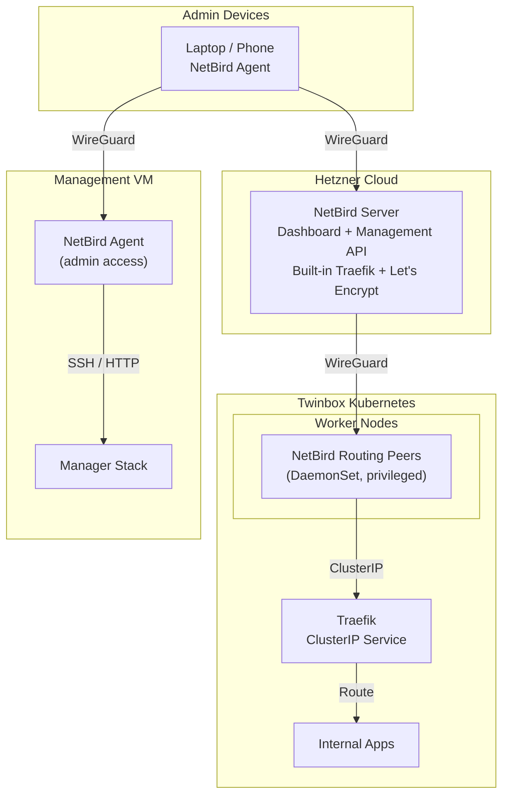

# NetBird

NetBird provides a self-hosted WireGuard VPN for secure access to the Twinbox cluster and Management VM. Unlike Tailscale (managed SaaS) or Wiredoor (simple reverse proxy), NetBird gives you full control over the VPN infrastructure with SSO integration through Authentik.

## Architecture

NetBird in Twinbox consists of four parts:

1. **Bastion Host** — A Hetzner Cloud VPS running the NetBird server, management API, dashboard, and built-in Traefik with Let's Encrypt.
2. **Ingress Configuration** — SSO integration, group creation, setup keys, and reverse proxy targets configured via OpenTofu.
3. **Routing Peers** — NetBird agents running as a Kubernetes DaemonSet that forward traffic from the bastion to internal Traefik services.
4. **Admin Access** — The Management VM enrolled as a NetBird peer so admin devices can reach it securely.



## Wizard Steps

### 1. Deploy NetBird Bastion Host (`provision-netbird-bastion`)

Provisions a Hetzner Cloud VM with the NetBird server stack.

**Prerequisites:**
- Hetzner Cloud account with a project
- Hetzner API token with Read & Write permissions
- Domain name for DNS routing
- `provision-nodes` and `choose-ingress-route` completed

**Inputs:**

| Input | Required | Default | Description |
|-------|----------|---------|-------------|
| `hcloud_token` | Yes | — | Hetzner Cloud API token |
| `zone_name` | Yes | — | Domain name (e.g., `example.com`) |
| `hcloud_location` | No | `fsn1` | Datacenter: `fsn1`, `nbg1`, or `hel1` |
| `hcloud_server_type` | No | `cax11` | Server size: `cax11` (ARM64) or `cx22` (x86) |
| `netbird_admin_email` | Yes | — | Let's Encrypt email address |
| `ssh_public_key` | No | — | Optional SSH public key |
| `cloudflare_api_token` | No | — | Optional Cloudflare token for DNS records |

**What it does:**
1. Generates a NetBird FQDN: `netbird.<domain>` for production, `netbird-<slug>.<domain>` for other clusters
2. Generates a random admin password
3. If no SSH key is provided, generates an ed25519 keypair stored in `manager-data/ssh/netbird-<cluster-id>/`
4. Deploys a Debian VM on Hetzner Cloud using OpenTofu (`infra/opentofu/netbird/`)
5. Installs NetBird server, dashboard, and built-in Traefik
6. Writes secrets to `/opt/twinbox/bootstrap/secrets/global/netbird.json`

**Secret Output:**

```json
{
  "NETBIRD_MANAGEMENT_URL": "https://netbird.example.com",
  "NETBIRD_SETUP_KEY": "generated-key",
  "NETBIRD_ADMIN_TOKEN": "generated-token",
  "HCLOUD_TOKEN": "...",
  "WIREDOOR_IP": "1.2.3.4",
  "CLUSTER_ID": "prd"
}
```

### 2. Configure NetBird Ingress (`configure-netbird-ingress`)

Connects NetBird to Authentik for SSO and configures routing.

**Depends on:** `provision-netbird-bastion`, `install-secret-sync`, `install-traefik`, `install-authentik-idp`, `create-users-and-groups`

**Inputs:**

| Input | Required | Default | Description |
|-------|----------|---------|-------------|
| `netbird_token` | No | — | Personal access token from dashboard (auto-generated if omitted) |
| `netbird_management_url` | No | — | Override for management URL |
| `traefik_resource_address` | No | — | Override for Traefik ClusterIP |
| `proxy_services_json` | No | — | JSON array of reverse proxy targets |

**What it does:**
1. Connects NetBird to Authentik for SSO via OIDC
2. Creates Twinbox NetBird groups and setup keys with OpenTofu
3. Records routing peer credentials in OpenBao
4. Configures reverse proxy targets for cluster services

### 3. Install NetBird Routing Peers (`install-netbird-routing-peers`)

Deploys NetBird agents in the Kubernetes cluster.

**Depends on:** `configure-netbird-ingress`

**What it does:**
1. Reads the setup key from OpenBao via External Secrets
2. Deploys NetBird agent as a privileged DaemonSet
3. Creates WireGuard interfaces and forwards traffic to Traefik

The setup key is read from OpenBao through External Secrets. The routing peer pod runs with privileged networking because NetBird needs to create a WireGuard interface and forward traffic into the cluster.

### 4. Configure NetBird Admin Access (`configure-netbird-admin-access`)

Enrolls the Management VM into the NetBird tailnet.

**Depends on:** `configure-netbird-ingress`

**What it does:**
1. Installs or starts a NetBird agent on the Management VM
2. Uses the setup key created by the ingress configuration
3. Admin devices enrolled in NetBird can reach the Management VM according to NetBird ACLs

This step runs from the Management VM runtime. It does not open public firewall ports; it only enrolls the VM into NetBird so approved admin devices can reach SSH and manager ports through NetBird policies.

## OpenTofu Workspaces

- Bastion: `manager-data/opentofu/netbird-<cluster-id>/`
- Ingress: `manager-data/opentofu/netbird-ingress-<cluster-id>/`

## Troubleshooting

### Routing peers not connecting

```bash
kubectl -n netbird get pods
kubectl -n netbird logs daemonset/netbird-routing-peers
kubectl -n netbird get externalsecret
```

Check that the setup key ExternalSecret reports `Ready=True` and that the secret contains a valid key.

### Management VM not reachable

```bash
# On the Management VM
sudo netbird status
sudo netbird up --setup-key <key>
```

Verify the NetBird agent is running and the setup key is valid.

### Bastion dashboard not loading

```bash
# SSH into the Hetzner VM
ssh -i manager-data/ssh/netbird-<cluster-id>/id_ed25519 root@<bastion-ip>
systemctl status netbird
systemctl status traefik
```

Verify NetBird server and Traefik are running on the bastion.

## Comparison with Other Ingress Options

| Feature | Wiredoor | Cloudflare Tunnel | Tailscale | NetBird |
|---------|----------|-------------------|-----------|---------|
| Self-hosted | Yes (Hetzner) | No (Cloudflare) | No (Tailscale Inc.) | Yes (Hetzner) |
| SSO | No | No | Yes (optional) | Yes (Authentik) |
| Mesh VPN | No | No | Yes | Yes |
| Reverse proxy | Yes | Yes | No | Yes |
| Upload limit | None | 100MB (Free) | None | None |
| WireGuard | Yes | No | Yes | Yes |
| Routing peers | No | No | Yes | Yes |

NetBird is the best choice when you want a self-hosted VPN with full SSO integration and the ability to route both user traffic and admin access through a single controlled infrastructure.
