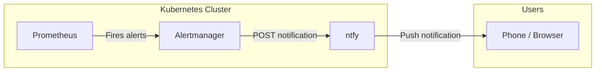

# ntfy

ntfy is a simple push notification service that Twinbox uses to route cluster alerts to operators. It integrates with Prometheus Alertmanager to deliver real-time notifications for warnings, critical issues, and emergencies.

## Architecture



## Installation

The `install-ntfy` step deploys ntfy through Argo CD after the observability stack is ready.

### What it does

1. Applies the ntfy Argo CD ApplicationSet
2. Waits for Argo CD health before continuing
3. Configures Alertmanager to route alerts to ntfy

### Prerequisites

- `install-prometheus` must be completed
- `install-dashy-dashboard` must be completed (ntfy depends on it in the journey)

### Inputs

None. The step is fully automated.

## Alert Routing

Twinbox seeds a small default alert set for Cilium and Longhorn. Alerts are routed to ntfy with different priorities:

| Priority | ntfy Priority | Use Case |
|----------|--------------|----------|
| Warning | 3 (default) | PVC usage > 70%, network degradation |
| Critical | 4 (high) | PVC usage > 85%, service down |
| Emergency | 5 (max) | PVC usage > 95%, control plane failure |

The default topic is `twinbox-alerts` at `https://ntfy.<ZONE_NAME>`.

## Configuration

### Custom topics

You can configure additional Alertmanager routes to send specific alerts to different ntfy topics. Edit the Alertmanager config in `gitops/values/prometheus.yaml`:

```yaml
alertmanager:
  config:
    route:
      routes:
        - match:
            severity: warning
          receiver: ntfy-warning
        - match:
            severity: critical
          receiver: ntfy-critical
    receivers:
      - name: ntfy-warning
        webhook_configs:
          - url: "https://ntfy.<ZONE_NAME>/twinbox-warnings"
            send_resolved: true
      - name: ntfy-critical
        webhook_configs:
          - url: "https://ntfy.<ZONE_NAME>/twinbox-critical"
            send_resolved: true
```

### Subscribing

Subscribe to notifications using the ntfy app or web interface:

```
https://ntfy.<ZONE_NAME>/twinbox-alerts
```

You can also use curl:

```bash
curl -s https://ntfy.<ZONE_NAME>/twinbox-alerts/json
```

## Verification

```bash
kubectl -n ntfy get pods
kubectl -n ntfy get ingressroute
kubectl -n monitoring get configmap alertmanager-config -o yaml | grep ntfy
```

## Troubleshooting

### No notifications received

```bash
# Verify ntfy is running
kubectl -n ntfy logs deployment/ntfy

# Test manual publish
curl -d "Test from Twinbox" https://ntfy.<ZONE_NAME>/twinbox-alerts

# Check Alertmanager routing
kubectl -n monitoring logs deployment/alertmanager
```

### Topic not found

ntfy creates topics automatically on first publish. If the topic shows 404, verify that Alertmanager is configured with the correct URL and that ntfy is reachable from the monitoring namespace.

```bash
kubectl -n monitoring exec deploy/prometheus -- wget -qO- https://ntfy.<ZONE_NAME>/twinbox-alerts
```

## Comparison with Other Notification Methods

| Method | Latency | Setup | Cost |
|--------|---------|-------|------|
| ntfy | Instant | Self-hosted | Free |
| Email | Minutes | Requires SMTP | Free |
| Slack/Discord | Seconds | Requires webhook | Free tier |
| PagerDuty | Instant | Requires account | Paid |

ntfy is the default because it is self-hosted, requires no external accounts, and delivers instant push notifications without complex routing rules.
