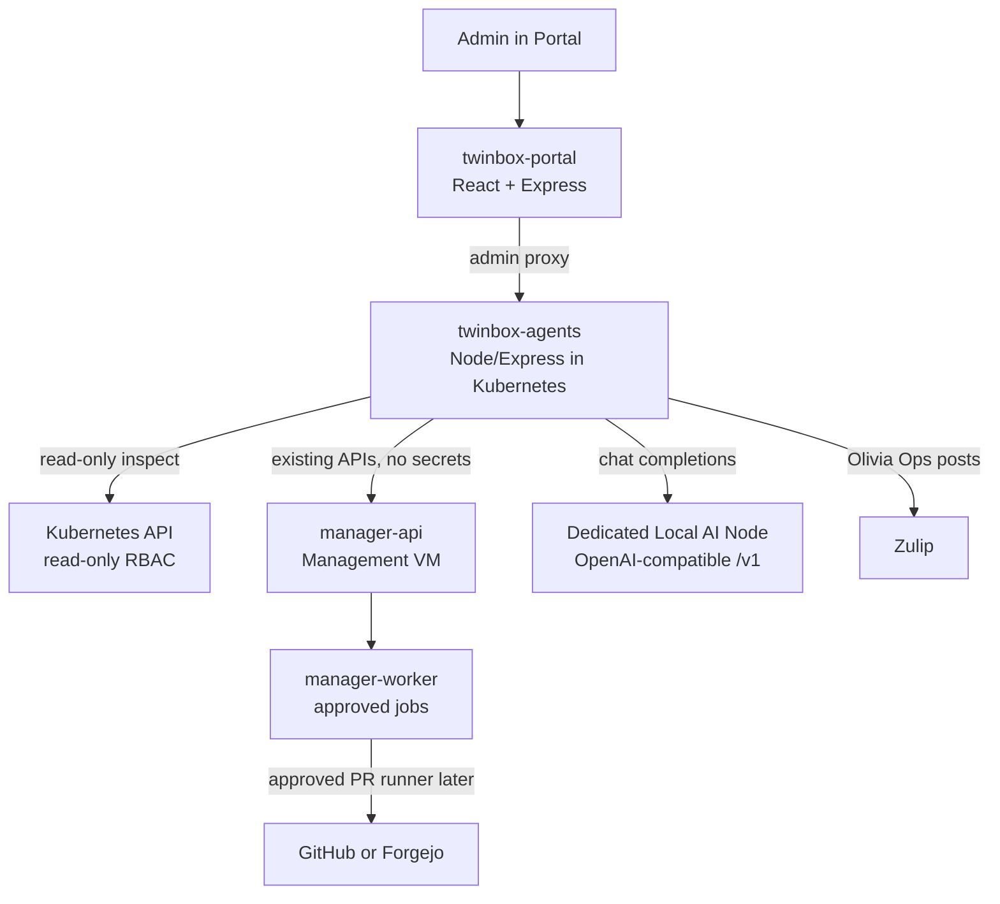

# Twinbox AI Beheerteam Implementation Plan

> **Voor een eenvoudiger model:** voer dit plan taak voor taak uit. Maak geen eigen architectuurkeuzes. Als een stap onduidelijk is, stop en vraag om verduidelijking in plaats van iets anders te bouwen.

## Doel

Voeg een local-first AI beheerteam toe aan Twinbox:

- Agents draaien als Kubernetes workload in de Twinbox cluster.
- Het LLM-model draait niet in de cluster. Twinbox configureert alleen een externe OpenAI-compatible endpoint, bijvoorbeeld een MacBook Pro met omlx, Ollama, vLLM, LM Studio of llama.cpp.
- De beheerder kan in het Portal het AI endpoint instellen en testen.
- Agents hebben herkenbare rollen en persoonlijkheden, zoals Betty Backup en Peter Proxmox.
- Agents zijn zichtbaar in het Portal als een klein operationeel team met status, werklog en taken.
- Alleen de coordinator post standaard in Zulip namens het team.
- Agents mogen onderzoeken, samenvatten en voorstellen doen. Mutaties blijven approval-only via bestaande Twinbox jobs, runbooks of draft PR's.

## Niet doen

- Bouw geen LLM runtime in Kubernetes.
- Deploy geen Ollama, vLLM, LM Studio, llama.cpp of omlx in de cluster.
- Voeg geen cloud-LLM als default toe.
- Geef agents geen directe Proxmox-, Talos-, database- of secret-admin credentials.
- Geef agents geen `cluster-admin`.
- Hard-code geen IP-adressen of CIDR-ranges. Gebruik alleen beheerderconfiguratie, DNS, NetBird hostnamen, environment variables of bestaande runtime discovery.
- Laat agents geen muterende Kubernetes/Proxmox/Talos acties uitvoeren zonder expliciete approval.
- Laat Codex/OpenCode geen productie-kubeconfig of clustersecrets krijgen.

## Architectuurkeuze voor v1

Maak een lichte eigen service: `twinbox-agents`.

Deze service draait in Kubernetes en doet vier dingen:

1. Houdt agentprofielen, events en work orders bij.
2. Roept het geconfigureerde OpenAI-compatible endpoint aan.
3. Leest clusterstatus read-only via de Kubernetes API.
4. Post optioneel korte coordinator-updates naar Zulip.

Gebruik in v1 geen CrewAI als dependency en maak kagent/OpenSRE optioneel voor later. Dit houdt de eerste implementatie klein en testbaar.



## Namen en rollen

Gebruik deze vaste v1-agenten. Zet ze als data in code, niet verspreid door losse conditionals.

| ID | Naam | Rol | Publiek? | Bevoegdheden v1 |
| --- | --- | --- | --- | --- |
| `olivia-ops` | Olivia Ops | Coordinator | Ja | Samenvatten, taken verdelen, approval requests formuleren, Zulip posts |
| `betty-backup` | Betty Backup | Backup specialist | Nee | Velero, Longhorn, CNPG backups read-only controleren |
| `peter-proxmox` | Peter Proxmox | Proxmox specialist | Nee | Manager API Proxmox summary lezen, voorstellen maken |
| `karel-kubernetes` | Karel Kubernetes | Kubernetes specialist | Nee | Pods, nodes, events, workloads read-only inspecteren |
| `tara-talos` | Tara Talos | Talos specialist | Nee | Talos-gerelateerde state via manager API beoordelen, geen directe Talos API in v1 |
| `sofia-sql` | Sofia SQL | Database specialist | Nee | CNPG clusters, poolers en scheduled backups read-only inspecteren |
| `gina-gitops` | Gina GitOps | GitOps/PR specialist | Nee | GitOps status beoordelen, later draft PR work orders maken |

De persoonlijkheden mogen menselijk klinken, maar output moet operationeel blijven:

- kort
- feitelijk
- geen geheimen
- geen verzonnen conclusies
- altijd evidence noemen
- altijd onderscheid maken tussen "gezien", "waarschijnlijk" en "advies"

## Work order lifecycle

Alle onderzoeken en acties lopen via `WorkOrder`.

Statussen:

- `new`
- `assigned`
- `investigating`
- `proposal_ready`
- `approval_required`
- `approved`
- `executing`
- `completed`
- `failed`
- `canceled`
- `degraded`

Een work order wordt alleen `executing` als:

- het een read-only onderzoek is, of
- een admin expliciet approval heeft gegeven.

## Data contracts

Maak JSON-serialiseerbare objecten. Gebruik ISO timestamps.

### AgentProfile

```json
{
  "id": "betty-backup",
  "displayName": "Betty Backup",
  "role": "backup-specialist",
  "public": false,
  "avatar": {
    "kind": "pixel",
    "palette": "green",
    "initials": "BB"
  },
  "summary": "Controleert backups, retentie en restore-signalen.",
  "systemPrompt": "Je bent Betty Backup..."
}
```

### ProviderConfig

Sla geen API key op in dit object.

```json
{
  "kind": "openai-compatible",
  "displayName": "Local MacBook Pro omlx",
  "baseUrl": "https://ai-node.example.local/v1",
  "model": "local-model-name",
  "timeoutMs": 60000,
  "enabled": true,
  "defaultForAgents": true,
  "capabilities": {
    "modelsEndpoint": true,
    "chatCompletions": true,
    "jsonMode": "unknown",
    "toolCalls": "unknown"
  },
  "lastTest": {
    "status": "ok",
    "latencyMs": 1250,
    "checkedAt": "2026-06-24T12:00:00.000Z",
    "message": "chat completion succeeded"
  }
}
```

### AgentEvent

```json
{
  "id": "evt_20260624_120000_0001",
  "timestamp": "2026-06-24T12:00:00.000Z",
  "agentId": "olivia-ops",
  "workOrderId": "wo_20260624_120000_0001",
  "type": "status",
  "severity": "info",
  "title": "Onderzoek gestart",
  "message": "Karel Kubernetes kijkt naar CrashLoopBackOff pods.",
  "metadata": {}
}
```

Types:

- `status`
- `finding`
- `tool_call`
- `proposal`
- `approval_request`
- `zulip_post`
- `error`
- `degraded`

### WorkOrder

```json
{
  "id": "wo_20260624_120000_0001",
  "createdAt": "2026-06-24T12:00:00.000Z",
  "updatedAt": "2026-06-24T12:00:00.000Z",
  "createdBy": "admin",
  "source": "portal",
  "type": "backup_health_check",
  "status": "new",
  "title": "Controleer backupstatus",
  "scope": {
    "clusterId": "active",
    "namespace": null,
    "resourceRef": null
  },
  "assignedAgents": ["olivia-ops", "betty-backup"],
  "evidence": [],
  "proposal": null,
  "approval": null,
  "result": null
}
```

### ApprovalRequest

```json
{
  "id": "approval_20260624_120000_0001",
  "workOrderId": "wo_20260624_120000_0001",
  "status": "pending",
  "actionKind": "manager_job",
  "action": "restart_stateless_deployment",
  "parameters": {
    "namespace": "example",
    "deployment": "example-api"
  },
  "risk": "Restarts all pods in the deployment.",
  "rollback": "If the rollout fails, use the previous ReplicaSet or Argo CD sync history.",
  "requestedByAgent": "olivia-ops",
  "approvedBy": null,
  "approvedAt": null
}
```

## File layout

Voeg deze nieuwe package toe:

```text
twinbox-agents/
  Dockerfile
  eslint.config.js
  package.json
  src/
    agent-profiles.mjs
    event-store.mjs
    k8s-readonly.mjs
    llm-client.mjs
    manager-client.mjs
    provider-config.mjs
    redaction.mjs
    server.mjs
    work-orders.mjs
    zulip-client.mjs
  test/
    agent-profiles.test.mjs
    event-store.test.mjs
    llm-client.test.mjs
    provider-config.test.mjs
    server.test.mjs
    work-orders.test.mjs
```

Voeg deze GitOps app toe:

```text
gitops/apps/twinbox-agents.yaml
gitops/platform-apps/twinbox-agents/
  configmap.yaml
  deployment.yaml
  externalsecret.yaml
  kustomization.yaml
  namespace.yaml
  pvc.yaml
  rbac.yaml
  service.yaml
```

Wijzig bestaande onderdelen:

```text
portal/server.mjs
portal/src/App.jsx
portal/src/App.css
portal/test/server.test.mjs
portal/test/agent-admin-model.test.mjs

manager-api/src/server.js
manager-api/src/lib/agents.js
manager-api/test/agents.test.mjs

manager-worker/src/worker.js
manager-worker/test/agent-config-sync.test.mjs
scripts/manager/sync-twinbox-agents-config.sh
```

Als een bestand nog niet bestaat, maak het aan. Als een bestaand bestand andere wijzigingen bevat, werk daarmee en revert niets.

## Phase 0: Voorbereiding

### Task 0.1: Controleer branch en werkboom

Run:

```bash
git status --short
git branch --show-current
```

Expected:

- Branch is `main`.
- Noteer bestaande wijzigingen. Revert niets.

### Task 0.2: Lees relevante code

Lees minimaal:

```bash
sed -n '1,220p' portal/server.mjs
sed -n '1,220p' portal/src/App.jsx
sed -n '1,220p' manager-api/src/server.js
sed -n '1,220p' manager-worker/src/worker.js
sed -n '1,140p' gitops/platform-apps/twinbox-portal/deployment.yaml
```

Doel:

- Begrijp hoe Portal admin endpoints maakt.
- Begrijp hoe manager-api jobs queue't.
- Begrijp hoe manager-worker jobs uitvoert.
- Begrijp hoe Portal naar manager-api praat via `PORTAL_MANAGER_BASE_URL`.

## Phase 1: Nieuwe `twinbox-agents` package

### Task 1.1: Maak package metadata

Maak `twinbox-agents/package.json`.

Gebruik ESM, Node 22-compatible code en dezelfde scripts als andere Node packages:

```json
{
  "name": "twinbox-agents",
  "version": "1.0.0",
  "private": true,
  "type": "module",
  "main": "src/server.mjs",
  "scripts": {
    "start": "node src/server.mjs",
    "lint": "eslint .",
    "lint:fix": "eslint . --fix",
    "format": "prettier --write .",
    "format:check": "prettier --check ."
  },
  "dependencies": {
    "@kubernetes/client-node": "^1.0.0",
    "express": "^5.1.0"
  },
  "devDependencies": {
    "@eslint/js": "^10.0.1",
    "eslint": "^10.4.0",
    "eslint-config-prettier": "^10.0.0",
    "globals": "^17.6.0",
    "prettier": "^3.0.0"
  }
}
```

Als de repo een nieuwere dependencyversie gebruikt na `npm install`, accepteer lockfile-wijzigingen alleen als er al een repo-root lockfile/pakketbeleid is. Maak geen onnodige lockfile als dit project er geen heeft voor andere packages.

### Task 1.2: Maak ESLint config

Maak `twinbox-agents/eslint.config.js` gelijkwaardig aan `manager-api` of `portal`.

Gebruik Node globals. Houd het simpel.

### Task 1.3: Maak Dockerfile

Maak `twinbox-agents/Dockerfile`.

Eisen:

- Non-root user.
- Production install.
- `PORT=8080`.
- Start met `node src/server.mjs`.
- Geen shell scripts nodig voor startup.

Voorbeeldstructuur:

```dockerfile
FROM node:22-alpine AS deps
WORKDIR /app
COPY package.json package-lock.json* ./
RUN npm install --omit=dev

FROM node:22-alpine
WORKDIR /app
ENV NODE_ENV=production
ENV PORT=8080
RUN addgroup -S twinbox && adduser -S twinbox -G twinbox
COPY --from=deps /app/node_modules ./node_modules
COPY package.json ./
COPY src ./src
USER twinbox
EXPOSE 8080
CMD ["node", "src/server.mjs"]
```

Als er geen `package-lock.json` is, zorg dat Dockerfile ook zonder lockfile werkt.

### Task 1.4: Implementeer `agent-profiles.mjs`

Maak `twinbox-agents/src/agent-profiles.mjs`.

Export:

- `AGENT_PROFILES`
- `getAgentProfile(id)`
- `listAgentProfiles()`

Definieer exact de v1-agenten:

- `olivia-ops`
- `betty-backup`
- `peter-proxmox`
- `karel-kubernetes`
- `tara-talos`
- `sofia-sql`
- `gina-gitops`

Elke profile heeft:

- `id`
- `displayName`
- `role`
- `public`
- `summary`
- `avatar`
- `systemPrompt`
- `allowedWorkOrderTypes`

Regels voor prompts:

- Geen geheimen vragen.
- Geen ruwe credentials tonen.
- Eerst bewijs verzamelen.
- Bij twijfel escaleren naar Olivia.
- Mutaties alleen voorstellen, niet uitvoeren.

### Task 1.5: Implementeer `redaction.mjs`

Maak `twinbox-agents/src/redaction.mjs`.

Export:

- `redactSensitiveText(value)`
- `redactObject(value)`

Redact minimaal:

- strings met `token=`
- strings met `api_key`
- strings met `password`
- strings met `authorization: bearer`
- PEM private keys
- kubeconfig client key data

Doel is defensief loggen, niet perfecte secret-detectie.

### Task 1.6: Implementeer file-based stores

Maak:

- `twinbox-agents/src/event-store.mjs`
- `twinbox-agents/src/work-orders.mjs`
- `twinbox-agents/src/provider-config.mjs`

Gebruik `AGENT_DATA_DIR` of `/data`.

Directory layout:

```text
/data/
  events/
    events.jsonl
  work-orders/
    <work-order-id>.json
  provider/
    config.json
```

Eisen:

- Maak directories automatisch aan.
- Schrijf JSON atomisch met temp file + rename.
- Event log is JSONL append-only.
- `listEvents({ sinceId, limit })` ondersteunt limit default `100`, max `500`.
- Geen API key opslaan in `provider/config.json`.

### Task 1.7: Implementeer OpenAI-compatible client

Maak `twinbox-agents/src/llm-client.mjs`.

Export:

- `normalizeOpenAIBaseUrl(baseUrl)`
- `listModels(provider, apiKey)`
- `createChatCompletion(provider, apiKey, messages, options)`
- `testProvider(provider, apiKey)`

Regels:

- `baseUrl` moet absolute `http` of `https` URL zijn.
- Trim trailing slash.
- Verwacht endpoints:
  - `GET <baseUrl>/models`
  - `POST <baseUrl>/chat/completions`
- Gebruik `fetch`.
- Zet `Authorization: Bearer <apiKey>` alleen als API key niet leeg is.
- Timeout via `AbortController`, default `60000`.
- Log nooit request/response bodies met secrets.
- `testProvider` doet:
  1. optionele `/models` call
  2. kleine chat completion met system/user prompt
  3. meet latency
  4. retourneert status en foutmelding zonder secrets

### Task 1.8: Implementeer Kubernetes read-only tools

Maak `twinbox-agents/src/k8s-readonly.mjs`.

Gebruik `@kubernetes/client-node`.

Export:

- `createKubernetesClients()`
- `listUnhealthyPods()`
- `listRecentWarningEvents()`
- `summarizeNodes()`
- `summarizeCloudNativePgClusters()`
- `summarizeScheduledBackups()`
- `summarizeVeleroBackups()`
- `summarizeLonghornRecurringJobs()`

Regels:

- Lees nooit Kubernetes Secrets.
- Lees geen ConfigMaps in v1.
- Pod logs zijn optioneel en standaard uit. Als je logs toevoegt, cap op 200 regels en redacteer.
- Fouten op onbekende CRDs mogen niet crashen. Retourneer `available: false` voor die summary.
- Gebruik dynamic/custom objects API voor CRDs:
  - CNPG clusters en scheduled backups.
  - Velero backups/schedules.
  - Longhorn recurring jobs.

Als een exacte API group/version onbekend is, zoek in bestaande manifests en implementeer defensief.

### Task 1.9: Implementeer manager client

Maak `twinbox-agents/src/manager-client.mjs`.

Gebruik env:

- `MANAGER_API_BASE_URL`, default `http://webwizard.longhorn-system.svc.cluster.local:8080`.

Export:

- `getManagerHealth()`
- `getActiveClusterSummary()`
- `getProxmoxClusterResources()`
- `queueApprovedManagerAction(action)`

Voor v1 mag `queueApprovedManagerAction` nog alleen een duidelijke `NOT_IMPLEMENTED` fout geven. Muterende integratie komt later in Phase 6.

### Task 1.10: Implementeer Zulip client

Maak `twinbox-agents/src/zulip-client.mjs`.

Gebruik env/config:

- `ZULIP_BASE_URL`
- `ZULIP_BOT_EMAIL`
- `ZULIP_BOT_API_KEY`
- `ZULIP_STREAM`, default `Twinbox AI`

Export:

- `isZulipConfigured()`
- `postCoordinatorMessage({ topic, content })`

Gebruik Zulip endpoint:

- `POST /api/v1/messages`
- Basic auth met bot email en API key.

Regels:

- Alleen Olivia Ops post in v1.
- Als Zulip niet geconfigureerd is, retourneer `{ skipped: true }`.
- Redacteer content voor verzenden.
- Max message length in v1: 4000 tekens.

### Task 1.11: Implementeer server

Maak `twinbox-agents/src/server.mjs`.

Env:

- `PORT`, default `8080`
- `AGENT_DATA_DIR`, default `/data`
- `TWINBOX_AGENT_INTERNAL_TOKEN`, verplicht voor alle `/api/*` endpoints behalve health
- `OPENAI_API_KEY_FILE`, optioneel pad naar mounted secret
- `MANAGER_API_BASE_URL`
- `ZULIP_*`

Endpoints:

- `GET /api/health`
- `GET /api/agents`
- `GET /api/events`
- `GET /api/providers`
- `POST /api/providers/test`
- `POST /api/providers/openai-compatible`
- `GET /api/work-orders`
- `POST /api/work-orders`
- `GET /api/work-orders/:id`
- `POST /api/work-orders/:id/approve`
- `POST /api/work-orders/:id/cancel`

Auth:

- `/api/health` is unauthenticated.
- Alle andere endpoints vereisen `Authorization: Bearer <TWINBOX_AGENT_INTERNAL_TOKEN>`.
- Bij ontbrekende token env: server mag starten, maar protected endpoints geven 503 met `agent internal token is not configured`.

Provider update:

- `POST /api/providers/openai-compatible` accepteert:
  - `displayName`
  - `baseUrl`
  - `model`
  - `timeoutMs`
  - `apiKey`
- Sla `apiKey` niet in config op.
- Voor v1: schrijf API key naar `/data/provider/api-key` met mode `0600`.
- Zet in de response nooit de API key.

Work order creation:

- Ondersteun deze v1-types:
  - `cluster_health_check`
  - `backup_health_check`
  - `proxmox_health_check`
  - `database_health_check`
  - `gitops_health_check`
- Maak bij creatie minimaal 1 `AgentEvent`.
- Assign agents deterministisch op basis van type.

Onderzoek uitvoeren:

- Voor v1 mag uitvoering synchroon na work order creatie gebeuren, zolang requests niet langer dan ongeveer 60 seconden duren.
- Als dit te traag wordt, voeg later een background loop toe.
- Gebruik LLM alleen voor samenvatting en advies, niet voor het ophalen van feiten.
- Feiten komen uit read-only tools.

### Task 1.12: Tests voor package

Maak tests met `node --test`.

Minimale tests:

- Agent profiles bevatten exact de 7 IDs.
- Provider base URL normalisatie accepteert http/https en weigert andere protocols.
- Provider config slaat geen API key op.
- Event store append/list werkt.
- Work order lifecycle werkt.
- Protected endpoint zonder token geeft 401.
- Health endpoint werkt zonder token.
- Zulip client skipped als niet geconfigureerd.
- Redaction redigeert tokens/password/private keys.

Run:

```bash
node --test twinbox-agents/test/*.mjs
node --check twinbox-agents/src/*.mjs
npm run lint --prefix twinbox-agents
npm run format:check --prefix twinbox-agents
```

Expected: alles pass.

## Phase 2: GitOps deployment voor `twinbox-agents`

### Task 2.1: Namespace en PVC

Maak `gitops/platform-apps/twinbox-agents/namespace.yaml`.

Namespace:

```yaml
apiVersion: v1
kind: Namespace
metadata:
  name: twinbox-agents
```

Maak `pvc.yaml`:

- name `twinbox-agents-data`
- namespace `twinbox-agents`
- `ReadWriteOnce`
- `longhorn`
- `5Gi`

### Task 2.2: ServiceAccount en RBAC

Maak `rbac.yaml`.

ServiceAccount:

- `twinbox-agents`
- namespace `twinbox-agents`

ClusterRole read-only:

Allow `get`, `list`, `watch` only for:

- core: `pods`, `pods/status`, `pods/log`, `nodes`, `nodes/status`, `events`, `namespaces`, `persistentvolumeclaims`
- apps: `deployments`, `replicasets`, `statefulsets`, `daemonsets`
- batch: `jobs`, `cronjobs`
- argoproj.io: `applications`
- postgresql.cnpg.io: `clusters`, `scheduledbackups`, `backups`
- velero.io: `backups`, `schedules`
- longhorn.io: `recurringjobs`, `volumes`

Do not include:

- `secrets`
- mutating verbs
- `*` resources
- `*` verbs

Als een API group niet bestaat in een cluster, dat is ok. RBAC mag de resource noemen.

### Task 2.3: ConfigMap en ExternalSecret

Maak `configmap.yaml`.

ConfigMap values:

- `MANAGER_API_BASE_URL=http://webwizard.longhorn-system.svc.cluster.local:8080`
- `ZULIP_STREAM=Twinbox AI`

Maak `externalsecret.yaml`.

ExternalSecret:

- name `twinbox-agents-runtime`
- namespace `twinbox-agents`
- ClusterSecretStore `openbao`
- target Secret `twinbox-agents-runtime`

Keys:

- `TWINBOX_AGENT_INTERNAL_TOKEN` from `twinbox/global/twinbox-agents`
- `ZULIP_BASE_URL` optional
- `ZULIP_BOT_EMAIL` optional
- `ZULIP_BOT_API_KEY` optional

If ExternalSecret optional fields are hard to express, only include `TWINBOX_AGENT_INTERNAL_TOKEN` first and add Zulip later.

### Task 2.4: Deployment en Service

Maak `deployment.yaml`.

Eisen:

- Deployment name `twinbox-agents`
- namespace `twinbox-agents`
- image `ghcr.io/harrywesterman/twinbox-agents`
- imagePullPolicy `Always`
- non-root security context
- `readOnlyRootFilesystem: true` waar mogelijk
- mount PVC op `/data`
- env from ConfigMap and Secret
- readiness/liveness/startup probes op `/api/health`
- resource requests:
  - cpu `50m`
  - memory `128Mi`
- resource limits:
  - cpu `500m`
  - memory `512Mi`

Service:

- name `twinbox-agents`
- port `80`
- targetPort `http`
- ClusterIP only

### Task 2.5: Kustomization en Argo CD app

Maak `gitops/platform-apps/twinbox-agents/kustomization.yaml`.

Resources:

- namespace
- pvc
- rbac
- configmap
- externalsecret
- deployment
- service

Images:

```yaml
images:
  - name: ghcr.io/harrywesterman/twinbox-agents
    newTag: latest
```

Maak `gitops/apps/twinbox-agents.yaml`.

Volg patroon van `gitops/apps/twinbox-portal.yaml`.

Belangrijk:

- Project/pad/revision consistent met bestaande apps.
- Automated sync consistent met bestaande platform apps.
- Gebruik geen hard-coded IP.

### Task 2.6: Validatie

Run:

```bash
kubectl kustomize gitops/platform-apps/twinbox-agents >/tmp/twinbox-agents.yaml
```

Als `kubectl` lokaal niet beschikbaar is, gebruik:

```bash
kustomize build gitops/platform-apps/twinbox-agents >/tmp/twinbox-agents.yaml
```

Expected:

- YAML rendert.
- Geen Secrets met plaintext API keys.
- RBAC bevat geen muterende verbs.

## Phase 3: Manager API config en secret sync

Doel: Portal kan providerconfig opslaan via manager-api. Manager-worker synchroniseert runtime config naar Kubernetes Secret/ConfigMap voor `twinbox-agents`.

### Task 3.1: Maak manager API agents lib

Maak `manager-api/src/lib/agents.js`.

Exports:

- `readAgentProviderConfig(dirs)`
- `writeAgentProviderConfig(dirs, config)`
- `normalizeOpenAICompatibleProvider(input)`
- `writeAgentEndpointSecret(runtimeEnv, apiKey)`
- `ensureAgentInternalToken(runtimeEnv)`
- `queueAgentConfigSync(dirs, cluster, payload)`

Data path:

```text
manager-data/agents/provider.json
```

Secret item:

```text
bootstrap/secrets/global/twinbox-agents.json
```

Fields:

- `TWINBOX_AGENT_INTERNAL_TOKEN`
- `OPENAI_API_KEY`
- optional `ZULIP_BASE_URL`
- optional `ZULIP_BOT_EMAIL`
- optional `ZULIP_BOT_API_KEY`

Rules:

- Never write API key into `provider.json`.
- Generate `TWINBOX_AGENT_INTERNAL_TOKEN` if missing.
- Use `crypto.randomBytes(32).toString("base64url")`.
- Validate `baseUrl` as absolute http/https URL.
- Validate `model` non-empty.
- Default `timeoutMs` to `60000`.

### Task 3.2: Voeg manager API endpoints toe

Wijzig `manager-api/src/server.js`.

Add endpoints:

- `GET /api/agents/provider`
- `POST /api/agents/provider/openai-compatible`
- `POST /api/agents/provider/test`
- `POST /api/agents/sync-config`

Endpoint behavior:

`GET /api/agents/provider`

- Return provider config without API key.
- Include whether API key exists as `hasApiKey: true/false`.

`POST /api/agents/provider/openai-compatible`

- Accept `displayName`, `baseUrl`, `model`, `timeoutMs`, optional `apiKey`.
- Validate and save config.
- Save API key only if body contains non-empty `apiKey`.
- Ensure internal token exists.
- Queue `sync_agent_config` job.
- Return config without secret.

`POST /api/agents/provider/test`

- Do not persist.
- Test supplied provider against OpenAI-compatible endpoint.
- If `apiKey` omitted, use stored secret if present.
- Return status, latency, model list availability, and sanitized error.

`POST /api/agents/sync-config`

- Ensure token exists.
- Queue `sync_agent_config` job.
- Return job.

Do not expose raw secrets.

### Task 3.3: Manager-worker job type

Wijzig `manager-worker/src/worker.js`.

Add queue type:

- `sync_agent_config`

Handler:

- Reads `manager-data/agents/provider.json`.
- Reads `bootstrap/secrets/global/twinbox-agents.json`.
- Calls script `scripts/manager/sync-twinbox-agents-config.sh`.
- Marks job success/failure like other jobs.

Payload:

```json
{
  "provider": {
    "kind": "openai-compatible"
  }
}
```

### Task 3.4: Sync script

Maak `scripts/manager/sync-twinbox-agents-config.sh`.

Purpose:

- Apply/update Kubernetes Secret `twinbox-agents-runtime`.
- Apply/update ConfigMap if needed.
- Restart deployment `twinbox-agents` if config changed.

Inputs:

- `MANAGER_DATA_DIR`, default `/data`
- `WORKSPACE_ROOT`, default `/opt/twinbox`
- existing cluster kubeconfig from runtime secrets

Implementation outline:

1. Locate active cluster state from `manager-data/clusters/*.json`.
2. Resolve kubeconfig using existing secret ref conventions.
3. Read `manager-data/agents/provider.json`.
4. Read `bootstrap/secrets/global/twinbox-agents.json`.
5. Create namespace if missing.
6. Use `kubectl -n twinbox-agents create secret generic twinbox-agents-runtime --dry-run=client -o yaml ... | kubectl apply -f -`.
7. Include:
   - `TWINBOX_AGENT_INTERNAL_TOKEN`
   - `OPENAI_API_KEY` if present
   - `ZULIP_*` if present
8. Use `kubectl -n twinbox-agents create configmap twinbox-agents-provider --dry-run=client -o yaml --from-file=provider.json=... | kubectl apply -f -`.
9. Run `kubectl -n twinbox-agents rollout restart deployment/twinbox-agents` if deployment exists.

Do not print secret values.

Add syntax check:

```bash
bash -n scripts/manager/sync-twinbox-agents-config.sh
```

### Task 3.5: Tests

Add `manager-api/test/agents.test.mjs`.

Test:

- baseUrl validation.
- API key not written to provider config.
- internal token generated.
- provider config read/write.
- POST endpoint does not echo API key.

Add `manager-worker/test/agent-config-sync.test.mjs`.

Test:

- worker recognizes `sync_agent_config`.
- script command is built with correct job type.
- secret redaction prevents API key from logs.

Run:

```bash
node --test manager-api/test/*.mjs
node --test manager-worker/test/*.mjs
node --check manager-api/src/server.js manager-api/src/lib/agents.js manager-worker/src/worker.js
bash -n scripts/manager/sync-twinbox-agents-config.sh
npm run lint --prefix manager-api
npm run lint --prefix manager-worker
npm run format:check --prefix manager-api
npm run format:check --prefix manager-worker
```

## Phase 4: Portal admin UI

### Task 4.1: Portal server proxy

Wijzig `portal/server.mjs`.

Add env:

- `PORTAL_AGENTS_BASE_URL`, default `http://twinbox-agents.twinbox-agents.svc.cluster.local`
- `TWINBOX_AGENT_INTERNAL_TOKEN`, from secret

Add helper:

- `agentUrl(pathname)`
- `proxyAgentRequest(req, res, pathname, init)`

Admin endpoints:

- `GET /api/admin/agents`
- `GET /api/admin/agents/events`
- `GET /api/admin/agents/providers`
- `POST /api/admin/agents/providers/openai-compatible`
- `POST /api/admin/agents/providers/test`
- `GET /api/admin/agents/work-orders`
- `POST /api/admin/agents/work-orders`
- `POST /api/admin/agents/work-orders/:id/approve`
- `POST /api/admin/agents/work-orders/:id/cancel`

Rules:

- Reuse existing admin checks.
- Portal server adds `Authorization: Bearer <TWINBOX_AGENT_INTERNAL_TOKEN>` when calling agent service.
- Provider save/test should go to manager-api endpoints first, not directly to agent service, because manager-api owns persistent provider config and secret sync.
- Agent events/work-orders go to `twinbox-agents`.

If `TWINBOX_AGENT_INTERNAL_TOKEN` missing:

- agent UI should show degraded/configuration-required state.
- Do not crash Portal.

### Task 4.2: Portal runtime secret

Wijzig `gitops/platform-apps/twinbox-portal/externalsecret.yaml`.

Add:

- `TWINBOX_AGENT_INTERNAL_TOKEN` from `twinbox/global/twinbox-agents`

Wijzig `gitops/platform-apps/twinbox-portal/deployment.yaml`.

Add:

- `PORTAL_AGENTS_BASE_URL=http://twinbox-agents.twinbox-agents.svc.cluster.local`

Do not add LLM endpoint values to Portal Deployment env. Those are configured through the admin UI and stored via manager-api.

### Task 4.3: Admin navigation

Wijzig `portal/src/App.jsx` en eventueel `portal/src/user-admin-model.js`.

Add admin route:

- `/admin/agents`

Visible only for `isAdmin`.

Label:

- `AI beheerteam`

The route should not replace existing `/admin/apps`, `/admin/observability`, `/admin/updates`, `/admin/users`.

### Task 4.4: Agent admin data model

Maak `portal/src/agent-admin-model.js`.

Exports:

- `buildAgentAdminViewModel(payload)`
- `formatAgentStatus(status)`
- `buildProviderHealthLabel(provider)`
- `groupEventsByWorkOrder(events)`

Keep logic testable outside React.

### Task 4.5: Agent admin page

Wijzig `portal/src/App.jsx`.

Create component:

- `AgentsAdminPage`

Sections:

1. AI endpoint setup
   - `displayName`
   - `baseUrl`
   - `model`
   - optional `apiKey`
   - `timeoutMs`
   - buttons: `Test endpoint`, `Save endpoint`
2. Team floor
   - compact pixel-style grid/list of 7 agents
   - status chip per agent
   - current work order title if any
3. Work orders
   - quick actions:
     - `Cluster health check`
     - `Backup health check`
     - `Proxmox health check`
     - `Database health check`
     - `GitOps health check`
   - status list
4. Approval queue
   - show pending approvals
   - approve/cancel buttons
5. Event feed
   - recent events
   - severity and agent

Design constraints:

- Match existing admin/observability style.
- Do not make a marketing hero.
- Do not use huge decorative cards.
- Keep it dense and operational.
- Pixel agents may be simple CSS avatars in v1; no external image dependency required.
- Text must not overflow on mobile.

### Task 4.6: CSS

Wijzig `portal/src/App.css`.

Add classes:

- `.agents-layout`
- `.agents-shell`
- `.agents-endpoint-form`
- `.agents-team-grid`
- `.agent-avatar`
- `.agent-avatar-pixel`
- `.agent-status-chip`
- `.agents-work-orders`
- `.agents-approval-queue`
- `.agents-event-feed`

Use existing CSS variables. Avoid a one-color purple/blue theme.

### Task 4.7: Portal tests

Add `portal/test/agent-admin-model.test.mjs`.

Extend `portal/test/server.test.mjs`.

Tests:

- admin agents endpoints require admin.
- Portal forwards agent token to `PORTAL_AGENTS_BASE_URL`.
- Provider save calls manager-api endpoint and does not echo API key.
- View model handles missing provider and degraded service.
- Navigation includes AI beheerteam only for admins.

Run:

```bash
node --test portal/test/*.mjs
node --check portal/server.mjs portal/src/*.js portal/src/*.jsx
npm run build --prefix portal
npm run lint --prefix portal
npm run format:check --prefix portal
```

## Phase 5: Read-only operational workflows

Implement these work order types in `twinbox-agents/src/work-orders.mjs` and related modules.

### Task 5.1: `cluster_health_check`

Assigned agents:

- Olivia Ops
- Karel Kubernetes

Facts:

- unhealthy pods
- recent warning events
- node readiness
- pending pods
- crashloop pods

LLM prompt:

- Provide a concise Dutch operational summary.
- Include evidence.
- Do not recommend deleting resources.
- If action needed, create proposal only.

Expected event titles:

- `Clustercontrole gestart`
- `Ongezonde pods gevonden`
- `Geen kritieke clusterproblemen gevonden`
- `Voorstel klaar`

### Task 5.2: `backup_health_check`

Assigned agents:

- Olivia Ops
- Betty Backup

Facts:

- Velero schedules/backups if installed.
- Longhorn recurring jobs.
- CNPG scheduled backups.
- Management backup status if manager-api exposes it; otherwise create note `management backup status unavailable`.

Expected output:

- Healthy/degraded/critical classification.
- List missing signals.
- No claim that restore works unless restore test exists.

### Task 5.3: `proxmox_health_check`

Assigned agents:

- Olivia Ops
- Peter Proxmox

Facts:

- manager-api `/api/proxmox/cluster-resources` if available.
- no direct Proxmox credentials in agent pod.

If manager-api unavailable:

- work order status `degraded`.
- event explains manager-api unreachable.

### Task 5.4: `database_health_check`

Assigned agents:

- Olivia Ops
- Sofia SQL

Facts:

- CNPG cluster conditions.
- pod readiness.
- scheduled backups.
- pooler resources.

Do not connect to Postgres databases in v1.

### Task 5.5: `gitops_health_check`

Assigned agents:

- Olivia Ops
- Gina GitOps

Facts:

- Argo CD Application resources.
- sync status.
- health status.
- recent warning events in Argo namespaces.

Do not call GitHub in v1.

### Task 5.6: Summary generation

For every work order:

1. Gather facts with deterministic tools.
2. Redact facts.
3. Send to LLM for summary.
4. Save summary in work order result.
5. Append events.
6. If Zulip configured, Olivia posts one summary.

If LLM endpoint offline:

- Set work order status `degraded`.
- Save raw deterministic facts.
- Event says AI endpoint unavailable.
- Do not call cloud fallback.

## Phase 6: Approval-only actions

Do not implement all actions at once. First implement the approval framework.

### Task 6.1: Approval model

In `twinbox-agents/src/work-orders.mjs`, support:

- `createApprovalRequest(workOrderId, request)`
- `approveWorkOrder(workOrderId, approver)`
- `cancelWorkOrder(workOrderId, actor)`

Approval request requires:

- actionKind
- action
- parameters
- risk
- rollback

### Task 6.2: First approved action: restart stateless deployment

Only after approval.

Preferred implementation:

- Queue manager-api job type later named `agent_approved_action`.
- manager-worker executes script with exact action.

For first version, it is acceptable for approval to only mark the work order `approved` and create an event `Execution not implemented yet`.

Do not let `twinbox-agents` patch deployments directly in v1.

### Task 6.3: Future approved actions list

Document but do not implement unless explicitly requested:

- restart stateless deployment
- refresh Argo CD app
- force ExternalSecret refresh
- run backup health check script
- create draft PR

## Phase 7: Zulip integration

### Task 7.1: Configuration

Zulip remains optional.

Config sources:

- `ZULIP_BASE_URL`
- `ZULIP_BOT_EMAIL`
- `ZULIP_BOT_API_KEY`
- `ZULIP_STREAM`

If missing:

- Portal shows `Zulip niet geconfigureerd`.
- Work orders still function.

### Task 7.2: Message format

Only Olivia posts.

Format:

```text
**Olivia Ops** - <status>

<korte samenvatting>

Betrokken experts: Betty Backup, Karel Kubernetes
Work order: <id>
Status: <status>
```

Rules:

- Dutch language.
- No secrets.
- No raw stack dumps unless short and redacted.
- One post per work order status transition max.
- Use topic `AI beheerteam` for routine checks.
- Use topic `Incident: <short title>` for incident-style work orders.

### Task 7.3: Tests

Test:

- no config means skipped.
- basic auth header is set.
- message content is redacted.
- message length capped.

## Phase 8: Draft PR runner design, not full implementation

This phase can be left as a design stub if time is limited.

### Task 8.1: Add work order type

Add type:

- `draft_pr_request`

Assigned agents:

- Olivia Ops
- Gina GitOps

The work order stores:

- requested change
- target repo
- allowed paths
- test commands
- approval status

### Task 8.2: Execution rule

Codex/OpenCode may only run after approval.

Execution options:

1. GitHub Actions workflow dispatch.
2. Kubernetes Job in `twinbox-agents` namespace.
3. Management VM worker job.

Choose option 1 for v1 design unless the user asks otherwise:

- GitHub already owns PRs.
- Runner does not need cluster secrets.
- It can create draft PRs with repo token.

Do not give the PR runner:

- kubeconfig
- Talos config
- Proxmox credentials
- database credentials
- OpenBao token

### Task 8.3: Stub output

If not implemented, Gina should produce:

- proposed branch name
- change summary
- files likely touched
- test plan
- approval request

No PR is created until the actual runner is implemented.

## Phase 9: Optional kagent/OpenSRE adapters

Do not block v1 on this.

### kagent adapter

Later, add kagent only if Twinbox needs:

- CRD-managed agents
- built-in MCP tool servers
- human-in-the-loop flows from kagent itself

For now, `twinbox-agents` is the source of truth for team/persona/work orders.

### OpenSRE adapter

Later, add OpenSRE as read-only RCA specialist:

- Agent name could be `Oscar SRE`.
- It receives sanitized incident facts.
- It returns RCA hypotheses and evidence.
- It never executes actions directly.

## Phase 10: Documentation

Update docs:

- `docs/portal.md`
- `docs/operations.md`
- optionally `docs/configuration.md`

Document:

- How to configure an external OpenAI-compatible endpoint.
- Example `baseUrl` values:
  - `https://ai-node.example.local/v1`
  - `http://ai-node.lan:8080/v1`
  - NetBird DNS hostname if available
- Do not document a fixed IP.
- How degraded mode works.
- How Zulip posting works.
- What agents can and cannot do.
- How to disable the AI beheerteam app.

## Acceptance criteria

The implementation is done only when all of these are true:

- `twinbox-agents` builds and tests pass.
- GitOps manifests render.
- Portal has `/admin/agents`.
- Admin can save and test an OpenAI-compatible endpoint.
- The endpoint is external to the cluster; no LLM runtime is deployed.
- Portal shows the seven named agents.
- A `backup_health_check` work order can run with a mocked LLM.
- A `cluster_health_check` work order can run with a mocked Kubernetes client or test fixture.
- Zulip missing config does not break anything.
- Zulip configured mode posts only Olivia coordinator messages.
- No API response echoes an API key.
- No new hard-coded IP/CIDR defaults are introduced.
- RBAC contains no mutating verbs and no access to Secrets.
- Approval requests exist before any mutating action.

## Required verification commands

Run the relevant subset after each phase, and all of them before final handoff:

```bash
node --test twinbox-agents/test/*.mjs
node --test portal/test/*.mjs
node --test manager-api/test/*.mjs
node --test manager-worker/test/*.mjs

node --check twinbox-agents/src/*.mjs
node --check portal/server.mjs
node --check manager-api/src/server.js manager-api/src/lib/agents.js
node --check manager-worker/src/worker.js

bash -n scripts/manager/sync-twinbox-agents-config.sh

npm run build --prefix portal
npm run lint --prefix twinbox-agents
npm run lint --prefix portal
npm run lint --prefix manager-api
npm run lint --prefix manager-worker
npm run format:check --prefix twinbox-agents
npm run format:check --prefix portal
npm run format:check --prefix manager-api
npm run format:check --prefix manager-worker

kubectl kustomize gitops/platform-apps/twinbox-agents >/tmp/twinbox-agents.yaml
```

If `kubectl kustomize` is unavailable, use:

```bash
kustomize build gitops/platform-apps/twinbox-agents >/tmp/twinbox-agents.yaml
```

Also run:

```bash
git diff --check
```

## Production rollout notes

Follow Twinbox repo rules:

1. Stay on `main` unless the user asks for a branch.
2. Commit code and tests together.
3. Push to GitHub `main` only when the user asks for a complete production change.
4. If Management VM code changed, wait for the "Publish Docker Images" workflow to finish successfully before refreshing the Management VM.
5. Portal and `twinbox-agents` roll out through images plus Argo CD/GitOps.
6. Do not run `docker compose pull && docker compose up -d` before image publish is complete.

## Suggested implementation order

Use this exact order:

1. `twinbox-agents` package skeleton, health endpoint, tests.
2. Agent profiles, event store, provider config, LLM client.
3. Read-only Kubernetes summaries.
4. GitOps manifests for `twinbox-agents`.
5. Manager API provider config and secret sync job.
6. Portal server proxy.
7. Portal UI `/admin/agents`.
8. Work order execution for cluster and backup checks.
9. Zulip posting.
10. Approval framework.
11. PR runner design stub.
12. Documentation updates.
13. Full verification.

Stop after each phase if tests fail. Fix failures before continuing.
