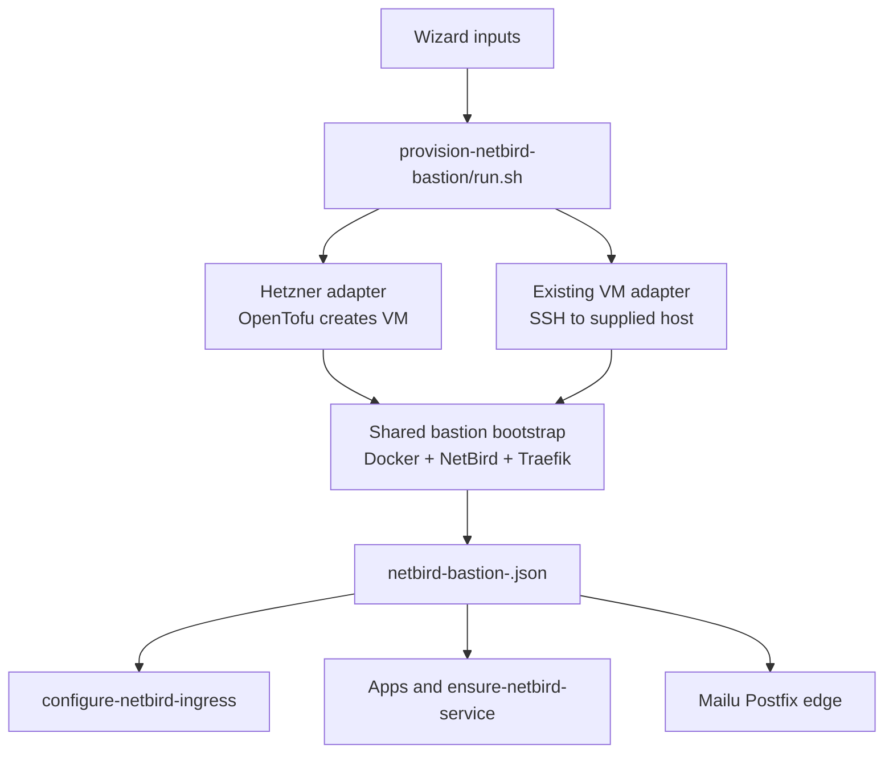

# BYO and Local VM Bastion Implementation Plan

## Summary

Twinbox should stop treating Hetzner as the only way to get a NetBird bastion.
The best implementation path is to keep the current Hetzner automation intact,
add a first-class "existing VM" path, and let that path cover both:

- an existing cloud VPS from any provider
- a local VM behind a home/office internet modem with port forwarding

This gives Twinbox broad provider support without maintaining many cloud APIs in
the first version. Provider-specific VM creation can be added later behind the
same abstraction.

## Goals

1. Keep the existing Hetzner flow working as-is for current users.
2. Add a generic bastion provider model:
   - `hetzner`
   - `existing-vm`
3. Support existing Linux VMs reachable by SSH from the Management VM.
4. Support local VMs where the SSH endpoint can differ from the public DNS
   target.
5. Reuse the current NetBird bootstrap behavior instead of creating a second
   bastion implementation.
6. Make Mailu work safely with non-Hetzner bastions by treating PTR/rDNS and
   port 25 as provider/user responsibilities unless the provider adapter knows
   how to configure them.
7. Add preflight checks so users learn early when port forwarding, DNS, CGNAT,
   or SMTP is the actual blocker.

## Non-Goals

- Do not add full automatic provisioning for every VM provider in the first
  change.
- Do not assume any fixed IP address or CIDR in code, scripts, or defaults.
  Addresses must come from user inputs, secrets, runtime discovery, or provider
  API responses.
- Do not expose SSH publicly for local VM deployments. SSH only needs to be
  reachable from the Management VM, and later through NetBird/Termix.
- Do not try to make residential email hosting look reliable by default.
  Twinbox can support it, but the UI and checks must be honest about port 25,
  PTR/rDNS, and IP reputation.
- Do not edit runtime state in `manager-data/`, `dist/`, `.terraform/`,
  `.venv/`, or generated dependency directories.

## Current State

The current NetBird bastion step is centered on Hetzner:

- `categories/talos-cluster/steps/provision-netbird-bastion/step.yaml`
  asks for `hcloud_token`, `hcloud_location`, and `hcloud_server_type`.
- `manager-web/src/question-flow.js` repeats the same hard-coded NetBird
  bastion questions for the setup wizard.
- `categories/talos-cluster/steps/provision-netbird-bastion/run.sh`
  creates Hetzner resources with OpenTofu, waits for cloud-init, writes
  `/opt/twinbox/bootstrap/secrets/global/netbird-bastion-<cluster-id>.json`,
  and fetches `/opt/netbird/setup-result.json` over SSH.
- `infra/opentofu/netbird/cloud-init/netbird.yaml.tftpl` contains most of the
  actual bastion bootstrap logic.
- `categories/talos-cluster/steps/configure-netbird-ingress/run.sh` assumes
  `.NETBIRD_IP` from the bastion secret is both the public DNS target and the
  SSH target.
- `scripts/manager/ensure-netbird-service.sh` reads NetBird URL/token details
  from the same bastion secret.
- `categories/apps/steps/install-mailu/run.sh` currently requires
  `.HCLOUD_TOKEN` and always runs `scripts/manager/ensure-hetzner-rdns.py`.

The bastion itself is not just "a random Docker host". It runs:

- NetBird management server, API, dashboard, and embedded relay/signal pieces
- the NetBird reverse proxy container
- Traefik for NetBird/dashboard/proxy ingress
- DNS-01 wildcard certificate issuance and renewal
- optional OPKSSH integration
- optional Beszel agent
- Postfix when Mailu is installed

## Target Architecture

The target shape is a bastion abstraction with provider-specific creation and a
shared bootstrap contract.



## Bastion Models

### Hetzner

The current behavior remains the compatibility path:

- Twinbox creates a VM through OpenTofu.
- Twinbox creates the provider firewall.
- Twinbox knows the public IPv4 from Terraform output.
- Twinbox can store `HCLOUD_TOKEN` for later Hetzner-only rDNS automation.
- Existing secrets and downstream scripts continue to work.

### Existing Cloud VM

The user creates a VM at any provider and gives Twinbox:

- SSH host reachable from the Management VM
- SSH port
- SSH user, initially `root` for v1
- private key, or a reference to an uploaded key file
- public DNS target, usually the same public IPv4 as the SSH host
- operating system family, initially Debian/Ubuntu only

Twinbox then:

- SSHs into the VM
- validates that it is a supported, mostly clean host
- installs Docker and dependencies if needed
- uploads/runs the shared NetBird bootstrap
- writes the same bastion secret schema
- creates/updates DNS records through external-dns

### Local VM With Port Forwarding

A local VM is the same `existing-vm` provider with one important difference:
the SSH endpoint and the public DNS endpoint are separate.

Example shape:

- Management VM reaches the bastion VM through a private LAN hostname/address.
- Internet users reach it through the router's public address.
- The modem/router forwards public ports to the VM.
- DNS records point at the public address or a user-managed dynamic DNS name.

Required user inputs:

- `existing_bastion_mode=local-port-forward`
- `existing_bastion_ssh_host`
- `existing_bastion_ssh_port`
- `existing_bastion_ssh_user`
- `existing_bastion_public_ipv4` for v1, or a future CNAME/DDNS target
- `existing_bastion_confirm_port_forwarding=true`

The first version should require a user-supplied public IPv4 for DNS A records.
Dynamic DNS support can be added next by allowing CNAME targets or installing a
small DNS updater on the local VM. Do not make dynamic DNS part of the first
code change unless the implementation stays small.

## Required Public Ports

For NetBird/proxy only:

| Port | Protocol | Purpose |
|------|----------|---------|
| 80 | TCP | ACME HTTP fallback, redirect, and bootstrap reachability checks |
| 443 | TCP | NetBird dashboard/API and reverse proxy HTTPS |
| 3478 | UDP | NetBird STUN |

For Mailu:

| Port | Protocol | Purpose |
|------|----------|---------|
| 25 | TCP | Public inbound SMTP to bastion Postfix |

SSH does not need to be public for existing/local VM mode. It only needs to be
reachable from the Management VM during bootstrap and maintenance.

## Secret Contract

Keep the existing fields for compatibility:

```json
{
  "NETBIRD_IP": "<public IPv4 for DNS and public checks>",
  "NETBIRD_URL": "https://netbird.<zone>",
  "NETBIRD_FQDN": "netbird.<zone>",
  "NETBIRD_PROXY_DOMAIN": "<zone>",
  "NETBIRD_ADMIN_TOKEN": "<token>",
  "NETBIRD_SETUP_TOKEN": "<token>",
  "SSH_PRIVATE_KEY": "<break-glass/bootstrap key when generated by Twinbox>",
  "CLUSTER_ID": "<cluster id>"
}
```

Add new fields:

```json
{
  "BASTION_PROVIDER": "hetzner|existing-vm",
  "BASTION_MODE": "cloud-vm|local-port-forward",
  "BASTION_PUBLIC_IPV4": "<public IPv4 used for A records>",
  "BASTION_SSH_HOST": "<host reachable from Management VM>",
  "BASTION_SSH_PORT": "<port>",
  "BASTION_SSH_USER": "root",
  "BASTION_OS_FAMILY": "debian|ubuntu",
  "BASTION_RDNS_PROVIDER": "hetzner|manual|unsupported",
  "BASTION_RDNS_STATUS": "configured|manual-required|unsupported|skipped"
}
```

Compatibility rules:

- Existing readers may continue to use `NETBIRD_IP`.
- New SSH helpers should prefer `BASTION_SSH_HOST`, `BASTION_SSH_PORT`, and
  `BASTION_SSH_USER`, falling back to `NETBIRD_IP`, port `22`, and `root`.
- New DNS helpers should prefer `BASTION_PUBLIC_IPV4`, falling back to
  `NETBIRD_IP`.
- `HCLOUD_TOKEN` is written only for `BASTION_PROVIDER=hetzner`.

## Implementation Phases

### Phase 1 - Add Bastion Provider Inputs

Files:

- `categories/talos-cluster/steps/provision-netbird-bastion/step.yaml`
- `manager-web/src/question-flow.js`
- `manager-api/test/catalog.test.mjs`
- `manager-web/test/app-layout.test.mjs`
- `tests/scripts/test_manager_scripts_args.py`
- docs that currently say "Hetzner VPS" as the only option

Changes:

1. Add `bastion_provider` input with default `hetzner`.
2. Keep existing Hetzner inputs.
3. Add existing VM inputs:
   - `existing_bastion_mode`
   - `existing_bastion_public_ipv4`
   - `existing_bastion_ssh_host`
   - `existing_bastion_ssh_port`
   - `existing_bastion_ssh_user`
   - `existing_bastion_ssh_private_key`
   - `existing_bastion_os_family`
   - `existing_bastion_confirm_clean_host`
4. If the current input renderer cannot hide/show conditional fields, keep all
   fields visible but make help text clear. A later UI refinement can add
   conditional input rendering.
5. Update tests that assert the exact NetBird bastion input list.

Acceptance:

- Catalog exposes both provider paths.
- Hetzner defaults are unchanged.
- Existing tests are updated to the new input contract.

### Phase 2 - Extract Shared Bootstrap

Files:

- `infra/opentofu/netbird/cloud-init/netbird.yaml.tftpl`
- new `scripts/manager/render-netbird-bastion-bootstrap.py` or
  `scripts/manager/netbird-bastion-bootstrap-template.sh`
- new tests under `tests/scripts/`

Changes:

1. Move the logic currently embedded in cloud-init into a reusable bootstrap
   script/template.
2. Render all runtime values from explicit variables:
   - NetBird FQDN
   - proxy domain
   - public zone
   - admin email
   - NetBird version
   - DNS provider
   - DNS credentials
   - optional OPKSSH issuer/client id
3. Keep cloud-init as a thin wrapper that writes credentials and invokes the
   shared bootstrap.
4. For existing VM mode, upload the same rendered bootstrap over SSH and run it
   directly.
5. Add a Twinbox ownership marker, for example
   `/opt/netbird/.twinbox-bastion.json`.
6. Refuse to overwrite an unmanaged `/opt/netbird/docker-compose.yml` unless
   the marker says Twinbox owns it.
7. Make the bootstrap idempotent:
   - safe to rerun on a partially completed install
   - safe to rerun after image pulls fail
   - preserves existing NetBird data volumes

Acceptance:

- Hetzner cloud-init still produces the same `/opt/netbird/setup-result.json`.
- Existing VM runner path uses the same bootstrap.
- `bash -n` passes for generated shell where applicable.
- Template tests prove required variables are rendered and no secrets are
  printed in expected log lines.

### Phase 3 - Implement Existing VM Runner Path

Files:

- `categories/talos-cluster/steps/provision-netbird-bastion/run.sh`
- new helper script if needed, for example
  `scripts/manager/bootstrap-existing-netbird-bastion.sh`
- tests in `tests/scripts/test_manager_scripts_args.py`

Changes:

1. Parse `bastion_provider` early.
2. Split the runner into provider functions:
   - `provision_hetzner_bastion`
   - `provision_existing_bastion`
   - `write_bastion_secret`
   - `create_netbird_dns_records`
   - `wait_for_netbird_setup_token`
3. For `hetzner`, preserve current OpenTofu behavior and fallback from ARM to
   x86 when placement is unavailable.
4. For `existing-vm`:
   - validate SSH inputs
   - write the provided key to a root-only temp file
   - test SSH reachability from the Management VM
   - detect OS through `/etc/os-release`
   - require Debian/Ubuntu in v1
   - verify required commands or install prerequisites through apt
   - upload the rendered bootstrap
   - run the bootstrap as root
   - stream/redact remote logs like the current cloud-init log streaming
   - fetch `/opt/netbird/setup-result.json`
5. For local mode:
   - use `BASTION_SSH_HOST` for SSH
   - use `BASTION_PUBLIC_IPV4` for DNS records and public checks
   - do not assume the Management VM can reach the public address through NAT
     hairpinning
6. Write a secret with both old and new fields.

Acceptance:

- Hetzner path still writes a compatible secret.
- Existing VM path writes a compatible secret without `HCLOUD_TOKEN`.
- Existing VM path can fetch `NETBIRD_ADMIN_TOKEN`.
- Logs redact tokens, passwords, secrets, and private keys.

### Phase 4 - Add Connectivity Preflights

Files:

- new `scripts/manager/check-bastion-public-reachability.py` or shell helper
- `categories/talos-cluster/steps/provision-netbird-bastion/run.sh`
- docs in `docs/netbird.md` and `docs/verification.md`

Checks:

1. DNS:
   - `netbird.<zone>` resolves to the expected public target after the
     DNSEndpoint is applied.
   - wildcard `*.<zone>` resolves to the expected public target after
     `configure-netbird-ingress`.
2. TCP:
   - `443/tcp` reachable from an external vantage point where possible.
   - `80/tcp` reachable if the bastion uses HTTP challenge or redirect checks.
3. UDP:
   - `3478/udp` is harder to prove from inside the same LAN. The first version
     can check local firewall state and print an explicit external validation
     command.
4. CGNAT/local mode:
   - compare the user-supplied public IPv4 with the VM's observed outbound
     address and warn if they differ.
   - do not fail solely on mismatch because policy routing, VPN, or provider
     NAT can create legitimate differences.
5. Mailu optional:
   - before installing Mailu, test whether `25/tcp` is reachable from outside
     or require a manual confirmation when the environment cannot test it.

Acceptance:

- Local VM users get clear errors for missing port forwards.
- Cloud VM users get clear errors for provider firewall blocks.
- Checks do not require hard-coded probe addresses.

### Phase 5 - Update Downstream SSH Consumers

Files:

- `categories/talos-cluster/steps/configure-netbird-ingress/run.sh`
- `categories/talos-cluster/steps/install-opkssh/run.sh`
- `scripts/manager/setup-termix.sh`
- `scripts/manager/configure-bastion-mailu-postfix.sh`
- `categories/apps/steps/install-mailu/run.sh`
- `scripts/manager/ensure-netbird-service.sh` if it starts needing SSH fields

Changes:

1. Add a shared helper pattern for reading bastion SSH fields:
   - host: `BASTION_SSH_HOST` then `NETBIRD_IP`
   - port: `BASTION_SSH_PORT` then `22`
   - user: `BASTION_SSH_USER` then `root`
2. Replace direct `root@$NETBIRD_IP` assumptions.
3. Keep `NETBIRD_IP` for public DNS and public reachability, not as the only
   SSH address.
4. Rename user-facing "Hetzner exit" wording to "bastion exit" where safe.
   Preserve internal IDs when changing them would break state or NetBird
   policies.

Acceptance:

- Local VM mode works when SSH target is private but DNS target is public.
- Existing Hetzner mode still works without new fields.
- No script requires `HCLOUD_TOKEN` except Hetzner-specific logic.

### Phase 6 - Make Mailu Provider-Aware

Files:

- `categories/apps/steps/install-mailu/run.sh`
- `categories/apps/steps/install-mailu/step.yaml`
- `docs/mailu.md`
- `docs/plans/mailu-bastion-postfix.md`
- `tests/test_mailu_gitops.py`

Changes:

1. Stop requiring `HCLOUD_TOKEN` unconditionally.
2. If `BASTION_PROVIDER=hetzner` and `HCLOUD_TOKEN` exists:
   - run `ensure-hetzner-rdns.py`
   - set `rdns_status=configured`
3. For non-Hetzner:
   - do not try provider-specific rDNS automation
   - set `rdns_status=manual-required`
   - print the required PTR value
   - keep Mailu DNS creation gated behind successful Postfix and relay checks
4. Add an optional input such as `confirm_manual_rdns` or
   `skip_rdns_automation_acknowledged` if Mailu should proceed on non-Hetzner.
5. Add/keep a port 25 check or explicit warning before publishing MX records.

Acceptance:

- Mailu can install with a non-Hetzner bastion when the user confirms manual
  PTR/rDNS responsibility.
- Mailu step result reports `rdns_status=manual-required` when appropriate.
- Hetzner path remains automatic.

### Phase 7 - Documentation and UX

Files:

- `docs/netbird.md`
- `docs/mailu.md`
- `docs/getting-started.md`
- `docs/architecture.md`
- `docs/verification.md`
- `categories/talos-cluster/README.md`

Changes:

1. Replace "Hetzner VPS" wording with "NetBird bastion" where the statement is
   provider-neutral.
2. Keep a Hetzner-specific section for the automated provider.
3. Add an "Existing VM" section.
4. Add a "Local VM with port forwarding" section:
   - required forwarded ports
   - static public IPv4 recommendation
   - CGNAT/DS-Lite warning
   - router/firewall notes
   - DNS and dynamic DNS caveat
5. Add a Mailu warning:
   - residential IP ranges are often poor for mail deliverability
   - PTR/rDNS may not be available from home internet providers
   - outbound/inbound port 25 may be blocked
   - external SMTP relay may be better for many users

Acceptance:

- Users can understand the difference between NetBird/proxy requirements and
  Mailu/email requirements.
- The docs no longer imply Hetzner is required for NetBird.

### Phase 8 - Provider Catalog Without API Automation

Files:

- new provider metadata file, for example
  `config/bastion-providers.json`
- `manager-api/src/lib/catalog.js`
- `manager-web/src/` components for provider hints if needed
- tests for catalog serialization

Model:

```json
{
  "id": "scaleway",
  "name": "Scaleway",
  "country": "France",
  "regions": ["Paris", "Amsterdam", "Warsaw"],
  "provisioning": "manual",
  "smtp25": "self-enable-security-group",
  "rdns": "provider-console",
  "notes": "Good EU candidate for BYO bastion and possible Mailu."
}
```

Do not put exact live prices into code unless there is a maintenance process.
Prices change too often. Prefer docs with date-stamped research, or a link to
provider pricing.

Acceptance:

- Wizard can show provider guidance without pretending Twinbox can create those
  VMs automatically.
- Existing VM path remains the actual implementation behind manual providers.

### Phase 9 - Provider Adapters Later

Add real VM creation adapters only after BYO VM support is stable.

Candidate order:

1. Scaleway
2. OVHcloud
3. IONOS
4. netcup
5. Exoscale

Adapter contract:

- create SSH key
- create VM
- attach firewall/security group
- return public IPv4
- expose provider name and region
- optionally configure PTR/rDNS
- destroy stale resources for reruns

Provider adapters should live behind one runner interface so the rest of
Twinbox never needs to know which cloud API was used.

## Detailed File Plan

| File | Planned change |
|------|----------------|
| `categories/talos-cluster/steps/provision-netbird-bastion/step.yaml` | Add provider and existing VM inputs; update text from Hetzner-only to bastion-provider wording. |
| `manager-web/src/question-flow.js` | Mirror new inputs until the UI can fully rely on API catalog data. |
| `categories/talos-cluster/steps/provision-netbird-bastion/run.sh` | Split provider logic, add existing VM bootstrap, write expanded secret schema. |
| `infra/opentofu/netbird/cloud-init/netbird.yaml.tftpl` | Thin wrapper around shared bootstrap. |
| `scripts/manager/*netbird*bastion*` | Add shared bootstrap/render/check helpers. |
| `categories/talos-cluster/steps/configure-netbird-ingress/run.sh` | Use separate SSH/public endpoints; keep old field fallback. |
| `scripts/manager/configure-bastion-mailu-postfix.sh` | Accept SSH user/port/host from caller or secret-derived values. |
| `categories/apps/steps/install-mailu/run.sh` | Remove unconditional `HCLOUD_TOKEN` requirement; add manual rDNS status for non-Hetzner. |
| `scripts/manager/ensure-hetzner-rdns.py` | Keep Hetzner-specific. Do not generalize until another provider adapter exists. |
| `docs/netbird.md` | Document Hetzner, existing cloud VM, local VM, port forwarding. |
| `docs/mailu.md` | Document provider-aware PTR/rDNS and port 25 limitations. |
| `docs/verification.md` | Add BYO/local bastion checks. |
| `tests/scripts/test_manager_scripts_args.py` | Assert new runner contract, DNS behavior, and absence of unconditional Hetzner token requirement. |
| `manager-api/test/catalog.test.mjs` | Update expected input list and help text assertions. |
| `manager-web/test/app-layout.test.mjs` | Update question flow expected inputs. |
| `tests/test_mailu_gitops.py` | Update Mailu assertions for provider-aware rDNS. |

## Existing VM Bootstrap Guardrails

The runner should fail before making large changes when:

- SSH authentication fails.
- The remote user is not root for v1.
- The OS is unsupported.
- `/opt/netbird/docker-compose.yml` exists without a Twinbox marker.
- Required DNS credentials cannot be read from the existing external-dns secret.
- The public DNS target is missing.
- The bootstrap cannot obtain a NetBird Personal Access Token.

The runner may install or change:

- Docker packages
- `/opt/netbird`
- NetBird compose files and environment files
- Traefik dynamic configuration under `/opt/netbird`
- systemd timers/services for certificate renewal
- UFW rules only if UFW is already active, or only after an explicit input says
  Twinbox may manage the host firewall

For existing/local VMs, do not blindly enable UFW as part of v1. If UFW is
already active, add the required allow rules. If it is inactive, print the
required firewall/port-forwarding list and rely on the user's provider firewall
or router rules.

## DNS Plan

For v1:

- `netbird.<zone>` is an A record to `BASTION_PUBLIC_IPV4`.
- `*.<zone>` is an A record to `BASTION_PUBLIC_IPV4`.
- DNS records continue to be applied through external-dns `DNSEndpoint`
  resources.

For local dynamic IP:

- v1 supports it only if the user reruns the relevant step after the public IP
  changes, or maintains the public IP in DNS externally.
- v1.1 can support CNAME/DDNS by adding:
  - `BASTION_DNS_TARGET_TYPE=a|cname`
  - `BASTION_DNS_TARGET`
  - CNAME-capable DNS rendering where provider support permits it
  - a clear warning that apex wildcard behavior varies by DNS provider

## Local VM Router Checklist

The wizard/docs should tell users to configure the modem/router before running
the step:

1. Reserve a stable LAN address for the bastion VM in DHCP or set it manually.
2. Forward `80/tcp`, `443/tcp`, and `3478/udp` to the VM.
3. Forward `25/tcp` only if Mailu/direct inbound mail is planned.
4. Do not forward SSH unless the user explicitly accepts the risk.
5. Confirm the ISP does not use CGNAT/DS-Lite for IPv4.
6. Prefer a static public IPv4 for v1.

## Security Considerations

- Treat the bastion private key as break-glass material.
- Do not print the private key, tokens, DNS credentials, Mailu relay secrets, or
  OPKSSH client secrets in logs.
- Existing VM mode must not overwrite a host with unrelated services.
- Local VM mode should strongly recommend a dedicated VM, VLAN/DMZ, snapshots,
  and minimal port forwards.
- Mailu on residential internet should be presented as advanced/experimental
  unless PTR/rDNS and port 25 are verified.
- Keep NetBird admin token storage behavior unchanged unless a separate secret
  hardening change is planned.

## Testing Plan

Minimum checks for the first implementation:

```bash
bash -n categories/talos-cluster/steps/provision-netbird-bastion/run.sh
bash -n categories/talos-cluster/steps/configure-netbird-ingress/run.sh
bash -n categories/apps/steps/install-mailu/run.sh
bash -n scripts/manager/configure-bastion-mailu-postfix.sh
python3 -m pytest -q tests
node --test manager-api/test/*.mjs
node --test manager-web/test/*.mjs
node --test manager-worker/test/*.mjs
make lint
make format-check
```

Focused new tests:

- Catalog exposes `bastion_provider` and existing VM inputs.
- Hetzner inputs remain present.
- Runner text no longer requires `hcloud_token` before checking provider.
- Runner writes `BASTION_PROVIDER` and SSH/public endpoint fields.
- `configure-netbird-ingress` reads SSH target fields separately from
  `NETBIRD_IP`.
- Mailu does not fail just because `HCLOUD_TOKEN` is missing when
  `BASTION_PROVIDER=existing-vm`.
- Mailu reports manual rDNS status for non-Hetzner.
- Documentation references local port forwarding and CGNAT.

Manual/live validation:

1. Existing Hetzner cluster path still provisions a bastion.
2. Existing cloud VM path provisions NetBird on a clean Debian/Ubuntu VM.
3. Local VM path provisions NetBird when SSH uses LAN address and DNS uses
   public address.
4. NetBird dashboard loads at `https://netbird.<zone>`.
5. An app reverse proxy service loads through `https://<app>.<zone>`.
6. Mailu Hetzner path still configures PTR/rDNS automatically.
7. Mailu non-Hetzner path stops with clear manual rDNS instructions, or
   proceeds only after explicit confirmation.

## Rollout Plan

1. Implement and test locally.
2. Commit to `main` only when ready for a production change.
3. Push to GitHub `main`.
4. Wait for GitHub Actions "Publish Docker Images" to complete successfully.
5. Refresh the Management VM only after images are published:

```bash
sudo -n sh -lc 'cd /opt/twinbox && docker compose pull && docker compose up -d'
```

6. Run one non-destructive catalog check through the refreshed Management API.
7. Run a live dry-run style validation against an existing VM if one is
   available.

## Open Questions

1. Should v1 accept only `root` SSH, or also a sudo user?
   - Recommendation: root only for v1. Add sudo user support later.
2. Should v1 support dynamic DNS for local VM?
   - Recommendation: require a public IPv4 first. Add CNAME/DDNS later.
3. Should Twinbox manage UFW on existing/local VMs?
   - Recommendation: only if UFW is already active, or behind an explicit
     confirmation input.
4. Should Mailu proceed on non-Hetzner without verified PTR/rDNS?
   - Recommendation: require explicit confirmation and make the step output
     say `manual-required`.
5. Should provider price/location/SMTP data live in code?
   - Recommendation: no exact prices in code. Keep date-stamped docs and link
     to providers.

## Estimated Effort

| Work | Estimate |
|------|----------|
| Provider input model and tests | 0.5-1 day |
| Shared bootstrap extraction | 1-2 days |
| Existing VM SSH runner | 1-2 days |
| Local port-forward preflights | 0.5-1 day |
| Downstream SSH/public endpoint split | 1 day |
| Mailu provider-aware rDNS | 0.5-1 day |
| Docs and verification | 0.5 day |

Conservative total: 5-8 engineering days for a clean, tested v1. The fastest
useful slice is 2-4 days if we skip dynamic DNS, sudo users, and provider
catalog UI polish.

## Recommended First PR Scope

The first implementation PR should include:

1. `bastion_provider=hetzner|existing-vm`
2. existing VM support with root SSH
3. separate SSH target and public DNS target
4. shared bootstrap extraction
5. Hetzner compatibility preserved
6. Mailu no longer hard-fails on missing `HCLOUD_TOKEN`
7. manual rDNS status for non-Hetzner
8. docs for local VM port forwarding
9. updated tests

Defer:

- CNAME/DDNS support
- sudo-user bootstrap
- full provider API adapters
- provider price catalog in UI
- automatic router configuration
