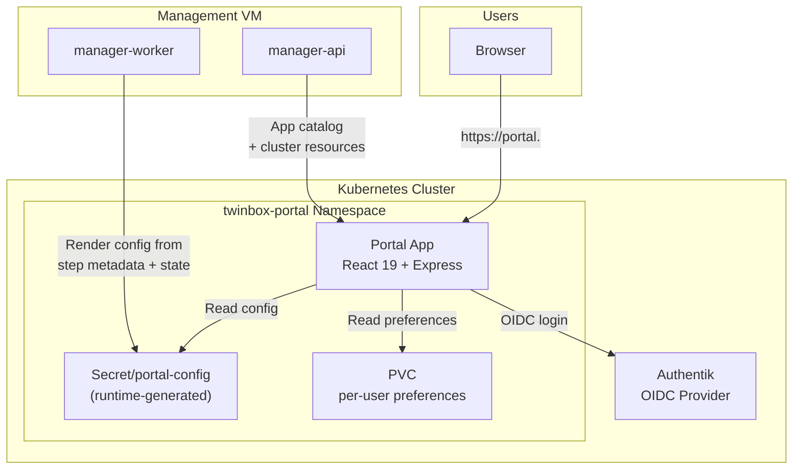

# Twinbox Portal

The Twinbox Portal is the default user-facing landing page for the cluster. It provides an app launcher, cluster status, per-user preferences, and an admin panel for app management.

## Architecture



## Features

- **App Launcher** — Grid of installed and available applications with one-click access
- **Intranet Links** — Customizable quick links to internal and external services
- **Cluster Status** — Live view of cluster health, node resources, and step completion
- **Per-User Preferences** — Theme, layout, and personal bookmark storage
- **Admin Panel** — App installation/uninstallation, observability profile management

## Technology Stack

- **Frontend:** React 19, Vite 8, ESM
- **Backend:** Express 5, `jose` for JWT validation
- **Build:** Vite (`vite build`) + Docker multi-stage
- **Runtime:** Node.js container on Kubernetes via `gitops/platform-apps/twinbox-portal/`

## Deployment

The Portal is deployed via Argo CD from `gitops/platform-apps/twinbox-portal/`.
Changes roll out through:

1. Git commit to `main`
2. Portal image publish workflow (`.github/workflows/docker-publish.yml`)
3. Argo CD sync

### Runtime Configuration

The portal configuration is not static in Git. Instead, it is generated at runtime by the `install-twinbox-portal` step:

1. `manager-worker` reads step metadata from `categories/`
2. Reads current step-state from `manager-data/step-state/`
3. Reads portal content from `portal/`
4. Renders the configuration into `Secret/portal-config`
5. Applies the secret to the cluster

This allows the portal to reflect the current state of installed apps without requiring a Git commit for every app install.

## Authentication

The Express server validates JWT tokens issued by Authentik via the `jose` library.
Unauthorized requests are redirected to the Authentik login flow.

### OIDC Flow

1. User visits `https://portal.<ZONE_NAME>`
2. Portal checks for a valid JWT in the session cookie
3. If missing, redirects to Authentik's OIDC authorization endpoint
4. Authentik validates the user and redirects back with a code
5. Portal exchanges the code for tokens and sets the session cookie
6. User is now authenticated

### Authorization

- All authenticated users can access the app launcher and cluster status
- Only members of the `admins` group can access the admin panel
- Group membership is read from the `X-authentik-groups` header

## Data Storage

| Data | Storage | Scope |
|------|---------|-------|
| App catalog config | `Secret/portal-config` | Cluster-wide |
| User preferences | PVC-backed JSON store | Per-user |
| Session tokens | Encrypted cookies | Per-session |
| Cluster status | Live API calls to `manager-api` | Real-time |

## App Catalog

The portal renders two types of apps:

### Platform Apps

Core infrastructure and platform services. Always visible to admins:

- Argo CD
- Grafana
- Headlamp
- pgAdmin 4
- Velero UI
- etc.

### User Apps

Applications installed through the App Installs flow. Visible based on step state:

- Nextcloud
- Immich
- Vaultwarden
- etc.

### Bundles

App bundles (Twinbox Desktop, Mijn Bureau, La Suite, openDesk) appear as installable groups. When a bundle is installed, its individual apps appear in the catalog.

## Admin Panel

The admin panel provides:

- **App Management** — Install/uninstall individual apps and bundles
- **Observability Profiles** — Switch between monitoring configurations
- **Cluster Resources** — View node CPU/memory/disk usage
- **Step Status** — See which wizard steps are completed, running, or failed
- **AI Beheerteam** — Configure external LLM endpoint, view agent team, run health checks

### AI Beheerteam (`/admin/agents`)

The AI beheerteam is installed from the Web Wizard step **Install AI Beheerteam**. After that, `/admin/agents` is the admin panel for configuring and monitoring the `twinbox-agents` service. It requires admin access.

**Endpoint setup:** Save and test an OpenAI-compatible LLM endpoint (e.g., omlx, Ollama, vLLM, LM Studio). The API key is stored separately from the config.

**Agents:** Seven fixed agent profiles (Olivia Ops, Karel Kubernetes, Betty Backup, Peter Proxmox, Tara Talos, Sofia SQL, Gina GitOps) with distinct roles and avatars.

**Work orders:** Quick actions for cluster, backup, Proxmox, database, and GitOps health checks. Each work order gathers facts, optionally summarizes via LLM, and saves results.

**Approvals:** Pending work orders requiring approval are shown with approve/cancel buttons.

**Degraded mode:** If `TWINBOX_AGENT_INTERNAL_TOKEN` is not configured in the Portal, the panel shows a degraded state. Work orders are still created but the agent service is unavailable.

Zulip integration is optional. When configured, Olivia Ops posts a short Dutch summary to the configured stream after each completed work order.

## Customization

### Intranet Links

Users can add custom quick links in the portal settings:

```json
{
  "intranet_links": [
    { "title": "Company Wiki", "url": "https://wiki.example.com", "icon": "fas fa-book" },
    { "title": "GitLab", "url": "https://git.example.com", "icon": "fab fa-gitlab" }
  ]
}
```

### Themes

The portal supports light and dark modes. The preference is stored per-user in the PVC-backed store.

## Verification

```bash
kubectl -n twinbox-portal get pods
kubectl -n twinbox-portal get secret portal-config
kubectl -n twinbox-portal get pvc
kubectl -n twinbox-portal get ingressroute
```

## Troubleshooting

### Portal shows empty app list

```bash
# Verify the config secret exists
kubectl -n twinbox-portal get secret portal-config -o jsonpath='{.data.config}' | base64 -d

# Verify step state is readable
ssh twinbox@<management-vm-ip> 'ls /opt/twinbox/manager-data/step-state/clusters/<cluster-id>/'

# Rerun install-twinbox-portal
# Through the wizard UI
```

### Authentik login fails

```bash
# Verify the OIDC secret
kubectl -n twinbox-portal get externalsecret portal-oidc
kubectl -n twinbox-portal get secret portal-oidc

# Check portal logs
kubectl -n twinbox-portal logs deployment/portal
```

### Preferences not persisting

```bash
# Verify the PVC is bound
kubectl -n twinbox-portal get pvc

# Check disk usage
kubectl -n twinbox-portal exec deploy/portal -- df -h /data
```

## Comparison with Dashy

| Feature | Twinbox Portal | Dashy |
|---------|---------------|-------|
| Target audience | End users | Operators / Admins |
| Authentication | OIDC (Authentik) | OIDC (Authentik) |
| App catalog | Dynamic from step state | Dynamic from step state |
| Admin panel | Yes | No |
| Per-user preferences | Yes | No |
| Intranet links | Yes | No |
| Customization | Theme + layout | YAML config only |
| Default landing page | Yes (`portal.<ZONE_NAME>`) | No (`admin.<ZONE_NAME>`) |

The portal is the new default front door for users. Dashy remains available at `admin.<ZONE_NAME>` as the legacy admin launcher for operator tools.
