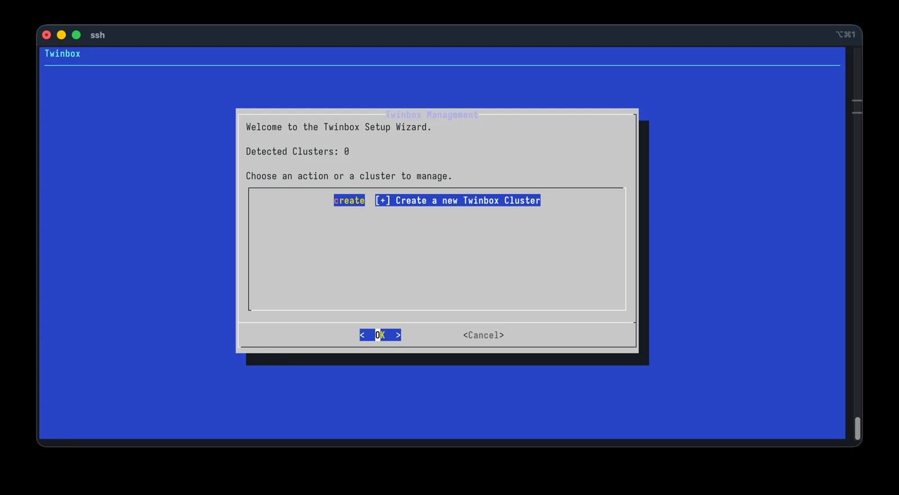
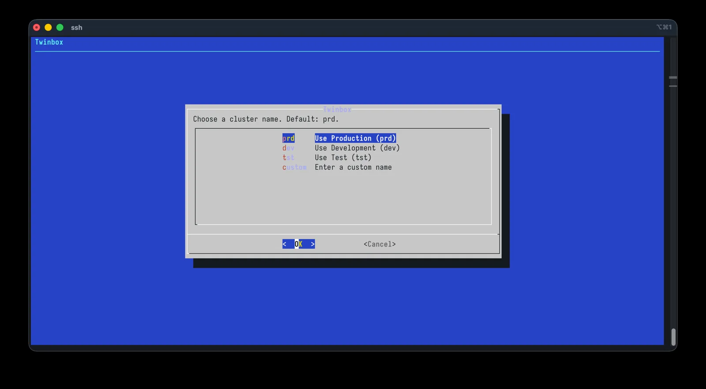
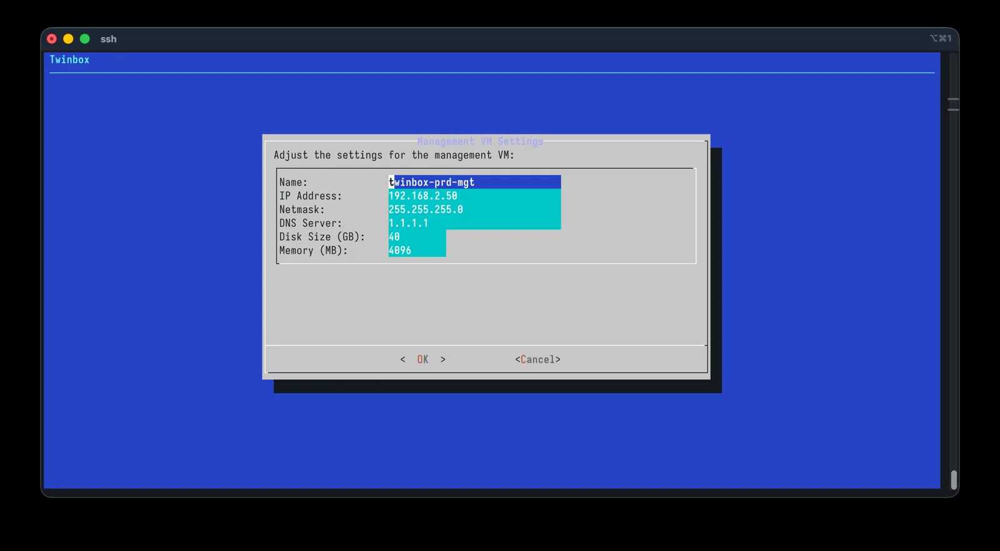
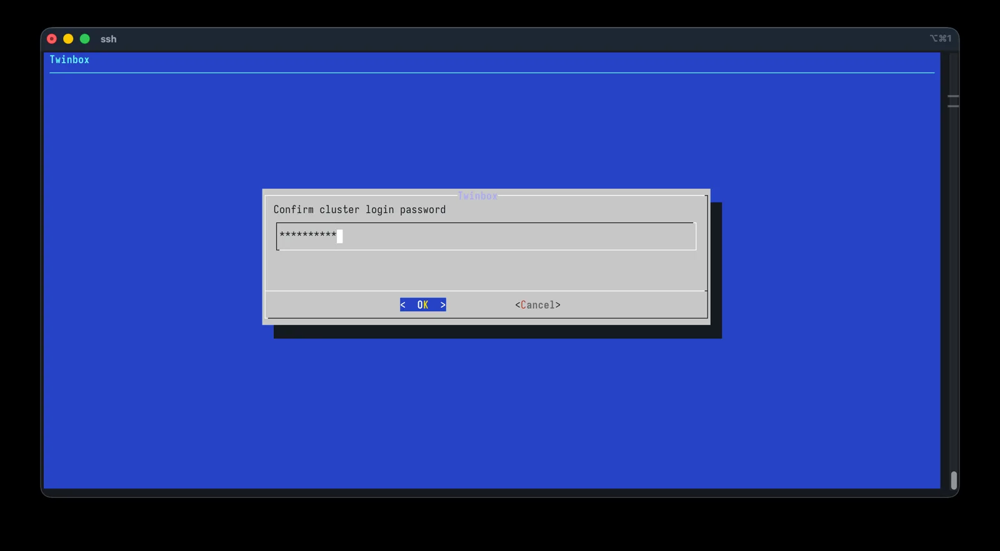
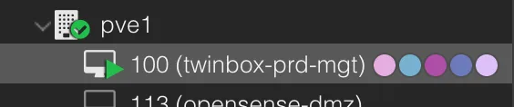
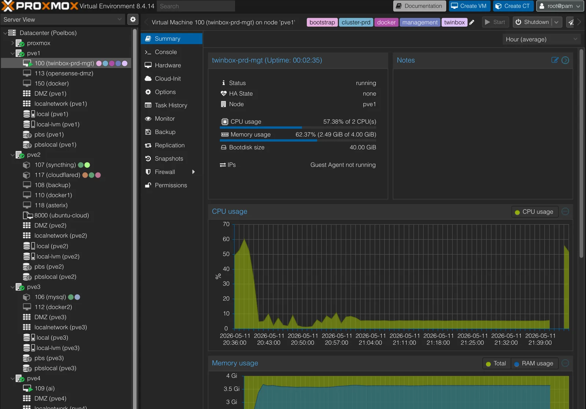
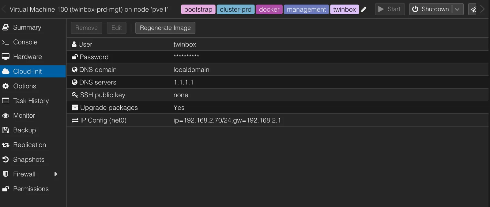
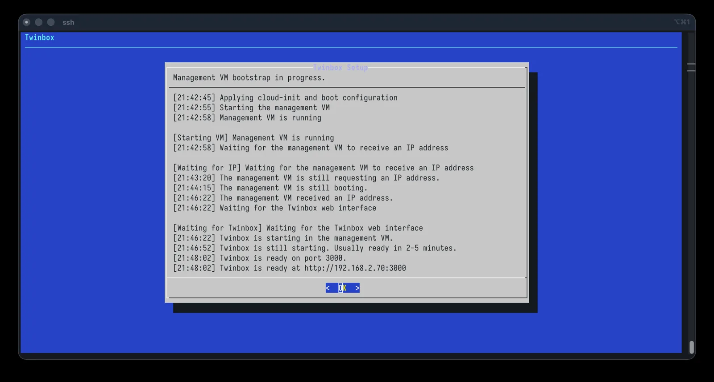

# Proxmox Bootstrap

The bootstrap step is the first real Twinbox action. You run it from the
Proxmox side, and it creates the Management VM that hosts the rest of the
workflow.

## What this step does

- Creates the Management VM
- Prepares the Docker-based runtime on that VM
- Hands off to the web wizard once the environment is ready

Open the console of one of the Proxmox servers. You can use the web interface to connect to the console, or use from the commandline an ssh client to connect to the Proxmox host and run the command there.

Give this command to start the bootstrap process:

```bash
bash <(curl -fsSL https://raw.githubusercontent.com/harrywesterman/twinbox/main/wizard/setup-wizard.sh)
```

## Proxmox wizard















