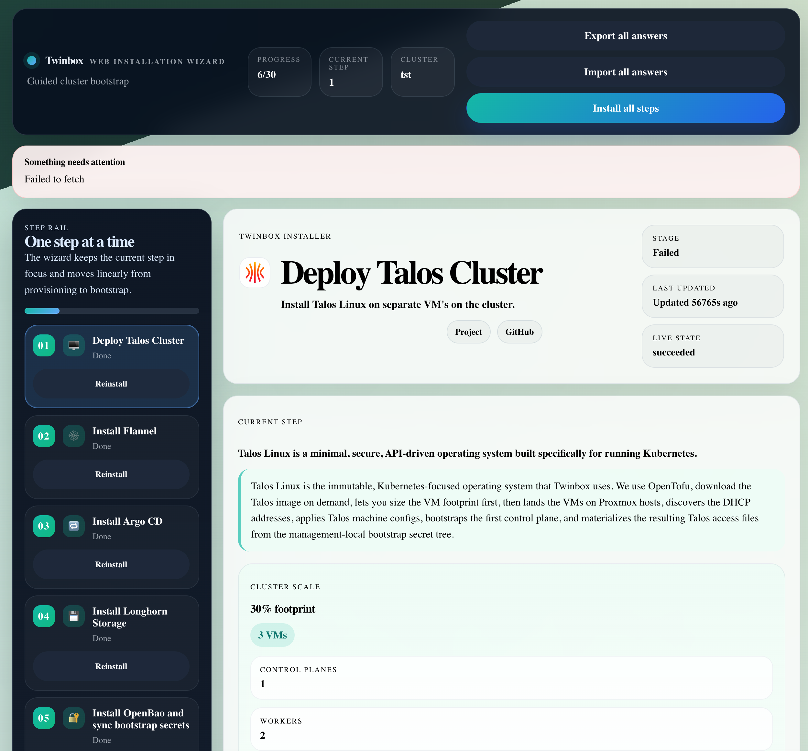

# Web Wizard

Once the Management VM is up, the rest of the setup happens in the browser.
The wizard is where you configure the cluster and confirm the choices Twinbox
will apply.

## Why this page matters

- It is the main user-facing interface after bootstrap
- It is where saved answers are reviewed and adjusted
- It is the page users are most likely to revisit while provisioning

## Example view

## Tips for writing this chapter

- Explain each screen as if the reader is seeing it for the first time.
- Keep steps short and action-oriented.
- Mention where to go if the user needs to revisit an earlier answer.
