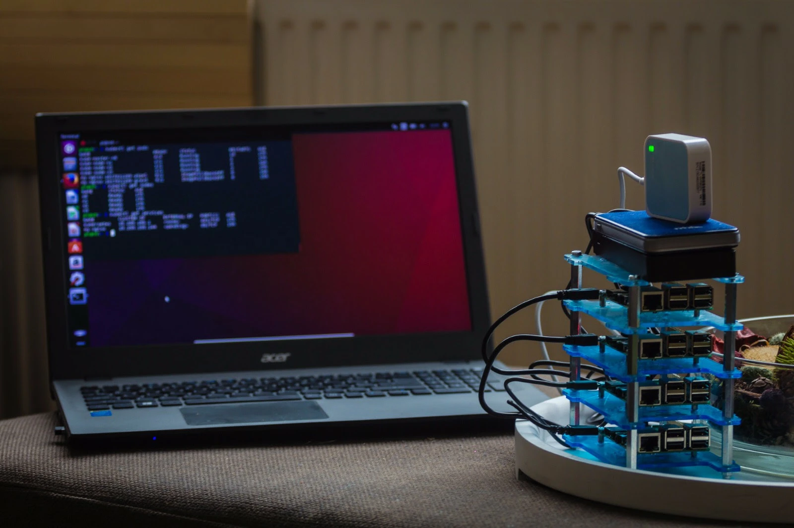

# Vision

## About me

Hello! I'm Harry Westerman, 55 years old from the Netherlands. Besides my lovely wife and three daughters (the oldest are twins, hence the name of this project) and other hobbies like brewing beer [bierineenweek.nl](https://bierineenweek.nl) :beers: and looking into my family history [stamboomwesterman.net](https://stamboomwesterman.net), I have a working background of 25 years in IT in Dutch banking and government. Always on the "Infrastructure" side of things. Like workstations, servers, networking, datacenters... Allways using the big Enterprise stuff from the big names in IT.

Since I got a Sinclair ZX81 from my uncle when I was 12 years old, I was always fascinated with computers. In my teens I ran a wonderfull Amiga BBS called Epsilon BBS that was connected to FidoNET. I always tinkered with a so called homelab. Trying out multiple Linux distributions, playing with loads of Open Source projects. Automating my house with the excellent [Home Assistant](https://www.home-assistant.io/), and running all kinds of stuff in Docker and Kubernetes.

In 2016 I even made a nice little cluster of Raspberry PI's. They were running Kubernetes, installed with Ansible from my laptop. The cluster was connected to my wifi, was powerbank powered, and could run on our coffee table in the living room:

I always wondered
